---

---

**前言**

这个项目是使用VNPY的一些核心思想进行搭建的。之所以没有直接使用VNPY，是我当时看到VNPY的代码时立马被其庞杂的代码给绕晕。得益于VNPY开源共建社区的特性，VNPY的功能十分强大；但同样这一特性也导致代码风格上的不统一和功能上的重复，一些功能对我本人来说也用不到相反增加了代码的复杂度。基于这个困境当时我决定保留VNPY中引擎+事件驱动的核心精华，并在此基础上进行了自己的交易框架构建。这个框架与VNPY最大的一个不同是十分重视代码之间的解耦:例如VNPY中策略和引擎之间是直接调用关系，而我将其改成通过事件引擎沟通（关于这个我猜测是由于VNPY初始版的回测中没有解决事件引擎同步调用带来的问题，所以实盘的交易引擎也采用这一特性）。虽然目前有一部分代码如GATEWAY中关于bar撮合的部分，由于是很久以前写的并没有做到解耦（目前也缺乏动力修改）,但大部分代码都遵循这一原则，不同模块、功能直接可以单独运行并进行检测。第二个不同在于这个项目提供了监测的APP，并有对应的引擎补充工具方便引擎与APP之间通信。

# S 0 快速上手

## 1.策略编写

策略编写时应该基础策略基类。在策略基类中已经定义了执行模块，它会将订单请求转为事件引擎，最后交由TRADE ENGINE处理

```
    def _execute(self, plan: List[Tuple[str, ModifyRequest | OrderRequest | CancelRequest]]):
        for act, req in plan:
            if act == "place":
                self.me.put(Event(EVENT_ORDER_REQ, req))
            elif act == "modify":
                self.me.put(Event(EVENT_MODIFY_REQ, req))
            elif act == "cancel":
                self.me.put(Event(EVENT_CANCEL_REQ, req))
```

如果不是必要不用修改这部分代码，编写策略应该关于目标层目标生成和协调层的计划生成，也就是_compute_desired和build_plan这两部分，只需要生成出对应的计划即可。

```
# -*- coding: utf-8 -*-
from __future__ import annotations

from datetime import datetime
from typing import Dict, List, Tuple, Optional
from collections import deque
import numpy as np
from talib import MACD
from coreutils.constant import Interval, Exchange, Direction, OrderType
from coreutils.object import BarData, TradeData, OrderRequest, PositionData, LogData
from strategy.strategy_base import StrategyBase, TargetOrder
from backtest.backtest_engine import BacktestEngine
from engine.event_engine import EventEngine, EVENT_TICK, EVENT_ORDER, EVENT_TRADE, EVENT_BAR, EVENT_LOG, \
    EVENT_ORDER_REQ, EVENT_CANCEL_REQ, EVENT_MODIFY_REQ

# 依赖：你已有的 StrategyBase / TargetOrder / 常量 等
# from your_module import StrategyBase, TargetOrder, ENTRY_REFS, EVENT_LOG, ...

class MACDStrategy(StrategyBase):
    """
    使用 talib.MACD 的最小示例：
    - 金叉：空仓 -> 买入开多
    - 死叉：持多 -> 卖出平多
    - 仅做多（无反手做空），下单用市价 MKT 简化
    - 信号只在选定 interval 的 bar 收到后触发
    """

    def __init__(
            self,
            event_engine,
            symbol: str,
            exchange: Exchange = Exchange.HKFE,
            work_interval: Interval = Interval.K_1M,
            volume: int = 1,
            fast: int = 12,
            slow: int = 26,
            signal: int = 9,
    ):
        super().__init__(event_engine)

        # 基本参数
        self.symbol = symbol
        self.exchange = exchange
        self.work_interval = work_interval
        self.volume = int(volume)
        self.time = datetime.now()
        # MACD 参数
        self.fast = fast
        self.slow = slow
        self.signal = signal

        # 数据与状态
        self._closes: deque = deque(maxlen=max(self.slow * 3, 200))
        self._last_close: Optional[float] = None
        self._pending_signal: Optional[str] = None  # 'buy' / 'sell' / None

        # 简化的持仓（只跟踪多头净仓）
        self.position = PositionData(
            symbol=self.symbol,
            exchange=self.exchange,
            volume=0,
            price=0.0,
            direction=Direction.NET,
            gateway_name="MACD",
        )

    # ===================== 事件回调 =====================

    def on_trade(self, trade: TradeData):
        self.write_log(LogData(msg=f"[MACD] {self.data_time} 收到TradeData:{trade}"))

        if trade.symbol != self.symbol:
            return

        if trade.direction == Direction.LONG:
            self.position.volume += trade.volume
            self.position.price = trade.price
        elif trade.direction == Direction.SHORT:
            self.position.volume -= trade.volume

    def on_bar(self, bar: BarData):
        self.data_time = bar.datetime
        # 仅在指定合约与周期上工作
        if bar.symbol != self.symbol or bar.interval != self.work_interval:
            return

        close = float(bar.close_price)
        self._last_close = close
        self._closes.append(close)

        # 使用 talib.MACD 计算
        if len(self._closes) < self.slow + self.signal + 1:
            return  # 数据不足

        arr = np.asarray(self._closes, dtype=float)
        macd, macd_signal, _ = MACD(
            arr,
            fastperiod=self.fast,
            slowperiod=self.slow,
            signalperiod=self.signal
        )

        # 需要至少两根有效值用于判断穿越
        if np.isnan(macd[-1]) or np.isnan(macd_signal[-1]) or np.isnan(macd[-2]) or np.isnan(macd_signal[-2]):
            return

        prev_diff = macd[-2] - macd_signal[-2]
        curr_diff = macd[-1] - macd_signal[-1]

        golden = (prev_diff <= 0) and (curr_diff > 0)  # 金叉
        dead = (prev_diff >= 0) and (curr_diff < 0)  # 死叉

        if golden and self.position.volume == 0:
            self._pending_signal = "buy"
            self.write_log(LogData(msg=f"[MACD] {self.data_time} 金叉 -> BUY @ {close}"))
            self._request_realign()

        if dead and self.position.volume > 0:
            self._pending_signal = "sell"
            self.write_log(LogData(msg=f"[MACD] {self.data_time} 死叉 -> SELL @ {close}"))
            self._request_realign()

    def on_tick(self, tick):
        # 本示例仅基于 bar 运行
        return

    # ===================== 计划生成/执行 =====================

    def _compute_desired_entry(self) -> Dict[str, "TargetOrder"]:
        targets: Dict[str, "TargetOrder"] = {}
        if self._pending_signal is None or self._last_close is None:
            return targets

        px = float(self._last_close)

        if self._pending_signal == "buy" and self.position.volume == 0:
            targets["entry"] = TargetOrder(
                symbol=self.symbol,
                reference=f"{self.data_time}entry",
                direction=Direction.LONG,
                price=px,
                trigger_price=px,
                volume=self.volume,
                type_=OrderType.MARKET,  # 简化：市价单
            )

        elif self._pending_signal == "sell" and self.position.volume > 0:
            # 平掉全部多头
            targets["close"] = TargetOrder(
                symbol=self.symbol,
                reference=f"{self.data_time}close",
                direction=Direction.SHORT,
                price=px,
                trigger_price=px,
                volume=self.position.volume,
                type_=OrderType.MARKET,
            )

        return targets

    def _build_plan(self) -> List[Tuple[str, OrderRequest]]:
        plan: List[Tuple[str, OrderRequest]] = []

        desired_entry = self._compute_desired_entry()
        for _, tgt in desired_entry.items():
            req = OrderRequest(
                symbol=self.symbol,
                exchange=self.exchange,
                direction=tgt.direction,
                type=tgt.type,
                price=tgt.price,
                trigger_price=tgt.trigger_price,
                volume=abs(tgt.volume),
                reference=tgt.reference,
            )
            plan.append(("place", req))

        # 消费掉本轮信号
        self._pending_signal = None
        return plan


```


## 2. 回测搭建

策略完成后，回测搭建遵循如下步骤

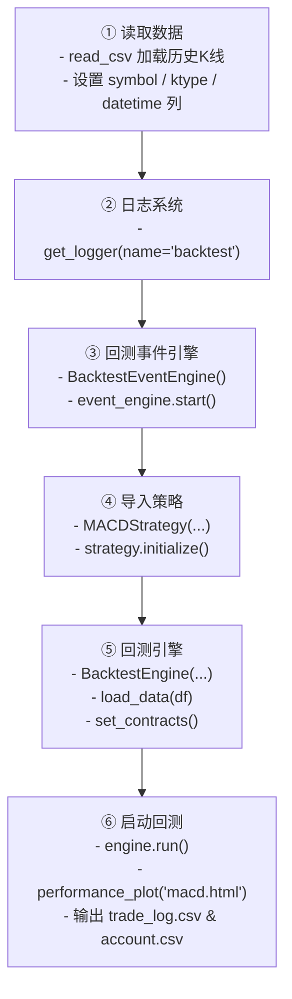


```
from coreutils.logger import get_logger
from coreutils.constant import Interval, Exchange, Direction, OrderType, OrderStatus, LogLevel
from backtest.backtest_event_engine import Event, BacktestEventEngine
from backtest.backtest_engine import BacktestEngine
import pandas as pd
from strategy.example.macd import MACDStrategy

# ==============1.读取数据=================
df = pd.read_csv('/autotrade/strategy/example/1h_2023.csv')
# 数据列必须有'symbol', 'open', 'high', 'low', 'close', 'datetime', 'ktype'
df['ktype'] = Interval.K_1H
df['symbol'] = 'HK.MHImain'
df = df[['symbol', 'open', 'high', 'low', 'close', 'trade_date', 'ktype']]
df.columns = ['symbol', 'open', 'high', 'low', 'close', 'datetime', 'ktype']

# ==============2.日志系统=================
logger = get_logger(name='backtest', logfile='macd.log')
# ==============3.回测事件引擎=================
# 回测里面事件引擎必须用BacktestEventEngine
event_engine = BacktestEventEngine()
event_engine.start()
# ==============4.导入策略=================
strategy = MACDStrategy(event_engine=event_engine, symbol="HK.MHImain", work_interval=Interval.K_1H)
strategy.initialize()
# ==============5.回测引擎=================
engine = BacktestEngine(event_engine=event_engine, logger=logger, initial_cash=50000,
                        daily_update_interval=Interval.K_1H)
# 导入之前的数据
engine.load_data(data_list=[df])
engine.set_contracts(contract_params={
    "HK.MHImain": {"size": 10, "margin_rate": 0.1, "long_rate": 0.00006, "short_rate": 0.00006}
})
# 启动回测引擎
engine.run()
engine.performance_plot(plot_path='macd.html')
engine.get_trade_log_df().to_csv(f'macd_tradelog.csv')
engine.get_account_daily_df().to_csv(f'macd_account.csv')
```

## 3. 实盘运行

### 3.1 代码编写

实盘框架需要配置logger\Trade Engine\oms\Event Engine，这一点和回测类似

```
from coreutils.constant import Interval
from engine.trade_engine import CtaEngine
from coreutils.logger import LoggerEngine
from engine.oms_engine import OmsBase
from engine.event_engine import EventEngine, Event
from conn.engine_mes_adapter import EngineMesAdapter
from gateway.gateway_futu import FutuGateway as Gateway
from strategy.example.macd import MACDStrategy

engine_id = 'mhi'

# ==============1.事件引擎=================
event_engine = EventEngine()
event_engine.start()
# ==============2.日志系统=================
# 改写增加微信推送
class WechatLog(LoggerEngine):
    def __init__(self, event_engine, engine_id, LOG_DIR=None):
        super().__init__(event_engine, engine_id, LOG_DIR)

    def process_error(self, msg: str):
        self.logger.wechat(content=msg, level='error')


logger_engine = WechatLog(event_engine, engine_id)
# ==============3.oms引擎=================
oms = OmsBase(event_engine)
# ==============4.gateway=================
gateway = Gateway(event_engine)
# ==============5.app通信模块(可选)=================
# 需要启动/autotrade/app/ws_hub.py
cta_adapter = EngineMesAdapter(engine_id, event_engine, oms)
cta_adapter.start()
# ==============6.cta 引擎=================
cta_engine = CtaEngine(oms=oms, event_engine=event_engine, gateway=gateway)
gateway.connect(
    setting={'symbols': ['HK.MHImain'], 'intervals': [Interval.TICK, Interval.K_1M, Interval.K_5M, Interval.K_15M]})
# ==============7.实例化引擎=================
strategy = MACDStrategy(event_engine=event_engine, symbol="HK.MHImain", work_interval=Interval.K_1H)
strategy.initialize()

```


### 3.2 修改GATEWAY

目前我只编写了FUTU的GATEWAY，并且在数据获取模块上也有缺陷。如果要实盘运行需要修改这一点

### 3.3 修改config

在config中我定义了一些例如数据库等配置信息，需要在根目录新建.env，也就是autotrade/.env，并且根据要求填写

```
# ===================== 数据库信息 =====================
DB_HOST=127.0.0.1
DB_PORT=3306
DB_USER=root
DB_PASSWORD=xxxxxx

# ===================== 常量设置 =====================
SERVERJIANG_PROTOKEN=xxx
SERVERJIANG_DBPATH=mysql+pymysql://root:@localhost:3306/qtdb_pro
SERVERJIANG_RETRY_TIMES=2
SERVERJIANG_RETRY_GAP=61
SERVERJIANG_SERVERJIANG=xxxxx 

# ===================== Linux 服务器配置 =====================
LINUX_HOSTNAME=xxx
LINUX_USERNAME=root
LINUX_PASSWORD=xxx

# ===================== Futu OpenD 配置 =====================
FUTU_HOST=127.0.0.1
FUTU_PORT=11111
FUTU_PWD_UNLOCK=xxxx
```


### 3.4 微信推送

想要实现微信推送的功能，可以参考6.1模块进行配置


## 4.  APP 使用

APP的flutter项目会放在git仓库里，里面会有一个安卓的apk安装包，如果是ios需要自行打包，下面是一些运行的必要准备：

1）添加用户

运行coreutlis.auth.user_manager.py，它首先会创建一个sqlite数据库，之后添加自己设定的用户名和密码

```python
    user_manager.add_user("testuser", "testpassword")
```

2)运行消息中心/conn/ws_hub.py

在这个文件中，根据自己的服务器或者主机地址填写host 和port

```
if __name__ == "__main__":
    host = "0.0.0.0"
    port = 8000
    uvicorn.run(app, host=host, port=port)
```

3）在实盘代码中实例化EngineMesAdapter

具体参考上面的3.1代码编写

```
cta_adapter = EngineMesAdapter(engine_id, event_engine, oms)
cta_adapter.start()
```

4）在交易代码启动后，可以打开app

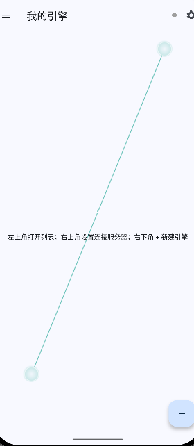


点击app右上角的小齿轮进行连接。

用户名和密码是之前在user_manager.py中设置的，服务器地址和ws_hub要保持一直(注意服务器的地址分为对内ip和对外ip，一般情况下要填外部ip，这一点根据不同环境和云厂商不一样)

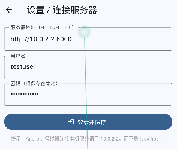


连接成功后回到首页，点击右下角+号新建引擎，策略名称可以自定义，但是engine_id要与EngineMesAdapter保持一致

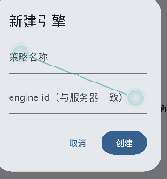


关于日志查询默认日志保存路径是/autotrade/logs/"engine_id".log，所以如果路径名称不一样，要么将日志路径修改和默认路径一致，要么在app中填写路径位置

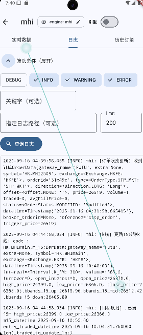


# S 1 回测模块


当时在看vnpy的文件时，发行它的整个回测十分庞杂，而且错一点就会导致整个回测系统报错。基于这一现状我决定将整个回测系统重构成三个大块：BacktestEngine、BacktestGateway、BacktestOms，分别负责充当主引擎、虚拟交易所、资金订单持仓管理功能。

在整个模块的设计上，BacktestEngine是和gateway镶嵌的，也就是BacktestEngine会直接调用gateway，这是为了和实盘保持一致。但比较不同的是，为了减少回测的消耗，回测中OMS也是没有和BacktestEngine解耦，BacktestEngine直接调用OMS引擎而非通过事件引擎。

在BacktestEngine与策略的沟通上采取的是通过BacktestEventEngine(与实盘中的EventEngine略有不同，在BacktestEngine中会介绍)沟通，也是事件驱动，在策略层面，实盘与回测并无不同。


## 1.1 BACKTEST GATEWAY 

BACKTEST GATEWAY  除了承担和实盘GATEWAY中提供与交易相关的send、modify、cancel交易请求以及on trade、on position、on order的订单回报，其还内嵌了一个“模拟交易所”。

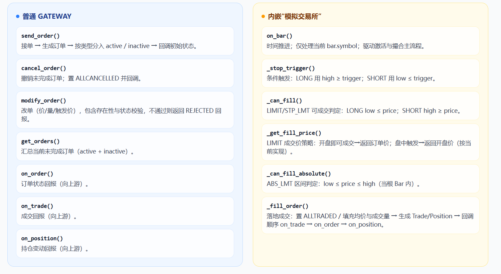


### 1.1.1  模拟交易所

好的，我按你给的叙述方式，写成一段 **README 风格、简洁清晰** 的说明，并把触发条件改成“大括号公式”。

#### 1.1.1.1 接收订单（`send_order`）

会根据 **订单类型** 将订单分入 `inactive_orders` 或 `active_orders`：

```python
if order.type in [OrderType.LIMIT, OrderType.MARKET]:
    order.status = OrderStatus.SUBMITTING
    self.active_orders[symbol][orderid] = order
elif order.type in [OrderType.STP_LMT, OrderType.STP_MKT]:
    order.status = OrderStatus.PENDING
    self.inactive_orders[symbol][orderid] = order
```

------

#### 1.1.1.2 撮合模块（`on_bar`）

**1）接收 bar data**（仅处理 `bar.symbol`）
**2）判断 inactive 订单是否应触发**，命中则移入 `active_orders` 并回调：

```python
if self._stop_trigger(order, bar):
    order.status = OrderStatus.PENDING
    order.datetime = self.current_date

    self.active_orders[symbol][oid] = order
    del self.inactive_orders[symbol][oid]
    self.on_order(order)
```

**触发判断逻辑**
 令 $\bar{H}=\text{bar.high\_price}$，$\bar{L}=\text{bar.low\_price}$，$\tau=\text{order.trigger\_price}$：

$\text{Trigger}(order,bar)= \begin{cases} \bar{H}\ \ge\ \tau, & \text{Direction}=\text{LONG} \\\\ \bar{L}\ \le\ \tau, & \text{Direction}=\text{SHORT} \end{cases}$

> 触发后订单进入 `active_orders`，状态为 `PENDING`，并通过 `on_order` 发回一次回报。


**3）判断active订单是否应该成交**

```
        for oid, order in list(self.active_orders.get(symbol, {}).items()):
            if order.status in [OrderStatus.ALLTRADED, OrderStatus.ALLCANCELLED]:
                continue

            if order.type in [OrderType.MARKET, OrderType.STP_MKT]:
                if order.direction == Direction.LONG:
                    close_price = max(order.trigger_price, bar.open_price)
                else:
                    close_price = min(order.trigger_price, bar.open_price)

                self._fill_order(order, close_price)
                del self.active_orders[symbol][oid]
            elif order.type in [OrderType.ABS_LMT]:
                if self._can_fill_absolute(order, bar):
                    self._fill_order(order, order.price)
                    del self.active_orders[symbol][oid]
            elif order.type in [OrderType.LIMIT, OrderType.STP_LMT]:
                if self._can_fill(order, bar):
                    self._fill_order(order, self._get_fill_price(order, bar))
                    del self.active_orders[symbol][oid]

```


记 $\bar{H}=\text{bar.high\_price}$、$\bar{L}=\text{bar.low\_price}$、$\bar{O}=\text{bar.open\_price}$、$P=\text{order.price}$、$\tau=\text{order.trigger\_price}$。

- **市价 / 止损市价（`MARKET / STP_MKT`）**

​	**成交价：**
$$
\text{px}=
\begin{cases}
\max(\tau,\ \bar{O}), & \text{Direction}=\text{LONG} \\\\
\min(\tau,\ \bar{O}), & \text{Direction}=\text{SHORT}
\end{cases}
$$
​	命中即成，随后 `_fill_order(order, px)` 并从 `active_orders` 删除。

------

- **绝对限价（`ABS_LMT`）**

​	**可成交条件：**
$$
\bar{L}\ \le\ P\ \le\ \bar{H}
$$
​	**成交价：**
$$
\text{px}=P
$$
​	满足则 `_fill_order(order, P)` 并从 `active_orders` 删除。

------

- **常规限价 / 止损限价（`LIMIT / STP_LMT`）**

​	**可成交条件：**
$$
\begin{cases}
\bar{L}\ \le\ P, & \text{Direction}=\text{LONG} \\\\
\bar{H}\ \ge\ P, & \text{Direction}=\text{SHORT}
\end{cases}
$$
​	**成交价（当前实现，来自 `_get_fill_price`）：**
$$
\text{px}=
\begin{cases}
P, & \text{LONG 且 } P\le \bar{O} \\\\
\bar{O}, & \text{LONG 且 } P>\bar{O} \\\\
P, & \text{SHORT 且 } P\ge \bar{O} \\\\
\bar{O}, & \text{SHORT 且 } P< \bar{O}
\end{cases}
$$
​	随后 `_fill_order(order, px)` 并从 `active_orders` 删除。

> 注：等价口径——**开盘即可成交 → 用订单价 $P$**；**盘中才触达 → 用开盘价 $\bar{O}$**。


### 1.1.2  Gateway 

**send_order()**

- 生成 `OrderData`，按类型入簿并回报：
  - `LIMIT / MARKET` → 放入 `active_orders[symbol]`，`status = SUBMITTING`
  - `STP_LMT / STP_MKT` → 放入 `inactive_orders[symbol]`，`status = PENDING`
- 调用 `on_order()` 回报当前状态；返回 `orderid`。

**cancel_order()**

- 在 `active_orders` / `inactive_orders` 中定位并移除。
- 若未终态，置 `ALLCANCELLED`，更新时间戳，`on_order()` 回报。

**modify_order()**

- 按 `symbol + orderid` 定位。
- 校验：不存在 / 已终态（`ALLTRADED/ALLCANCELLED/PARTCANCELLED`）/ 新数量小于已成交 → 构造一笔 `REJECTED` 并 `on_order()`。
- 否则更新 `price / volume / trigger_price`，置 `MODIFIED`，更新时间戳，`on_order()`。

**get_orders()**

- 汇总返回当前**未完成**订单（`active + inactive`）。

**回调出口**

- `on_order()`、`on_trade()`、`on_position()`：将订单/成交/持仓回报**向上层转发**（不处理资金与风控）。


## 1.2 BACKTEST OMS

BACKTEST OMS继承OMS BASE(为了与实盘保持一致)，只是增加一些功能

```
class BacktestOms(OmsBase):
    """
    回测专用 OMS（含保证金逻辑）
    - 事件驱动：接收 Trade 事件更新仓位和资金
    - 支持卖空、翻仓、均价计算、保证金管理
    """

    def __init__(self, event_engine: BacktestEventEngine = BacktestEventEngine(), initial_cash: float = 1_000_000):
        super().__init__(event_engine)

```

和OMS BASE不同，BACKTEST OMS并不通过事件引擎推动而是通过BACKTEST ENGINE调用，其主要负责两个功能：处理静态权益和动态权益

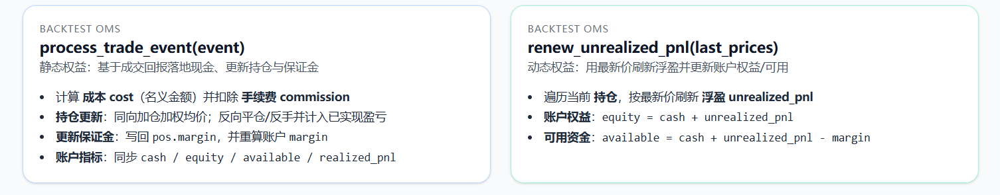

------

### 1.2.1 合约参数（`set_contract_params`）

用于为每个 `symbol` 配置合约倍数与费率、保证金率。

```python
def set_contract_params(symbol, size=1, long_rate=0, short_rate=0, margin_rate=0):
    self.sizes[symbol] = size
    self.long_rates[symbol] = long_rate
    self.short_rates[symbol] = short_rate
    self.margin_rates[symbol] = margin_rate
```

- `size`：合约乘数
- `long_rate / short_rate`：多/空侧手续费率
- `margin_rate`：保证金率

------

### 1.2.2 交易事件处理（`process_trade_event`）

**1）接收 Trade**
 登记 `trade` 到 `self.trades`，取 `symbol/price/volume/direction` 等。

**2）计算手续费与成本**

 记 $s=\text{size}$、$p=\text{trade.price}$、$q=\text{trade.volume}$，则成交名义金额

$\text{cost}=p\times q \times s$

手续费：

$\text{commission}=\text{cost}\times \begin{cases} \text{long\_rate}, & \text{Direction}=\text{LONG} \\\\ \text{short\_rate}, & \text{Direction}=\text{SHORT} \end{cases}$

现金：$\text{cash} \leftarrow \text{cash}-\text{commission}$

```
commission = cost * (
    self.long_rates.get(symbol, 0) if trade.direction == Direction.LONG else self.short_rates.get(symbol,
                                                                                                  0))
```


**3）更新持仓**

记号

- $q_{\text{old}}$：旧持仓数量（**有符号**，多为 $+$、空为 $-$）
- $p_{\text{old}}$：旧持仓均价
- $q_{\text{new}}$：本次成交数量（**有符号**；LONG 取 $+\lvert\cdot\rvert$，SHORT 取 $-\lvert\cdot\rvert$）
- $p_{\text{new}}$：本次成交价格（trade.price）
- $s$：合约乘数（size）
- $m$：保证金率（margin_rate）

> 手续费与现金变动不在下列公式中展开；实现盈亏 $\text{realized\_pnl}$ 会在**反向成交**时计入现金。

**情况 A：方向一致（加仓）**

当 $q_{\text{old}}\cdot q_{\text{new}} > 0$：

$\begin{aligned} q_{\text{pos}} &= q_{\text{old}} + q_{\text{new}} \\\\ p_{\text{avg}} &= \frac{p_{\text{old}}\cdot \lvert q_{\text{old}}\rvert + p_{\text{new}}\cdot \lvert q_{\text{new}}\rvert}{\lvert q_{\text{pos}}\rvert} \end{aligned}$

此时 $\text{realized\_pnl}=0$。

------

**情况 B：方向相反（平仓或反手）**

当 $q_{\text{old}}\cdot q_{\text{new}} \le 0$：

- **先平仓部分**

平仓数量：$c=\min\big(\lvert q_{\text{old}}\rvert,\ \lvert q_{\text{new}}\rvert\big)$ 

实现权益更新：$\text{realized\_pnl}= \begin{cases} \ (\,p_{\text{new}}-p_{\text{old}}\,)\,c\,s, & q_{\text{old}}>0\ \text{（原多）}\\[4pt] \ (\,p_{\text{old}}-p_{\text{new}}\,)\,c\,s, & q_{\text{old}}<0\ \text{（原标题空）} \end{cases}$

- **得到新持仓与均价**

$q_{\text{pos}} = q_{\text{old}} + q_{\text{new}}$$p_{\text{avg}}= \begin{cases} p_{\text{old}}, & \lvert q_{\text{new}}\rvert < \lvert q_{\text{old}}\rvert\ \text{（部分平，均价不变）}\\[4pt] p_{\text{new}}, & \lvert q_{\text{new}}\rvert \ge \lvert q_{\text{old}}\rvert\ \text{（完全反手/打平后新开）} \end{cases}$

------

```
# 情况一：方向一致（加仓）
if old_volume * new_volume > 0:
    volume = old_volume + new_volume
    price = (old_price * abs(old_volume) + new_price * abs(new_volume)) / abs(volume)

# 情况二：方向相反（平仓或反手）
else:
    close_qty = min(abs(old_volume), abs(new_volume))
    if old_volume > 0:
        realized_pnl = (new_price - old_price) * close_qty * size
    else:
        realized_pnl = (old_price - new_price) * close_qty * size

    self.accounts['BACKTEST'].cash += realized_pnl
    volume = old_volume + new_volume
    if abs(new_volume) < abs(old_volume):  # 部分平仓，保持原均价
        price = old_price
    else:  # 完全反手，新开仓
        price = new_price


```


**4）押金计算（Margin）**

- 当 $q_{\text{pos}}\neq 0$ 时（代码按**成交价**计保证金）：$\text{margin}=\lvert q_{\text{pos}}\rvert \cdot p_{\text{new}} \cdot s \cdot m$

- 若 $q_{\text{pos}}=0$：$\text{margin}=0,\quad \text{该持仓移除}$

账户侧的总保证金为所有持仓保证金之和：

$\text{account.margin}=\sum_{\text{symbols}}\text{pos * margin}$

```

if volume != 0:
    margin = abs(volume) * trade.price * size * margin_rate
    pos.margin = margin
    pos.volume = volume
    pos.price = price

else:
    margin = 0
    self.positions.pop(symbol, None)

self.accounts['BACKTEST'].margin = sum(p.margin for p in self.positions.values())

```


------

### 1.2.3 浮盈刷新（`renew_unrealized_pnl`）

目前**浮盈不在 `process_trade_event` 中计入**，而是通过 `renew_unrealized_pnl` 刷新。这个函数在BACKTEST ENGINE中，当bar.interval为设定的更新频率时被触发。

传入最新价 `last_prices`，逐合约计算浮盈并回写账户与合约统计。

记 $p_{\text{last}}=\text{last\_prices[symbol]}$（缺省用持仓价），则$\text{float\_pnl}=(p_{\text{last}}-p_{\text{avg}})\cdot q_{\text{pos}}\cdot s$

账户侧：

$\begin{aligned} \text{unrealized\_pnl} &= \sum \text{float\_pnl} \\\\ \text{equity} &= \text{cash}+\text{unrealized\_pnl} \\\\ \text{available} &= \text{cash}+\text{unrealized\_pnl}-\text{margin} \end{aligned}$

同时同步到 `contracts_log[symbol]['unrealized_pnl']`。

```

"""总权益 = 可用现金 + 占用保证金 + 持仓浮盈"""
self.accounts['BACKTEST'].unrealized_pnl = 0.0
self.accounts['BACKTEST'].equity = self.accounts['BACKTEST'].cash
for symbol, pos in self.positions.items():
    if pos.volume != 0:
        size = self.sizes.get(symbol, 1)
        last_price = last_prices.get(symbol, pos.price)
        float_pnl = (last_price - pos.price) * pos.volume * size
        self.accounts['BACKTEST'].unrealized_pnl += float_pnl
        self.accounts['BACKTEST'].equity += float_pnl
        self.accounts['BACKTEST'].available = (self.accounts['BACKTEST'].cash +
                                               self.accounts['BACKTEST'].unrealized_pnl - self.accounts[
                                                   "BACKTEST"].margin)

        # 更新contract指标
        contract_info = self.contracts_log.get(symbol)
        contract_info['unrealized_pnl'] = float_pnl
```


------

### 1.2.4 查询

- `get_contract_log()`：返回合约级资金与持仓快照（深拷贝）
- `get_trades()`：返回回测期间的成交日志列表

------


## 1.3 BACKTEST ENGINE 

BACKTEST ENGINE 分成个模块，交易引擎和普通的Trade Engine一样，通过事件引擎与策略沟通

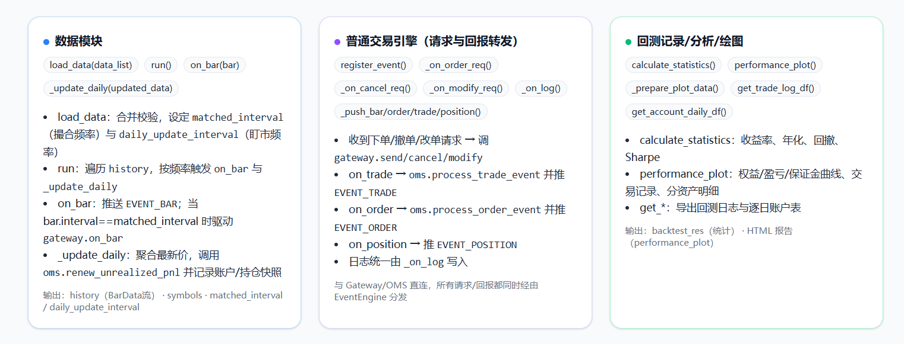

### 1.3.1 数据加载模块

#### 1.3.1.1 load_data

```
engine = BacktestEngine(event_engine=event_engine,logger=logger,initial_cash=50000)
engine.load_data(data_list=[data_mhi,data_hsi])
```

**1）数据标准**

传入的必须是一个列表，列表中每一个元素为数据框，且包含'symbol', 'open', 'high', 'low', 'close', 'datetime', 'ktype'这几列，并且ktype必须为Interval类型

**2）多周期数据排序**

当策略采用多周期数据时(比如用2h的sma判断开仓，然后用15m的sma判断止损线),那么engine必须知道每一根bar发生的时间。假设我们的数据框如下：

2h数据

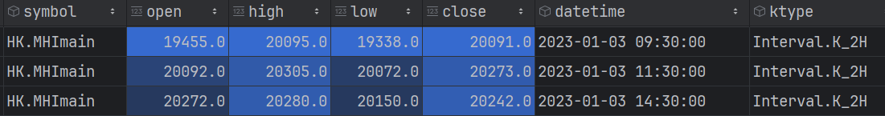

15m数据

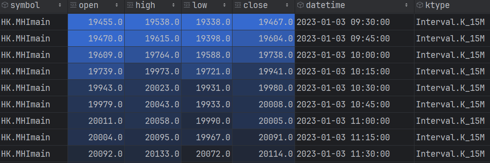

1m数据

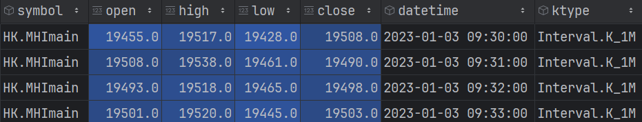

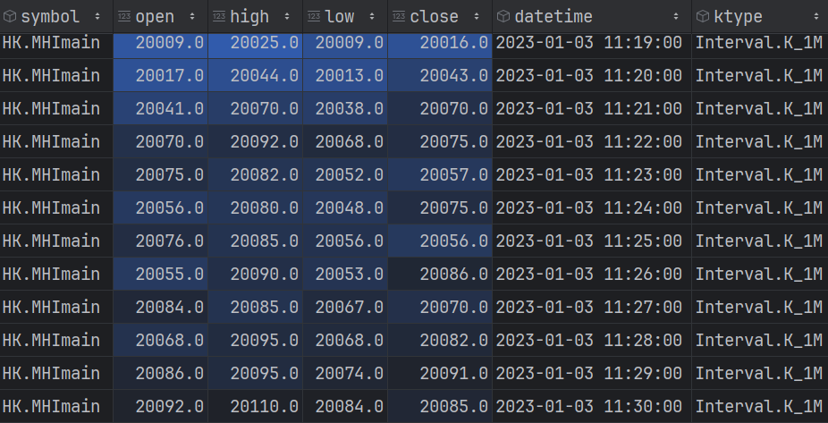

这里面datetime代表的是开始的时间，例如1m的11:29代表11:29-11:30的数据，2h的datetime的9:30代表9:30-11:30这一段的数据。所以关键就得明白数据传入的顺序。例如同样是datetime为9:30，2h的数据是在11:29:59更新的，而1m却是在9:29:59更新的，那么1m的9:30-11:29都应该排在2h的9:30前。

造成这个的原因是数据标准这里我才用的是start_time，而非end_time,这一点主要是要和大部分api接口保持一致。

为了解决这个问题，这块代码的逻辑是将数据框合并后，利用错位后的一个bar的datetime当作end_time，并以此排序。例如2h 9:30的一根是11:30，那么也就是这根bar结束时间应该是11:29:59。简单来说，这部分就是算一个end_time

```
        for data in data_list:
            if not required_cols.issubset(data.columns):
                raise ValueError(f"loaded data must have columns {required_cols}")
            if data.empty:
                continue
            if not isinstance(data['ktype'].iloc[0], Interval):
                raise TypeError("ktype data must be Interval")

            d = data.copy()
            d.loc[:, 'datetime'] = pd.to_datetime(d['datetime'], errors='coerce')
            d.loc[:, 'end_date'] = d['datetime'].shift(-1) - pd.Timedelta(seconds=1)

            # 只丢掉时间相关的 NaT（通常是最后一行）
            parts.append(d.dropna(subset=['datetime', 'end_date']))

        df = pd.concat(parts, ignore_index=True, copy=False)
        del parts
        df = df.sort_values(by=['end_date', 'ktype'], ascending=True)
```


**3）撮合周期 matched_interval**

在多个周期数据被传入时[1m,15m.2h]，到底用哪一个作为1.1.1 模拟交易所的on_bar的数据？如果没有对此限制，那就可能出现11:29时，2h、15m、1m 的数据会被传入，这会带来撮合上的混乱。比如9：31的1m的high为120，之后到11:20-11:30都小于110，在11:20挂了110的多头STP_MKT,理论上来说这个订单不会被触发。但是由于11:29传入了2h的数据，它还包含了9:30-11:29的数据，从而订单被错误的触发。

为了解决这个问题，我特意把interval类型在vnpy的基础上进行了改动

```

@total_ordering
class Interval(Enum):
    """
    Interval of bar data.
    """
    NONE = math.nan
    TICK = 0.1
    K_1M = 60
    K_3M = 180
    K_5M = 300
    K_15M = 900
    K_30M = 1800
    K_1H = 3600
    K_2H = 7200
    K_3H = 10800
    K_4H = 14400
    K_DAY = 86400
    K_WEEK = 604800
    K_MON = 2592000
    K_QUARTER = 7776000
    K_YEAR = 31104000

    def __lt__(self, other: "Interval") -> bool:
        if isinstance(other, Interval):
            return float(self.value) < float(other.value)
        return NotImplemented

```

在load_data时，在没有指定matched_interval时，它会自动选出最小的Interval作为gateway的撮合周期。

```
self.matched_interval = min(interval_list) if self.matched_interval is None else self.matched_interval
```


**4）更新周期 daily_update_interval**

更新周期是指多久在BACKTEST ENGINE调用_update_daily，涉及到在1.2.3的浮盈刷新，并记录快照供1.3.3绘制。为了节省消耗，在没有指定的daily_update_interval时，默认采用间隔最大的interval更新(比如传入了1m\15m\2h,默认在2h的频率上更新)。

```
self.daily_update_interval = max(
            interval_list) if self.daily_update_interval is None else self.daily_update_interval
```


#### 1.3.1.2 k线推进 run

 在1.3.1.1 中得到更新周期和撮合周期后，run会将k线逐一推进

```
pre_update_daily_time = None
updated_data = {}

for bar in self.history:
    if bar.interval == self.matched_interval:
        self.current_datetime = bar.datetime
    self.on_bar(bar)
    # self.history 已按时间升序
    # 只用盯市基准周期来聚合（例如 15m）
    if bar.interval == self.daily_update_interval:
        # 窗口切换：bar.datetime 与上一个 15m 结束时间不同 → 先 flush 上一窗口
        if pre_update_daily_time is not None and bar.datetime != pre_update_daily_time:
            if updated_data:
                self.update_datetime = bar.datetime
                self._update_daily(updated_data)
                updated_data = {}

        # 累积当前窗口的数据
        updated_data[bar.symbol] = bar.close_price
        pre_update_daily_time = bar.datetime

# 循环结束，flush 最后一个窗口
if updated_data:
    self.update_datetime = pre_update_daily_time
    self._update_daily(updated_data)

self.backtest_res = self.calculate_statistics()
print("回测结束")
```

这里判断是否需要调用_update_daily的依据是更新频率如果选择的是2h，当2h的数据从9:30切换到11:30，就默认2h数据已经全部走完，需要更新浮盈。这么处理的好处是：1.对于多symbol，避免每一次2h都要调用更新，然后在oms中寻找对应symbol的从而节省开销；2.在记录回测时，避免重复(避免不同symbol各记录一次快照)


### 1.3.2 交易引擎

交易引擎和普通的TRADE ENGINE如CTAENGINE一致，其通过事件引擎与策略进行沟通，这能最大程度减少回测与实盘切换时的成本。

```
    def register_event(self):
        """注册事件监听"""
        self.event_engine.register(EVENT_ORDER_REQ, self._on_order_req)
        self.event_engine.register(EVENT_MODIFY_REQ, self._on_modify_req)
        self.event_engine.register(EVENT_CANCEL_REQ, self._on_cancel_req)
        self.event_engine.register(EVENT_LOG, self._on_log)

    def _on_order_req(self, event: Event):
        req: OrderRequest = event.data
        log_data = LogData(msg=f"[BacktestEngine] 收到发送订单请求{req}")
        self._on_log(Event(EVENT_LOG,log_data))
        self.gateway.send_order(req)

    def _on_cancel_req(self, event: Event):
        req: CancelRequest = event.data
        log_data = LogData(msg=f"[BacktestEngine] 收到取消订单请求{req}")
        self._on_log(Event(EVENT_LOG,log_data))
        self.gateway.cancel_order(req)

    def _on_modify_req(self, event: Event):
        req: ModifyRequest = event.data
        log_data = LogData(msg=f"[BacktestEngine] 收到修改订单请求{req}")
        self._on_log(Event(EVENT_LOG,log_data))
        self.gateway.modify_order(req)

    def _on_log(self, event: Event):
        log_data: LogData = event.data
        if log_data.level == LogLevel.DEBUG:
            self.logger.debug(f"BackTestTime:{self.current_datetime} {log_data.msg}")
        elif log_data.level == LogLevel.INFO:
            self.logger.info(f"BackTestTime:{self.current_datetime} {log_data.msg}")
        elif log_data.level == LogLevel.WARNING:
            self.logger.warning(f"BackTestTime:{self.current_datetime} {log_data.msg}")
        elif log_data.level == LogLevel.ERROR:
            self.logger.error(f"BackTestTime:{self.current_datetime} {log_data.msg}")

    def _push_bar_event(self, bar: BarData):
        self.event_engine.put(Event(EVENT_BAR, bar))

    def _push_order_event(self, order: OrderData):
        self.event_engine.put(Event(EVENT_ORDER, order))

    def _push_trade_event(self, trade: TradeData):
        self.event_engine.put(Event(EVENT_TRADE, trade))

    def _push_position_event(self, position: PositionData):
        self.event_engine.put(Event(EVENT_POSITION, position))
```


### 1.3.3 回测记录模块

回测记录模块最重要的两个功能，一个是在策略回测期间更新浮盈记录快照，另一个就是在回测结束后统计并画出回测图。

#### 1.3.3.1 回测期更新 _update_daily

在前面中已经论述了这个函数的调用逻辑，这里就不再过多叙述

#### 1.3.3.2 回测统计

这部分最重要的是回测图的绘制以及指标计算。


**1）回测图**

关于图绘制引擎的详细介绍会放在S2中，这里只做简单描述。在得到回测图数据后，代码会自动绘制权益页、交易详情统计页，

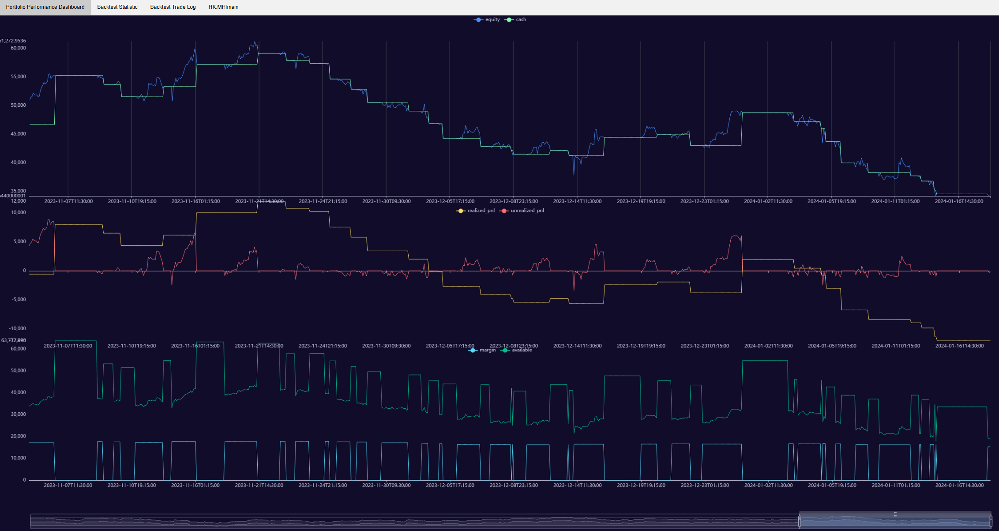

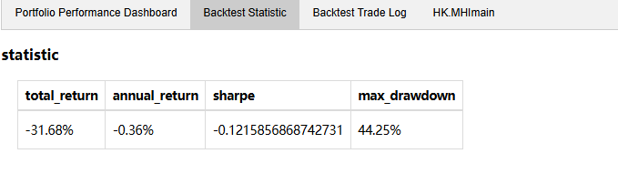

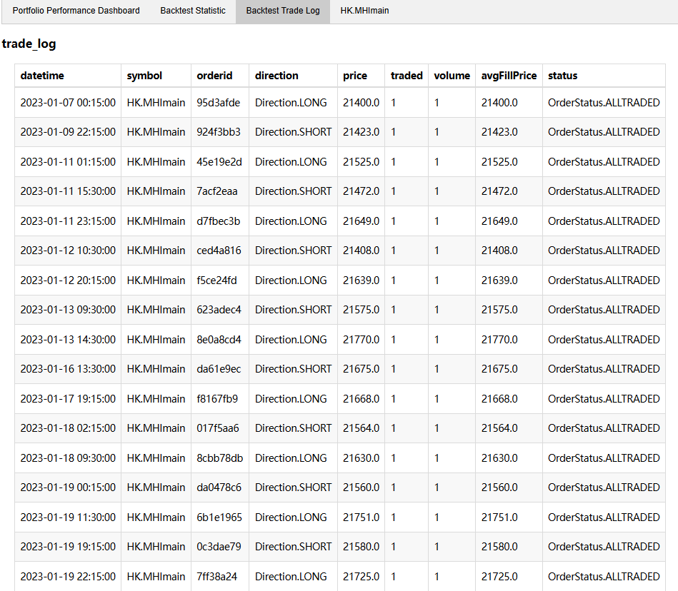

当plot_symbol_detail开启时，会根据不同的symbol增加其交易、持仓和k线对应的详细数据页。这里就设计到交易数据的聚合与分组。

例如margin、equity等数据都可以直接引用这里不做多的描述，但是对于分资产的交易数据和持仓数据就必须进行处理。时间线只有一个(可以理解为在1.3.1.2中run只是根据一张大的dataframe包含不同周期和symbol进行推进)，在交易多个资产时，回测必须将每一个symbol的交易、持仓和它的k线进行匹配。例如下图这样，画出来HK.MHImain的持仓、交易情况与k线


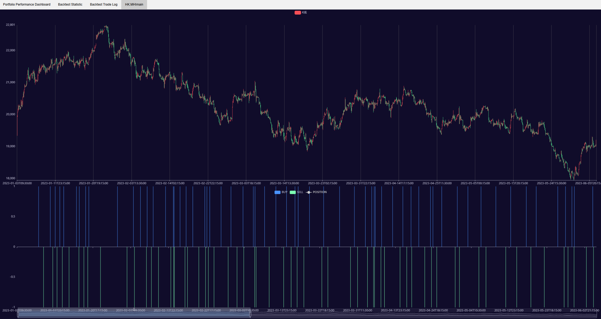

假设daily_update_interval是2h，最终图片画出来的也是2h的频率。那么假设9:31,9:59,10:30,11:20分别交易+1、-1、+1、-1数量资产，那么对于9:30-11:30来说，就是买入了2手，又卖出了2手。通过这个我们可以判断这个区间内的交易情况。要实现上述场景，就必须将买入和卖出分开，同时9:31,9:59,10:30,11:20划分在不同的区间内(例如这里他们都属于9：30-11:30)

```
        # 准备数据
        for symbol, info in contract_log.items():
            spec_contract_detail = pd.DataFrame.from_dict(info, orient="index")
            spec_contract_detail.index = pd.to_datetime(spec_contract_detail.index)

            spec_trade_log = trade_log[trade_log["symbol"] == symbol].copy()
            spec_trade_log['datetime_fit'] = pd.cut(spec_trade_log['datetime'], bins=spec_contract_detail.index,
                                                    right=False, labels=spec_contract_detail.index[0:-1],
                                                    ordered=False)

            buy_log = spec_trade_log[spec_trade_log["direction"] == Direction.LONG] \
                .groupby('datetime_fit', observed=False)['volume'].sum()

            sell_log = spec_trade_log[spec_trade_log["direction"] == Direction.SHORT] \
                .groupby('datetime_fit', observed=False)['volume'].sum()

            spec_contract_detail['buy_log'] = buy_log
            spec_contract_detail['sell_log'] = sell_log
            plot_data[symbol] = spec_contract_detail
```


**2）指标计算**

```
    def calculate_statistics(self):
        df = pd.DataFrame.from_dict(self.account_daily, orient="index")
        total_return = (df["equity"].iloc[-1] / self.initial_cash) - 1
        daily_return = df["equity"].pct_change().dropna()
        sharpe = (daily_return.mean() - self.risk_free / self.annual_days) / \
                 (daily_return.std() + 1e-9) * np.sqrt(self.annual_days)
        max_drawdown = self._calc_max_drawdown(df["equity"])
        annual_return = ((1 + daily_return.mean()) ** self.annual_days) - 1

        print("\n===== 回测绩效 =====")
        print(f"初始资金: {self.initial_cash:.2f}")
        print(f"结束资金: {df['equity'].iloc[-1]:.2f}")
        print(f"总收益率: {total_return * 100:.2f}%")
        print(f"年化收益率: {annual_return * 100:.2f}%")
        print(f"最大回撤: {max_drawdown * 100:.2f}%")
        print(f"Sharpe Ratio: {sharpe:.2f}")
        return {"total_return": f"{total_return * 100:.2f}%", "annual_return": f"{annual_return * 100:.2f}%",
                "sharpe": sharpe, "max_drawdown": f"{max_drawdown * 100:.2f}%"}

```


## 1.4 BACKTEST EVENT ENGINE

普通的事件引擎机构图如下，在订阅后，当Event Engine收到事件会同步推送给不同消费者。

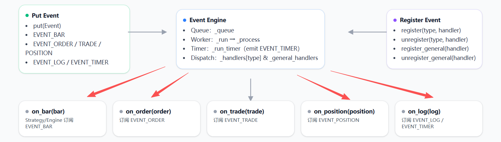

由于是同步的，Event Engine并不会等待事件消费完再推送另一个事件。在实盘中，这提升了运行效率，但是在回测中这会引发问题。比如在回测中，由于运行速度特别快，比如on bar推送了一个2h的bar，传入到strategy时strategy还未消费完这根bar，下一根2h的bar又会传入。这在实盘中，2h并不会接连传入并不存在这个问题，这也是vnpy在设计时，对于回测部分没有采取事件引擎，但这也造成strategy无法和Trade Engine或者BACKTEST ENGINE真正解耦。

为了解决这个问题，这个框架增加了BACKTEST EVENT ENGINE。其他部分与普通的事件引擎一致，但是在消费时它从同步改成了单线程，每一次当事件被消费后，才会推动下一个事件。也就是on bar运行完后，才会推动on trade等等。

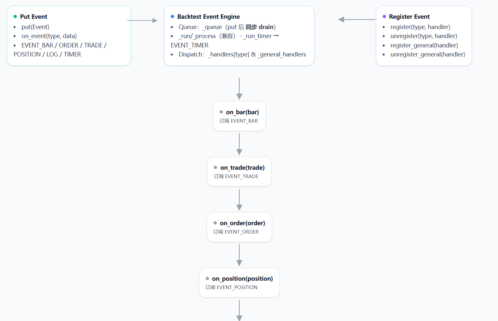


关键区别在 `put` 方法里：

**BacktestEventEngine**

```
def put(self, event: Event) -> None:
    self._queue.put(event)
    while not self._queue.empty():
        e = self._queue.get()
        self._process(e)
```

- 除了把事件放进队列，还会**立即把队列里的事件取出并处理完**。
- 也就是说，即使 `_run` 线程在后台运行，这里也会“同步消费”事件。
- 这种设计会导致：调用 `put` 的线程也会参与事件处理，相当于是**单线程消费为主**。

**EventEngine**

```
def put(self, event: Event) -> None:
    self._queue.put(event)
```

- 这里只是把事件放进队列，不会立即处理。
- 真正的消费逻辑全部由 `_thread` 线程里的 `_run` 完成。
- 所以 `put` 调用是**异步的**，不会阻塞，事件处理由后台线程并发执行，属于**多线程消费**。


## 1.5 回测模块示例


```
from coreutils.logger import get_logger
from coreutils.constant import Interval, Exchange, Direction, OrderType, OrderStatus, LogLevel
from backtest.backtest_event_engine import Event, BacktestEventEngine
from backtest.backtest_engine import BacktestEngine
import pandas as pd
from strategy.example.macd import MACDStrategy

# ==============1.读取数据=================
df = pd.read_csv('/autotrade/strategy/example/1h_2023.csv')
# 数据列必须有'symbol', 'open', 'high', 'low', 'close', 'datetime', 'ktype'
df['ktype'] = Interval.K_1H
df['symbol'] = 'HK.MHImain'
df = df[['symbol', 'open', 'high', 'low', 'close', 'trade_date', 'ktype']]
df.columns = ['symbol', 'open', 'high', 'low', 'close', 'datetime', 'ktype']

# ==============2.日志系统=================
logger = get_logger(name='backtest', logfile='macd.log')
# ==============3.回测事件引擎=================
# 回测里面事件引擎必须用BacktestEventEngine
event_engine = BacktestEventEngine()
event_engine.start()
# ==============4.导入策略=================
strategy = MACDStrategy(event_engine=event_engine, symbol="HK.MHImain", work_interval=Interval.K_1H)
strategy.initialize()
# ==============5.回测引擎=================
engine = BacktestEngine(event_engine=event_engine, logger=logger, initial_cash=50000,
                        daily_update_interval=Interval.K_1H)
# 导入之前的数据
engine.load_data(data_list=[df])
engine.set_contracts(contract_params={
    "HK.MHImain": {"size": 10, "margin_rate": 0.1, "long_rate": 0.00006, "short_rate": 0.00006}
})
# 启动回测引擎
engine.run()
engine.performance_plot(plot_path='macd.html')
engine.get_trade_log_df().to_csv(f'macd_tradelog.csv')
engine.get_account_daily_df().to_csv(f'macd_account.csv')
```


# S 2 绘图模块

绘图模块目前只涉及用pyechart绘制k线、折线等，后续可能根据需求再增加。现在只针对这一部分进行介绍。

**kline_dashboard**

在用pyechart时，如果想将不同的指标添加到k线图上或者增加副图，每次都需要重写编写Grid文件，十分麻烦。因此这里采取组件管理的思想，定义一个ChartManager，在这个基础上将不同的图组合在一起。

功能概览

- 主图：K线（可叠加均线、布林带等任意 `Line/Bar`）
- 副图：任意数量的 `Line/Bar` 指标区，自动**纵向排布**并与主图联动
- 全局联动与缩放：`DataZoom(inside/slider)` 统一控制所有 x 轴；十字光标联动
- 主题/尺寸：可设置主题、宽高、主/副图高度占比与图间间距

------

组件函数（基础图元）

**`create_kline(df: pd.DataFrame) -> Kline`**

- 输入：必须包含列 `{"date","open","high","low","close"}`
- 输出：`pyecharts.charts.Kline` 主图对象
- 校验：类型与必需列不满足时抛出异常

**`create_line(x_data, y_data, x_label=None, y_label=None) -> Line`**

- 输入：`x_data/y_data` 支持 `list` 或 `pd.Series`
- 输出：不带点的折线（隐藏 label，适合叠加为技术指标）

**`create_bar(x_data, y_data, x_label=None, y_label=None) -> Bar`**

- 输入：`list` 或 `pd.Series`
- 输出：柱状图（默认隐藏 label，适合成交量/MACD 柱）

**`create_table(df: pd.DataFrame, title='') -> Table`**

- 简单表格组件（统计/日志等），自动用列名与行值生成表。

------

布局管理器 `ChartManager`

> 负责拼装“主图 + 叠加图层 + 多个副图”的**完整页面**。

成员

- `main_chart`: 主图对象（通常为 `Kline`）
- `overlap_charts`: 叠加到主图的图层列表（`Line/Bar` 指标）
- `sub_charts`: 副图列表（若干 `Line/Bar`）
- `width/height/theme`: 画布尺寸与主题
- `datazoom_range`: 初始缩放区间（%），默认 `(80, 100)`
- `main_height`: 主图高度占比（%），默认 `50`
- `vgap_pct`: 副图间垂直间距百分比，默认 `6`

主要方法

- `set_main(chart, height=50)`: 设定主图与主图高度占比
- `add_to_main(chart)`: 向主图**叠加**一条/多条指标
- `add_sub_chart(chart)`: 追加一个副图区（自动纵向排布）
- `set_datazoom_range(start=80, end=100)`: 设置初始可视区
- `output() -> Grid`: 返回最终 `Grid` 组合（可嵌入页面/Notebook）
- `render(path="kline.html")`: 直接渲染为 HTML

组合细节（内部 `_compose()`）

- **联动**：所有图共享十字光标（`axispointer.link = "all"`）
- **缩放**：`inside + slider` 两个 DataZoom，一次控制**所有 x 轴**
- **自适应 y 轴**：`is_scale=True`，`min_="dataMin" / max_="dataMax"`
- **轴绑定**：主图 `xaxis_index=0`，副图从 `1` 递增；在添加到 `Grid` 前强制绑定，保证多图联动正确


示例

```
    import pandas as pd
    import numpy as np
    from pyecharts.globals import ThemeType


    # ===============================
    # 数据准备
    def cal_sma(n, data):
        return np.convolve(data, np.ones(n) / n, mode='valid').tolist() + [0] * (n - 1)


    def cal_bbands(data):
        mid = np.array(cal_sma(20, data))
        std = np.std(data)
        up = mid + 2 * std
        down = mid - 2 * std
        return {
            "bbands_up": up.tolist(),
            "bbands_mid": mid.tolist(),
            "bbands_down": down.tolist(),
        }


    # 创建假数据
    def generate_fake_kline_data(n=100):
        np.random.seed(42)
        base_price = 100
        dates = pd.date_range(end=pd.Timestamp.today(), periods=n).strftime('%Y-%m-%d').tolist()
        open_prices = np.random.normal(loc=base_price, scale=2, size=n)
        close_prices = open_prices + np.random.normal(loc=0, scale=2, size=n)
        high_prices = np.maximum(open_prices, close_prices) + np.random.rand(n)
        low_prices = np.minimum(open_prices, close_prices) - np.random.rand(n)
        volume = np.random.randint(1000, 5000, size=n)

        df = pd.DataFrame({
            "date": dates,
            "open": open_prices,
            "close": close_prices,
            "high": high_prices,
            "low": low_prices,
            "vol": volume
        })
        return df


    # 创建测试数据
    df = generate_fake_kline_data()
    df['date'] = pd.to_datetime(df['date'])
    sma10 = cal_sma(10, df["close"])
    sma15 = cal_sma(15, df["close"])
    date = df["date"]
    macd = np.random.randn(len(df['close'])).tolist()
    bar_data = df[['date']].copy()
    bar_data['macd'] = macd
    bar_data.iloc[0:5] = np.nan

    # ===============================
    # 主图
    kline = create_kline(df)
    # 叠加主图的线
    sma10_p = create_line(df['date'], sma10, y_label='sma10')
    sma15_p = create_line(df['date'], sma15, y_label='sma15')
    # 副图（MACD柱状图）
    macd_bar = create_bar(bar_data['date'], bar_data['macd'], y_label='macd')
    # 使用 ChartManager 构建图表
    manager = ChartManager(theme=ThemeType.DARK)
    manager.set_main(kline)
    manager.add_to_main(sma10_p)
    manager.add_to_main(sma15_p)
    manager.add_sub_chart(macd_bar)
    manager.set_datazoom_range(70, 100)
    manager.render("example_chart.html")

    print("示例图已生成：example_chart.html")

    k_line = ChartManager(theme=ThemeType.DARK)
    k_line.set_main(kline)
    k_line.set_datazoom_range(70, 100)
    k_line.add_sub_chart(macd_bar)

    sma_p = sma10_p.overlap(sma15_p)
    sma = ChartManager(theme=ThemeType.DARK)
    sma.set_main(sma_p)
    sma.set_datazoom_range(70, 100)

    # tab用于分页
    basic_plot = Tab()
    basic_plot.add(k_line.output(), "equity_plot")
    basic_plot.add(sma.output(), "profit_plot")
    basic_plot.render("basic_plot.html")
```

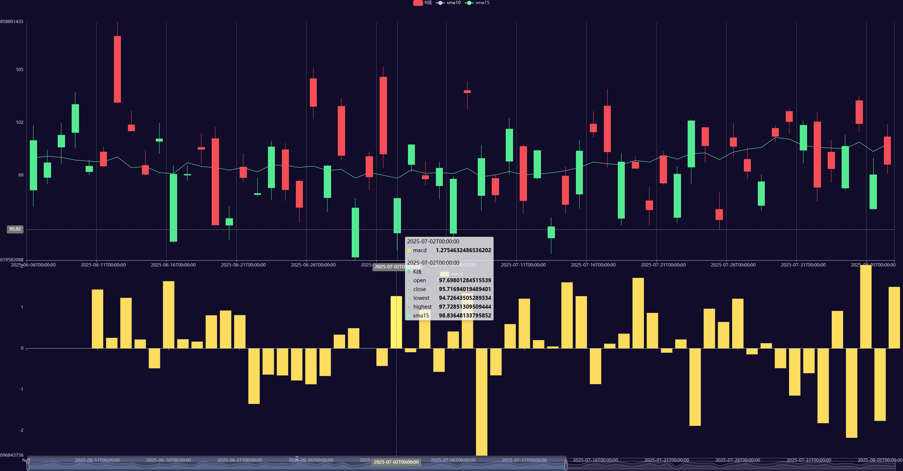

# S 3 引擎模块(/autotrade/engine)

## 3.1 事件引擎(event_engine.py)

事件引擎是一个**生产者-消费者**模型的回调分发器——各处把 `Event(type, data)` 丢进线程安全队列，后台**Worker 线程**不断取出并按事件类型把它们**回调**给已注册的处理函数；同时 **Timer 线程**按固定间隔自动产生日历事件（`eTimer`）。

### 运行逻辑（流程一看就懂）

1. **注册订阅**：用 `register(type, handler)` 订阅某类事件；用 `register_general(handler)` 订阅**所有**事件（常用于日志/监控）。
2. **启动引擎**：`start()` 同时启动两个后台线程：
   - `_run()`：从 `_queue.get(timeout=1)` 取出事件 → 调用 `_process(event)`
   - `_run_timer()`：`sleep(interval)` → 产生日历事件 `Event(EVENT_TIMER)` → `put()`
3. **投递事件**：业务侧或策略侧调用 `put(Event(type, data))` 把事件压入 `_queue`。
4. **事件分发**：`_process(event)` 先把事件派发给 **该类型**的全部处理函数 `self._handlers[type]`，再广播给 **general** 处理器 `self._general_handlers`。
5. **停止引擎**：`stop()` 将 `_active=False`，并 `join()` 两个线程，安全退出。

> 事件对象很轻量：`Event(type: str, data: Any)`；类型常量如 `EVENT_BAR/TRADE/ORDER/POSITION/LOG` 等都在文件头集中定义，便于统一管理。


**示例**

```
from engine.event_engine import EventEngine, Event,EVENT_BAR
from coreutils.object import BarData

def print_bar(event):
    bar = event.data
    print(bar)

event_engine = EventEngine()
event_engine.start()
event_engine.register(EVENT_BAR, print_bar)
event_engine.put(Event(EVENT_BAR,{'close':1}))
```


## 3.2 OMS引擎(oms_engine.py)

OMS引擎是通过注册事件来与TRADE ENGINE、GATEWAY等沟通，其是负责维护订单生命流程。

### **3.2.1 数据缓存**

内存里维护“**最后一次回报为准**（last write wins）”的快照字典：

- `ticks: { vt_symbol → TickData }`
   最新 Tick，键是**合约唯一键** `vt_symbol`（通常 `symbol.exchange`）。
- `orders: { vt_orderid → OrderData }`
   最新订单快照，键是 `vt_orderid`（全局唯一的订单ID）。
   同时维护：
  - `active_orders: { vt_orderid → OrderData }`
     仅保存**仍处于活动态**的订单；依据 `order.is_active()` 自动增删：
    - 活动（可成交/挂单中等）→ 放入/更新 `active_orders`
    - 终态（已成/已撤/拒单等）→ 从 `active_orders` 移除
- `trades: { vt_tradeid → TradeData }`
   成交回报按 `vt_tradeid` 记录最新一条（如果同ID多次更新则覆盖）。
- `positions: { symbol → PositionData }`
   最新持仓，键使用**交易标的** `symbol`（注意：这里是 `symbol`，不是 `vt_symbol`）。
- `accounts: { vt_accountid → AccountData }`
   最新账户维度快照（资金、权益等）。
- `contracts: { vt_symbol → ContractData }`
   合约静态信息（乘数、最小变动等），按 `vt_symbol` 索引。
- `quotes: { vt_quoteid → QuoteData }`
   双边报价（如期权/做市）快照，键是 `vt_quoteid`。
   同时维护：
  - `active_quotes: { vt_quoteid → QuoteData }`
     仅保存**仍活动**的报价；依据 `quote.is_active()` 自动增删。

### **3.2.2 事件注册 & 处理**

- 初始化时调用 `register_event()`，把本类的处理函数注册到 `EventEngine`：
   `EVENT_TICK / EVENT_ORDER / EVENT_TRADE / EVENT_POSITION / EVENT_ACCOUNT / EVENT_CONTRACT / EVENT_QUOTE`
- 事件到达时，每个 `process_*_event` 都做两件事：
  1. **解析 `event.data`** 为对应的数据对象（如 `OrderData`、`TradeData` 等）；
  2. **更新缓存**：把对象写入相应字典；若是订单/报价，还要依据 `is_active()` 维护 `active_orders/active_quotes`。

> 简单说：**事件进来 → 写入/更新快照 →（若需）维护活动集合**。这样 OMS 始终持有“全市场/全账户”的最新视图，上层模块（策略、风控、回测记录器等）只负责**读**。


## 3.3 交易引擎 (trade_engine.py)

### 3.3.1 CTA ENGINE(TRADE ENGINE)

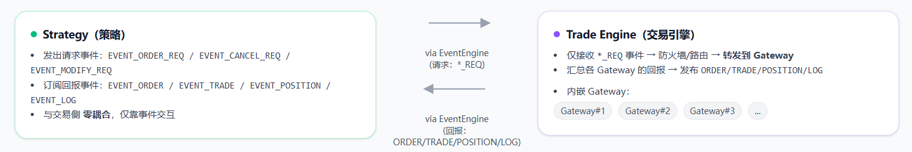

TRADE ENGINE主要负责几个功能：统一GATEWAY，接收并转发各种订单请求；处理部分CMD命令，充当防火层拦截订单。TRADE ENGINE只和GATEWAY直接接触，与其他模块无论是策略、OMS、消息中继BUS ADAPTER都是通过事件引擎。

#### 3.3.1.1 处理订单请求

由于目前只涉及FUTU GATEWAY，但是后续如果增加GATEWAY需要在这一层进行统一，比如根据不同的symbol发送给不同的GATEWAY。接受订单的方式为事件推送

```
    # ---- 注册所有事件（行情/订单/持仓/命令 + 三个“请求事件”） ----
    def _register(self):
        self.ee.register(EVENT_COMMAND, self._on_cmd)

        self.ee.register(EVENT_ORDER_REQ, self._on_order_req)
        self.ee.register(EVENT_CANCEL_REQ, self._on_cancel_req)
        self.ee.register(EVENT_MODIFY_REQ, self._on_modify_req)
        
    # ---- 三个“请求事件”入口：统一防火墙+下发 ----
    def _on_order_req(self, e: Event):
        # 如果引擎暂停mute request
        if not self.active:
            return
        req: OrderRequest = e.data
        # mute 防火墙（策略/外部模块均受控），内部单白名单放行
        if req.symbol in self._muted_symbols and not self._is_internal_ref(req.reference):
            self.logger.warning(f"[FW] send blocked: {req.symbol} ref={req.reference}")
            return
        self.gateway.send_order(req)

    def _on_cancel_req(self, e: Event):
        # 如果引擎暂停mute request
        if not self.active:
            return
        req: CancelRequest = e.data
        # 撤单默认不拦，避免清场被卡；如需风控可在此加策略
        self.gateway.cancel_order(req)

    def _on_modify_req(self, e: Event):
        # 如果引擎暂停mute request
        if not self.active:
            return
        req: ModifyRequest = e.data
        # ModifyRequest 通常没有 reference，mute 期间一律拦截（简单稳妥）
        if req.symbol in self._muted_symbols:
            self.logger.warning(f"[FW] modify blocked: {req.symbol} {req.orderid}")
            return
        self.gateway.modify_order(req)
```

在接受到订单REQUEST后ENGINE会直接发送给GATEWAY,后续回调由GATEWAY通过事件引擎推送，所以这是一种单向联系


#### 3.3.1.2 拦截订单

当TRADE ENGINE收到下面的命令时会设置防火墙拦截订单

```
CMD_ENGINE_MUTE = "engine.mute"  # data: {"symbols":[...], "on":True/False, "reason":""}
CMD_ENGINE_SWITCH = "engine.switch"  # data: {"on":True/False}
```

**1）CMD_ENGINE_SWITCH**

当这个命令开启时，self.active会变为False，TRADE ENGINE会拦截所有的订单请求，包括send、modify和cancel。这个命令是为了暂停交易引擎，主要是在后续APP中想要暂停引擎有用。

**2) CMD_ENGINE_MUTE**

这个命令会对涉及的symbol拦截**发送订单**和**修改订单**请求(注意不包括取消订单请求)。设计这一功能的初衷是在构思移仓模块时，一开始想要把移仓模块加入TRADE ENGINE，然后移仓时MUTE涉及主力合约变动的symbol订单（避免一边移仓策略一边下单）。后面为了极致的解耦将这一功能拆开只保留mute对于symbol的功能，剩下的单独移到RolloverManager，这么做后续也方便开发风控模块


### 3.3.2  RolloverManager
这个模块负责处理移仓(主力合约变动事件)。由于现阶段只涉及FUTU，而FUTU支持期货的主力合约代码合约下订单所以对于这个模块没有完整的编写完成。例如EVENT_ROLLOVER在FUTU GATEWAY中并没有涉及。现在只是给出一个设计的框架和思路。


**定位**：

- 通过事件引擎完成移仓，不直连 gateway。
- 只监听/发布事件：
  - 监听：`EVENT_ROLLOVER`、`EVENT_ORDER`、`EVENT_POSITION`
  - 发布：`EVENT_ORDER_REQ`、`EVENT_CANCEL_REQ`
- 任务按 `symbol_group` 管理，单组一条任务，状态机推进；所有网关交互都走“请求事件”。

**基本约束**：

- 清场时**只撤非 ROLL 订单**（`reference` 未以 `ROLL:` 开头）。
- 发腿只**等 ACK**（订单被受理且非 `REJECTED` 即视为 OK），**不等待成交**。
- 与 OMS 解耦：仓位/订单状态从 OMS 读取与回调，不做资金/风控。

------

#### 3.3.2.1 事件契约

**入口命令（启动移仓）**

`EVENT_ROLLOVER`，data 结构：

```
{
  "symbol_group": "IF_MAIN",
  "old": "IF2409",
  "new": "IF2410",
  "mode": "hedged"   // 或 "flat"
}
```

**下发的请求**

- 撤单：`EVENT_CANCEL_REQ(CancelRequest)`（仅撤“受影响标的且非 ROLL”的活动单）
- 发单：`EVENT_ORDER_REQ(OrderRequest)`
  - `reference` 统一打标：`ROLL:{group}:{old}->{new}:{OPEN|CLOSE}`
  - 价格类型：当前实现使用 `MARKET`

**回调事件（用于推进状态机）**

- 订单：`EVENT_ORDER(OrderData)`（用于判断撤单完成、腿的 ACK/REJECT）
- 持仓：`EVENT_POSITION(PositionData)`（用于拿到旧合约净持仓与交易所）

------

#### 3.3.2.2 状态机（Task.phase）

| Phase         | 含义                                                   |
| ------------- | ------------------------------------------------------ |
| `IDLE`        | 空闲（初始默认，不直接用）                             |
| `CANCEL`      | 进入清场：发撤单（仅撤非 ROLL 活动单）                 |
| `WAIT_CANCEL` | 等待清场结果（通过 `EVENT_ORDER` 回调感知）            |
| `AWAIT_POS`   | 等待/刷新旧合约仓位（`EVENT_POSITION` 回调）           |
| `WAIT_ACKS`   | 已发腿，等待 ACK/REJECT                                |
| `DONE`        | 完成（所有需要的腿都 ACK 且未 REJECT；或确认无需发腿） |
| `FAILED`      | 失败（任一需要的腿 REJECT；或关键信息缺失）            |

> 代码里还有 `ISSUE` 枚举值，但当前实现通过 `_decide_after_clear` 直接发腿，未显式进入 `ISSUE`。

------

#### 3.3.2.3 工作流程（分步）

**0）收到命令**

- `_on_rollover` 接到 `EVENT_ROLLOVER`：
  - 若该 `symbol_group` 已有进行中的任务 → 忽略（幂等）
  - 创建 `Task`，置 `phase=CANCEL`，进入 `_advance(t)`

**1）清场非 ROLL 活动单**

- `_advance` 在 `CANCEL`：调用 `_cancel_nonroll_orders`
  - 命中范围：`{ symbol_group, old_symbol, new_symbol }`
  - 条件：订单 `is_active()` 且 `reference` **不**以 `ROLL:` 开头
  - 对每一笔发 `EVENT_CANCEL_REQ`
- 转 `WAIT_CANCEL`；若此刻**已无**非 ROLL 活动单 → 直接 `AWAIT_POS` 并 `_decide_after_clear`

**2）等待清场/仓位**

- `EVENT_ORDER` 回调（`_on_order`）：
  - 处于 `WAIT_CANCEL` 时，任何**非活动**订单都会推进检测
  - 只要遇到**非 ALLCANCELLED** 的回报，标记 `seen_non_allcancelled=True`（说明期间可能有成交）
  - 当 `_has_active_nonroll(t)==False` → 转 `AWAIT_POS`，尝试补齐 `exchange`（`_infer_ex`）
- `EVENT_POSITION` 回调（`_on_position`）：
  - 记录见到旧合约 `position`（`pos_seen=True`），补全 `exchange`
  - 若处于 `AWAIT_POS` 或“`WAIT_CANCEL` 且已无非 ROLL 活动单” → 调 `_decide_after_clear`

**3）清场后决策与发腿（核心）**

`_decide_after_clear(t)`：

- 读取 OMS 的旧合约仓位：`pos = oms.get_position(old_symbol)`
  - 若还未拿到 → `phase=AWAIT_POS`（继续等仓位回调）
- 计算净持仓：`vol, dire = _calc_net_pos(old_symbol)`（无仓返回 `0, None`）

分三类处理：

1. **未见成交**且**无旧仓** → **`DONE`**（`"all cancelled & no position"`）
2. **见过成交**但当前**无旧仓** → 继续 `AWAIT_POS`（考虑回报延迟）
3. **有旧仓** → 进入发腿：
   - 没有 `exchange` → **`DONE`**（`"no exchange"`，当前实现直接放过；可改为失败/重试）
   - 记录 `target_volume/target_direction`，清空 ACK 状态
   - **hedged 模式**：
     - 同量同向在**新合约开仓**（`OPEN`）
     - 同时在**旧合约平仓**（`CLOSE`）
   - **flat 模式**：
     - 先**旧合约平仓**，再**新合约开仓**
   - 发两条 `EVENT_ORDER_REQ`（`MARKET`），`reference` 分别带 `:OPEN` / `:CLOSE`
   - `phase=WAIT_ACKS`，进入 `_check_finish`

> `OPEN` 方向：与旧仓方向一致；`CLOSE` 方向：旧仓方向的反向（多 → 卖，空 → 买）。

**4）等待 ACK/REJECT → 结束**

- `EVENT_ORDER` 回调内，根据 `reference` 落 `open_acked/close_acked` 与 `open_rejected/close_rejected`
- `_check_finish` 判定：
  - 任一**需要**的腿被 `REJECTED` → **`FAILED`**（`"leg rejected"`）
  - 两腿（或单腿）**都已 ACK 且未 REJECT** → **`DONE`**
  - 注：不等待 `TRADE` 成交回报

------

**关键细节**

- **只撤非 ROLL**：`_cancel_nonroll_orders()` 通过 `reference` 前缀过滤，避免误撤迁移中的腿。
- **活动单检测**：`_has_active_nonroll()` 决定是否可从 `WAIT_CANCEL` 提前进入 `AWAIT_POS`。
- **净持仓**：`_calc_net_pos()` 从 OMS 取 `PositionData` 的 `volume/direction`（无仓返回 `0,None`）。
- **交易所推断**：`_infer_ex()` 先看旧合约的 `position.exchange`，再看新合约；都没有则 `None`。
- **幂等与复用**：同一 `symbol_group` 同时只跑一条任务；重复命令在进行中会被忽略。
- **引用打标**：`ROLL:{group}:{old}->{new}:{OPEN|CLOSE}` —— 便于在回调中精确识别腿与结果。

------

**模式说明**

- **hedged**：并发开新 + 平旧，尽量无缝对冲敞口（当前用市价单）。
- **flat**：先平旧，再开新，更保守，期间有空窗敞口。


### 3.3.3 交易引擎扩展思路

在3.3.2中提到了在最早的版本中，我尝试在CTAENGINE本身上增加一个RolloverManager，在设计S 6 通信模块(ENGINE与APP通信)时，也曾把通信和CTAENGINE糅合在一起。但事实上由于采用了事件引擎，TRADE ENGINE理论上可以与除GATEWAY的其他模块保持独立，这些扩展都应该和TRADE ENGINE解耦。

在后续针对TRADE ENGINE的扩展中，设计思路因和RolloverManager和EngineBusAdapter一样做到解耦，尽量不要改动或者最小改动TRADE ENGINE。通过增加事件类型，充分发挥事件引擎的作用。其次是TRADE ENGINE应该单纯发挥发送订单与GATEWAY沟通的职责，剩下的应单独拆成一个模块，单独运行。

# S 4 策略模块 

关于策略模块目前采用的是

- 市场层：负责处理行情、订单持仓回报
- 目标层：根据市场层或者其他生成订单目标
- 协调层：将目标与现实对齐，生成计划
- 计划层：执行协调层产出的计划

后续可以根据需要增加风控层或者其他。编写策略时尽量继承strategy里面的strategybase，通过重写类方法来规范策略的编写。


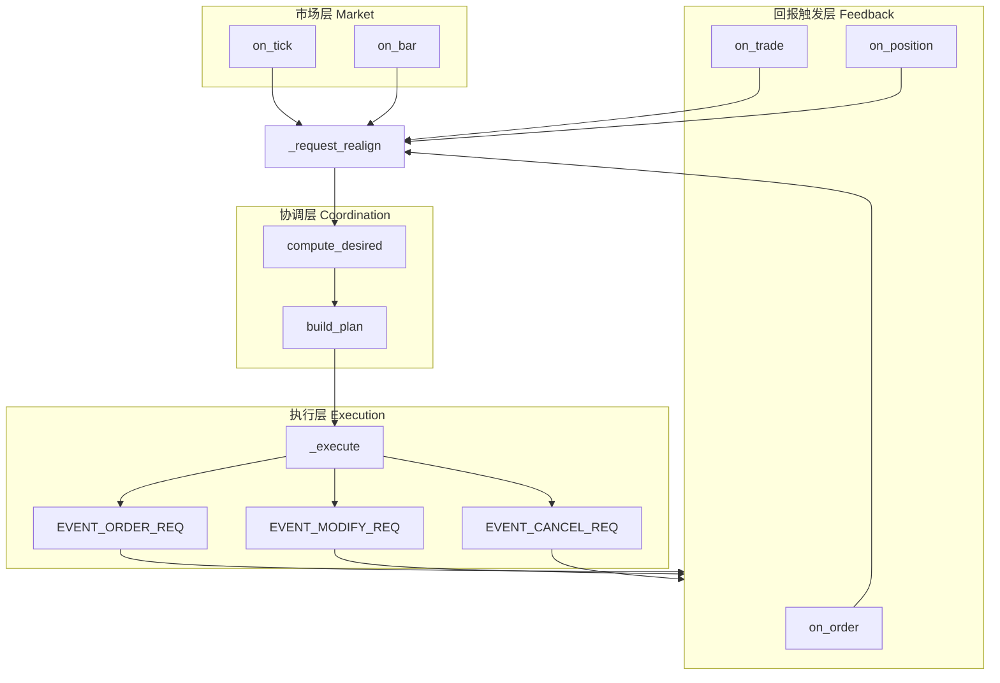


假设现在有一个策略，策略的内容

1. MACD出现金叉时买入
2. MACD出现死叉时卖出

下面将根据这个策略讲述后续内容


## 4.1 策略初始化

正如在交易引擎和回测引擎里面说的，策略与引擎之间的沟通是通过事件引擎沟通，因此策略模块要针对事件进行订阅.

```
    def initialize(self):
       self.register_event()

    # ===================== Engine 直接回调：只入队 =====================
    def register_event(self):
        """注册事件监听"""
        self.me.register(EVENT_TICK, self.process_tick_event)
        self.me.register(EVENT_ORDER, self.process_order_event)
        self.me.register(EVENT_TRADE, self.process_trade_event)
        self.me.register(EVENT_BAR, self.process_bar_event)
      	self.me.register(EVENT_POSITION, self.process_position_event)


```

在初始化中也可以加上一些数据或者读取之前的订单情况来冷启动。

## 4.2  市场层

### 4.1 .1 on bar\on tick

在这一层处理行情数据，比如计算指标等。on bar、on tick是统一接口，如果是不同的周期频率，比如同时有15m和30m，可以在on bar中增加判断并交由不同函数执行

```
    def on_bar(self, bar: BarData):
        if bar.interval == Interval.K_1M:
            self.on_1m(bar)
        elif bar.interval == Interval.K_15M:
            self.on_15m(bar)
        elif bar.interval == Interval.K_30M:
            self.on_30m(bar)
```


在MACD策略中，我们在on bar中生成交易信号

- 15m K 线到达 → 维护并更新 `EMA12/EMA26/DEA`，计算 `DIF/DEA`
- 识别是否发生**由下向上穿越**（记录上一根的 `DIF-DEA` 符号，检测符号翻转）
- 如果金叉：在策略状态里写入 `target_pos["IF"] = +1`；如果死叉：`target_pos["IF"] = 0`
- `self._request_realign()` 触发对账

```
    def on_bar(self, bar: BarData):
        self.data_time = bar.datetime
        # 仅在指定合约与周期上工作
        if bar.symbol != self.symbol or bar.interval != self.work_interval:
            return

        close = float(bar.close_price)
        self._last_close = close
        self._closes.append(close)

        # 使用 talib.MACD 计算
        if len(self._closes) < self.slow + self.signal + 1:
            return  # 数据不足

        arr = np.asarray(self._closes, dtype=float)
        macd, macd_signal, _ = MACD(
            arr,
            fastperiod=self.fast,
            slowperiod=self.slow,
            signalperiod=self.signal
        )

        # 需要至少两根有效值用于判断穿越
        if np.isnan(macd[-1]) or np.isnan(macd_signal[-1]) or np.isnan(macd[-2]) or np.isnan(macd_signal[-2]):
            return

        prev_diff = macd[-2] - macd_signal[-2]
        curr_diff = macd[-1] - macd_signal[-1]

        golden = (prev_diff <= 0) and (curr_diff > 0)  # 金叉
        dead = (prev_diff >= 0) and (curr_diff < 0)  # 死叉

        if golden and self.position.volume == 0:
            self._pending_signal = "buy"
            self.write_log(LogData(msg=f"[MACD] {self.data_time} 金叉 -> BUY @ {close}"))
            self._request_realign()

        if dead and self.position.volume > 0:
            self._pending_signal = "sell"
            self.write_log(LogData(msg=f"[MACD] {self.data_time} 死叉 -> SELL @ {close}"))
            self._request_realign()

```


### 4.1.2 on order\on trade\on position

这一层负责处理订单回报，在这个过程中根据订单回报状态可以调用一次目标层或者协调层。例如开仓以后希望里面挂一个条件止损订单，可以在on position中加入self._request_realign()

------

## 4.3 目标层

**职责**：根据最新特征与风控，产出**目标持仓/目标委托**，与代码里的 `TargetOrder` 对齐。
 **对应函数**：`_compute_desired_entry()` → `Dict[str, TargetOrder]`

MACD策略中根据不同信号和持仓生成不同的目标订单

- 读取上一步写下的 `target_pos`，形成目标：
  - 若目标是**仓位**，可转换为**订单意图**：
    - 当前仓位 `pos` 来自 OMS（或你在 `on_position` 里缓存）
    - `delta = target - pos`
    - `delta > 0` → 生成 `TargetOrder(direction=LONG, volume=delta, type=MARKET)`
    - `delta < 0` → 生成 `TargetOrder(direction=SHORT, volume=abs(delta), type=MARKET)`
- 返回 `{symbol: TargetOrder(...)}`

在实际中，还可以生成空目标然后交由协调层对齐。例如遇到夜盘时所有目标都为空，然后协调层根据现实订单状况发出计划

```
    def _compute_desired_entry(self) -> Dict[str, "TargetOrder"]:
        targets: Dict[str, "TargetOrder"] = {}
        if self._pending_signal is None or self._last_close is None:
            return targets

        px = float(self._last_close)

        if self._pending_signal == "buy" and self.position.volume == 0:
            targets["entry"] = TargetOrder(
                symbol=self.symbol,
                reference=f"{self.data_time}entry",
                direction=Direction.LONG,
                price=px,
                trigger_price=px,
                volume=self.volume,
                type_=OrderType.MARKET,  # 简化：市价单
            )

        elif self._pending_signal == "sell" and self.position.volume > 0:
            # 平掉全部多头
            targets["close"] = TargetOrder(
                symbol=self.symbol,
                reference=f"{self.data_time}close",
                direction=Direction.SHORT,
                price=px,
                trigger_price=px,
                volume=self.position.volume,
                type_=OrderType.MARKET,
            )

        return targets

```


------

## 4.4  协调层

**职责**：把**目标**与**现实**对齐，生成**行动列表**（下发请求而非直接调用网关）。
 **对应函数**：`_build_plan()` → `List[Tuple[action, Request]]`，其中：

- `action ∈ {"place","modify","cancel"}`
- `Request ∈ {OrderRequest, ModifyRequest, CancelRequest}`

核心逻辑：

1.**取现实状态**：

- 由 `on_order/on_trade` 累积维护的**本地订单快照**（或从 OMS 取）
- 当前**持仓**

2.比较**目标 vs 现实**：

- 若已有反向挂单 → `cancel` 它们
- 若需要买入且没有等价挂单 → `place` 一个 `OrderRequest(MARKET, LONG, volume=delta)`
- 若已有一个限价单但偏离理想价格/数量 → `modify` 或 `cancel+place`

3.得到 `plan = [("cancel", CancelRequest(...)), ("place", OrderRequest(...)), ...]`

```
    def _build_plan(self) -> List[Tuple[str, OrderRequest]]:
        plan: List[Tuple[str, OrderRequest]] = []

        desired_entry = self._compute_desired_entry()
        for _, tgt in desired_entry.items():
            req = OrderRequest(
                symbol=self.symbol,
                exchange=self.exchange,
                direction=tgt.direction,
                type=tgt.type,
                price=tgt.price,
                trigger_price=tgt.trigger_price,
                volume=abs(tgt.volume),
                reference=tgt.reference,
            )
            plan.append(("place", req))

        # 消费掉本轮信号
        self._pending_signal = None
        return plan
```

------

## 4.5 执行层

**职责**：按计划逐项下发请求（事件），不阻塞。
 **对应函数**：`_execute(plan)`：

- `place` → `EVENT_ORDER_REQ(OrderRequest)`
- `modify` → `EVENT_MODIFY_REQ(ModifyRequest)`
- `cancel` → `EVENT_CANCEL_REQ(CancelRequest)`

注意点：

- **不直接关心回报**，订单/成交回报在**市场层**的 `on_order/on_trade` 进入，再次触发对账，形成闭环。
- 若需要**节流/重试**，可在 `_execute` 前加限频过滤、失败缓存等。

在MACD策略中

```
    def _execute(self, plan: List[Tuple[str, ModifyRequest | OrderRequest | CancelRequest]]):
        for act, req in plan:
            if act == "place":
                self.me.put(Event(EVENT_ORDER_REQ, req))
            elif act == "modify":
                self.me.put(Event(EVENT_MODIFY_REQ, req))
            elif act == "cancel":
                self.me.put(Event(EVENT_CANCEL_REQ, req))
```

- 依次 `self.me.put(Event(EVENT_..._REQ, req))` 下发
- 不等待成交；成交/订单状态回报会回到 `on_order/on_trade`，再次触发**对账**
- 这样就完成了一次**闭环**：金叉→目标→对账计划→执行→回报→对账…（直到一致）


# S 5 GATEWAY(/autotrade/gateway/)

## 5.1 GATEWAY BASE

**Gateway** 是策略/引擎与外部交易系统（券商、交易所、撮合后端）之间的**适配层**。
 它把外部世界的行情与回报**标准化**为框架事件（`EVENT_*`），并把框架内的下单/撤单等**请求**转换成实际 API 调用。

------

**角色与职责**

- **连接管理**：`connect()` / `close()`，自动重连、首轮快照查询（合约、账户、持仓、历史订单与成交）。
- **行情订阅**：`subscribe()` 下发订阅；收到行情后用 `on_tick()` 推送事件。
- **交易指令**：`send_order()`、`cancel_order()`、（可选）`modify_order()`、双边报价 `send_quote()/cancel_quote()`。
- **状态查询**：`query_account()`、`query_position()`、（可选）`query_history()`。
- **事件推送**：所有外部回报统一通过 `on_xxx()` → `on_event()` → `EventEngine.put()` 发出框架事件。

> 注意：**Gateway 不做撮合与资金逻辑**（那是撮合/OMS 的工作）；它只负责**调用外部 API 并回报**。

------

**设计约束**

- **线程安全**：所有方法可并发调用；不要在多个对象间共享可变状态。
- **非阻塞**：方法需尽快返回；耗时动作放到后台线程或异步回调里。
- **自动重连**：断线自恢复；恢复后补齐快照（`on_contract/on_account/on_position/...`）。
- **数据不可变**：推送给 `on_xxx()` 的 `*Data` 对象**不要再修改**（若有缓存，推送前 `copy` 一份）。
- **唯一 ID**：`send_order()` 内生成**网关内唯一**的 `orderid`；返回 `vt_orderid`（框架用于路由与跟踪）。

------

**事件模型（统一出口）**

BaseGateway 已封装一组 **on_xxx → 事件** 的标准出口：

- 行情：`on_tick(TickData)` → `EVENT_TICK` 与 `EVENT_TICK + vt_symbol`
- 交易：`on_trade(TradeData)` → `EVENT_TRADE` 与 `EVENT_TRADE + vt_symbol`
- 订单：`on_order(OrderData)` → `EVENT_ORDER` 与 `EVENT_ORDER + vt_orderid`
- 仓位/账户/合约/报价：`on_position` / `on_account` / `on_contract` / `on_quote`
- 日志：`on_log(LogData)`（内部也可用 `write_log(msg, level)` 便捷写入）

> 通过**通用事件** + **细分事件**（带 `vt_symbol` / `vt_orderid` 后缀），上层既能监听全量流，也能精准订阅单标的/单订单。

------


## 5.2 FUTU GATEWAY

目前我只编写了FUTU的GATEWAY，在编写FUTU GATEWAY时最麻烦的是FUTU GATEWAY并不支持条件订单(模拟交易中)。为了统一上层接口，减少回测和实盘的切换难度，这里在GATEWAY中增加条件订单的功能。

### 5.2.1 send_order

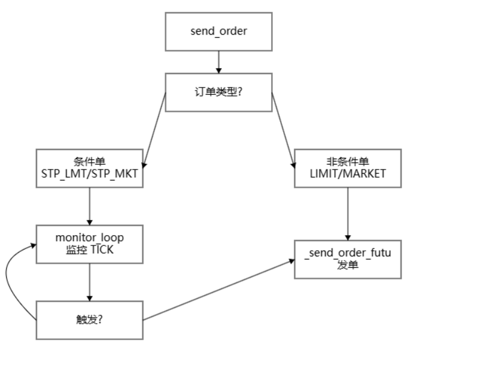

`send_order` 统一先生成**本地订单号** `order_id`；交易所返回的真实编号记为 **`broker_id`**（存放在 `OrderData.broker_orderid`）。
 二者的映射由 `_order_map: Dict[str, OrderData]` 维护，**外部只使用本地 `order_id`** 进行增删改查。

- **条件单**（`STP_LMT/STP_MKT`）
   写入 `_pending_orders`，同时更新 `_order_map` 并**订阅该标的的 TICK**。`_monitor_loop` 通过 `EVENT_TICK` 持续检查触发条件；
   一旦触发：从 `_pending_orders` 移除 → 调用 `_send_order_futu()` 真正下单 → 回填 `broker_id` →（必要时）取消订阅 TICK。
- **非条件单**（`LIMIT/MARKET`）
   直接调用 `_send_order_futu()`，回填 `broker_id`，更新 `_order_map`。

> **状态回报说明**：
>  `send_order` 的**首次状态**（如 `SUBMITTING`/`PENDING`）由网关**主动**调用 `on_order` 推送；
>  后续状态变更与成交明细**以交易所回调**（`on_order_update`）为准。
>  与之相对，**`modify`/`cancel`** 的状态**全部以回调为准**（网关不主动改状态）。


```
    def send_order(self, req):
        """
        发送订单的逻辑与取消或者修改订单的逻辑不同,发送订单的on_order由本身触发，而其他修改取消订单会等到回调
        """
        # todo 这里存在一个潜在bug,假设刚提交订单此时res_order还没由futu返回，
        #  但是立马成交,回调on_order_update早于自身的on_order触发，此时self._order_map由没有对应订单信息，就会错过这条更新，
        #  后续需要加上每次发送收到res_order后强制查询并且调用on_order
        with self._lock:
            local_id = uuid.uuid4().hex[:6]  # 生成本地订单 ID
            if req.type in [OrderType.MARKET, OrderType.LIMIT]:
                res_order = self._send_order_futu(local_id, req)
            else:
                res_order = OrderData(symbol=req.symbol, exchange=req.exchange, orderid=local_id, type=req.type,
                                      direction=req.direction, volume=req.volume, price=req.price, gateway_name='FUTU',
                                      broker_orderid=None, status=OrderStatus.PENDING, trigger_price=req.trigger_price,
                                      reference=req.reference, datetime=pd.Timestamp.now())
                self._pending_orders[local_id] = req
                # 更新tick订阅
                self._update_monitoring_tick_subscriptions(sub=True, symbol=req.symbol)
            self._order_map[res_order.orderid] = res_order
        self.on_order(res_order)
    
    def _monitor_loop(self, tick: TickData):
        """
        持续监控挂单触发条件：
        - 当当前价格满足条件时，通过 futu API 真正下单
        - 更新对应的 OrderInfo，并移除 pending 订单
        """
        current_price = tick.last_price  # 从最新数据中取价格
        for local_id, req in list(self._pending_orders.items()):
            if req.symbol != tick.symbol:  # 只检查同一个标的
                continue
            if self._should_trigger(req=req, current_price=current_price):
                req.type = OrderType.MARKET if req.type == OrderType.STP_MKT else OrderType.LIMIT
                res_order = self._send_order_futu(local_id, req)
                with self._lock:
                    del self._pending_orders[local_id]
                    self._order_map[res_order.orderid] = res_order
                    # 更新tick订阅
                    self._update_monitoring_tick_subscriptions(sub=False, symbol=req.symbol)
                self.on_order(res_order)

```


### 5.2.2  modify_order\cancel_order

modify_order和cancel_order的逻辑是一致的。他们会首先检查订单是否还停留在本地(条件订单放在`_pending_orders`)。如果订单在本地则直接修改，并且直接调用on_order返回订单状态；如果订单以及发送给futu，则会向futu发送请求，订单状态由on_order_update调用on order返回


```
def modify_order(self, req: ModifyRequest) -> None:
        # 只支持修改价格和数量
        # 如果在本地查询不到order信息
        res_order = OrderData(symbol=req.symbol, exchange=req.exchange, orderid=req.orderid, type=OrderType.MARKET,
                              direction=Direction.NET, volume=req.qty, price=req.price, gateway_name='FUTU',
                              trigger_price=req.trigger_price, status=OrderStatus.UNKNOWN, datetime=pd.Timestamp.now())
        if req.orderid not in self._order_map.keys():
            res_order.status = OrderStatus.REJECTED
        # 如果order还停留在本地
        elif req.orderid in self._pending_orders.keys():
            with self._lock:
                res_req = self._pending_orders[req.orderid]
                res_req.price = req.price
                res_req.qty = req.qty
                res_req.trigger_price = req.trigger_price
                order_id = req.orderid
                res_order = OrderData(symbol=res_req.symbol, exchange=res_req.exchange, orderid=order_id,
                                      type=res_req.type, direction=res_req.direction, volume=res_req.qty,
                                      price=res_req.price, gateway_name='FUTU', broker_orderid=None,
                                      status=OrderStatus.MODIFIED, trigger_price=res_req.trigger_price,
                                      reference=res_req.reference, datetime=pd.Timestamp.now())

        # 如果已经发送到了futu
        else:
            pre_order = self.get_order_from_map(order_id=req.orderid)
            broker_orderid = pre_order.broker_orderid
            res_order.broker_orderid = broker_orderid

            ret_unlock, res_unlock = self.trd_ctx.unlock_trade(FutuInfo.pwd_unlock)
            if ret_unlock != RET_OK:
                res_order.status = OrderStatus.REJECTED

            ret_modify_order, res_modify_order = self.trd_ctx.modify_order(
                ModifyOrderOp.NORMAL,
                res_order.broker_orderid,
                req.qty, req.price,
                trd_env=self.trd_env, aux_price=req.trigger_price
            )
            if ret_modify_order != RET_OK:
                res_order.status = OrderStatus.REJECTED
            else:
                # 当向futu提交改单且提交成功时，具体状态由on order返回
                return
        self.on_order(res_order)
    
    def cancel_order(self, req: CancelRequest):
        res_order = OrderData(symbol=req.symbol, exchange=req.exchange, orderid=req.orderid, type=OrderType.MARKET,
                              direction=Direction.NET, volume=0, price=0, gateway_name='FUTU',
                              status=OrderStatus.UNKNOWN, datetime=pd.Timestamp.now())
        if req.orderid not in self._order_map.keys():
            res_order.status = OrderStatus.REJECTED
        elif req.orderid in self._pending_orders.keys():
            with self._lock:
                res_order.reference = self._pending_orders[req.orderid].reference
                res_order.status = OrderStatus.ALLCANCELLED
                del self._pending_orders[req.orderid]
                # 更新tick订阅
                self._update_monitoring_tick_subscriptions(sub=False, symbol=req.symbol)

        else:
            pre_order = self.get_order_from_map(order_id=req.orderid)
            broker_orderid = pre_order.broker_orderid
            res_order.broker_orderid = broker_orderid

            ret_unlock, res_unlock = self.trd_ctx.unlock_trade(FutuInfo.pwd_unlock)
            if ret_unlock != RET_OK:
                res_order.status = OrderStatus.REJECTED

            # 发起撤单请求，qty 和 price 参数会被忽略（CANCEL 模式下无意义）
            ret_modify_order, res_modify_order = self.trd_ctx.modify_order(
                ModifyOrderOp.CANCEL,
                broker_orderid,
                0, 0,
                trd_env=self.trd_env
            )
            if ret_modify_order != RET_OK:
                res_order.status = OrderStatus.REJECTED
            else:
                # futu不会返回时CANCEL_ALL或者CANCEL_PART
                # 当向futu提交撤单且提交成功时，具体状态由on order返回
                return
        self.on_order(res_order)
```


### 5.2.3 on_order_update

更新订单状态是会检查broker_id是否存在`self.order_map`中，如果不存在则跳过。这样做有两个好处：一是当存在有多个策略多个TRADE ENGINE时，这能过滤掉不是由当前TRADE ENGINE发送的订单；二是send_order是，如果是非条件订单，由于futu的订单返回是异步的，所以会导致on_order_update会先于res_order返回，这会造成有broker_id却还没有order_id，相当于自然过滤掉由于send_order带来的状态更新，交由send_order返回订单状态

```
    def on_order_update(self, df):
        broker_id = f'{df['order_id']}'
        pre_order = self.get_order_from_map(broker_id=broker_id)
        # 排除不在self._order_map中的订单
        # 由于futu采用回调,发送订单时on_order_update会先于_send_order中res_order,此时self._order_map还没有映射
        # 因此刚开始提交futu的订单状态并不由on_order_update返回,而是在self._send_order中返回
        if pre_order is None:
            return
```


### 5.2.4  K线订阅

Tick数据的订阅目前是使用futu 官方的方式直接订阅

```
class FutuTickHandler(TickerHandlerBase):
    """Tick 数据回调处理器，转发给 Gateway"""

    def __init__(self, gateway):
        super().__init__()
        self.gateway = gateway

    def on_recv_rsp(self, rsp_str):
        ret_code, data = super(FutuTickHandler, self).on_recv_rsp(rsp_str)
        if ret_code == RET_OK:
            self.gateway.on_tick(data)  # 转发给 Gateway
        return ret_code, data

```

但是在bar的订阅上，由于futu的k线撮合机制比较奇怪，我的策略是在文华财经的k线基础上，所以需要将futu推送过来的1m数据按照文化财经的样式撮合成15m、30m这样。因此我还有一个模块query_mhi.py专门处理这一问题，在FUTU GATEWAY中是通过监听zmq接收query_mhi.py推送过来的数据。在实际运行中可以根据需求修改这一模块。

```
    def subscribe_bar(self, symbols: list[str], intervals: list[Interval]):
        """
        setting 参数来自 vn.py UI 或 config.json
        例如：
        {
            "symbols": ["HK.MHImian"],
            "interval": "15m"
        }
        """

        sub_kline = klinepubsub.MultiKlineSubscriber("127.0.0.1", 20250, intervals)
        sub_list = [(symbol, interval) for symbol in symbols for interval in intervals]
        for symbol, interval in sub_list:
            sub_kline.subscribe(interval, partial(self.on_kline, interval=interval))
            self.write_log(f"FutuGateway 已启动，订阅 {symbol} 的 {interval} K线",level=LogLevel.INFO)
```


# S 6 核心工具(/autotrade/coreutils)

## 6.1 logger+微信推送

### 6.1.1 logger用法

本模块是我在项目里用的一个轻量日志封装，基于 `logging`，默认**按天滚动切分**并**同时输出到文件和控制台**，并额外挂了一个 `logger.wechat(...)` 方法，便于把关键事件推送到微信（Server 酱）。

**特性**

- 按天切分：`TimedRotatingFileHandler`，**保留最近 30 天**。
- 双通道：文件 `./logs/<logfile>` + 控制台（可关闭）。
- 可配置：`name / logfile / level / to_console`。
- 微信推送：`logger.wechat(title, content=None, level="info", channel=1)`。

**用法示例**

```
from logger import get_logger

# 初始化（一次）
logger = get_logger(name="trade", logfile="trade.log")

# 常规日志
logger.info("策略启动")
logger.warning("持仓较重")

```

**API**

```
get_logger(
    name: str = "main",          # 日志器名称（建议用模块名）
    logfile: str = "run.log",    # 日志文件名，输出目录 ./logs/
    level = logging.INFO,        # DEBUG/INFO/WARNING/ERROR/CRITICAL
    to_console: bool = True      # 是否同步打印到控制台
) -> logging.Logger
```

返回的是标准 `logging.Logger`


### 6.1.2 微信推送

在上面的实例上挂了一个微信推送的方法：

```
logger.wechat(
    title: str,                  # 推送标题（必填）
    content: str | None = None,  # 推送正文（可空，默认与 title 相同）
    level: str = "info",         # 本地日志等级
    channel: int = 1             # 推送通道（按 Server 酱配置）
)
```

```
logger = get_logger(name="trade", logfile="trade.log")
# 重要事件：本地落盘 + 微信推送
logger.wechat("仓位过高", "当前持仓 92%，建议减仓")
logger.wechat("策略启动成功")  # 仅标题也可
```

微信推送使用的是Server 酱，要使用微信推送，需要

1. 注册Server 酱并获得token并绑定微信测试号，网址如下https://sct.ftqq.com/ ；

   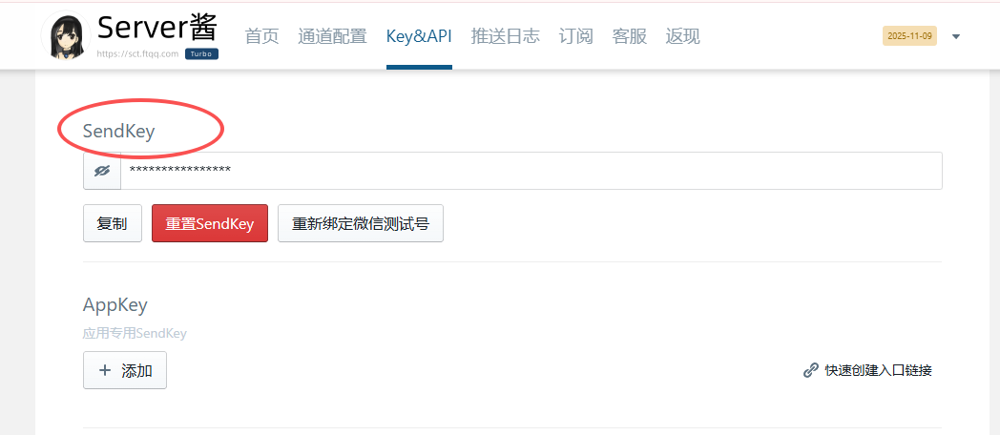

2. 在/autotrade下新建.env,并增加serverjiang中proToken和serverjiang(网址)

```
SERVERJIANG_PROTOKEN=xxxxx  # server酱里面的sendkey
SERVERJIANG_DBPATH=mysql+pymysql://root:@localhost:3306/qtdb_pro
SERVERJIANG_RETRY_TIMES=2
SERVERJIANG_RETRY_GAP=61
SERVERJIANG_SERVERJIANG="https://sctapi.ftqq.com/修改"
```


### 6.1.3 LoggerEngine

基于事件引擎的log处理模块，自动订阅EVENT_LOG并记录。默认记录位置放在根目录下的logs里面，也就是/autotrade/logs/

```
class LoggerEngine:
    def __init__(self, event_engine, engine_id, LOG_DIR=None):
        self.event_engine = event_engine
        if LOG_DIR is None:
            BASE_DIR = self.get_base_dir()
            LOG_DIR = str((BASE_DIR / "logs" / f'{engine_id}.log').resolve())  # 日志最好放在/autotrade/logs里面，方便app读取

        self.logger = get_logger(name=engine_id, logfile=LOG_DIR)
        self.event_engine.register(EVENT_LOG, self._on_log)

    # 日志模块
    def _on_log(self, event: Event):
        log_data: LogData = event.data
        log_level = log_data.level
        msg = log_data.msg
        if log_level == LogLevel.DEBUG:
            self.process_debug(msg)
        elif log_level == LogLevel.INFO:
            self.process_info(msg)
        elif log_level == LogLevel.WARNING:
            self.process_warning(msg)
        elif log_level == LogLevel.ERROR:
            self.process_error(msg)

    def process_debug(self, msg: str):
        self.logger.debug(msg)

    def process_info(self, msg: str):
        self.logger.info(msg)

    def process_warning(self, msg: str):
        self.logger.warning(msg)

    def process_error(self, msg: str):
        self.logger.error(msg)

    @staticmethod
    def get_base_dir():
        if "__file__" in globals():
            # 普通脚本运行: __file__ 存在
            return Path(__file__).resolve().parent.parent
        else:
            # 交互模式 (Jupyter/IPython): 用当前工作目录
            return Path().resolve()
```

具体用法如下

```
event_engine = EventEngine()
event_engine.start()
logger = LoggerEngine(event_engine,engine_id="logger_test")
event_engine.put(Event(EVENT_LOG,LogData(msg='this is a test')))
```

如果要改成微信推送，可以继承后改写

```
class WechatLog(LoggerEngine):
    def __init__(self, event_engine, engine_id, LOG_DIR=None):
        super().__init__(event_engine, engine_id, LOG_DIR)

    def process_error(self, msg: str):
        self.logger.wechat(content=msg, level='error')


logger_engine = WechatLog(event_engine, engine_id)
```


## 6.2 数据定义模块(Object.py\Constant.py)

### 6.2.1 `constant` —— 统一枚举定义

**作用**：把交易系统里会反复用到的“枚举值”集中到一处，做到**约定一致**、**类型明确**。
 **常用枚举**（节选）：

- **Direction**：`LONG / SHORT / NET`（方向/净持仓）
- **Offset**：`OPEN / CLOSE / CLOSETODAY / CLOSEYESTERDAY`
- **OrderStatus**：`SUBMITTING / NOTTRADED / PARTTRADED / ALLTRADED / PARTCANCELLED / ALLCANCELLED / REJECTED / PENDING / MODIFIED / UNKNOWN`
- **OrderType**：`LIMIT / MARKET / STP_LMT / STP_MKT / FAK / FOK / ABS_LMT / ...`
- **Exchange**：常见中外交易所代码（`CFFEX / SHFE / HKFE / CME / ...`）与 `LOCAL / GLOBAL / UNKNOWN`
- **Product / OptionType / Currency**：产品种类、期权类型、货币
- **LogLevel / CMD**：日志/命令等级
- **Interval**：K线周期（`K_1M、K_15M、K_1H、K_DAY...`），实现了**可比较**（`@total_ordering`），可以直接用 `min/max/sort` 做周期比较。

> 使用这些枚举可以避免魔法字符串，显式约束上游/下游的数据口径。

### 6.2.2  `object` —— 数据结构（Dataclass）

**作用**：定义系统在“事件总线/网关/策略/OMS”之间流转的**标准数据载体**（DTO）。
 所有实体（除少数请求/日志）都继承自 `BaseData`，都带有：

- `gateway_name`：来源标识；
- 常见的 **复合ID**：
  - `vt_symbol = "{symbol}.{exchange}"`
  - `vt_orderid = "{gateway}.{orderid}"`
  - `vt_tradeid / vt_positionid / vt_quoteid` 等

**行情**：

- `TickData`：逐笔/盘口快照（价格、量、五档等）
- `BarData`：K线（含 `interval`、OHLC、成交量）

**交易生命周期**：

- `OrderRequest`（下单请求） → `create_order_data()` 生成 `OrderData`骨架
- `OrderData`（订单状态快照）
  - 方法：`is_active()`、`create_cancel_request()`、`to_dict()`
- `TradeData`（成交回报）
  - 也带 `is_active()` 与 `to_dict()`
- `CancelRequest` / `ModifyRequest`（撤改请求）
- `QuoteRequest` / `QuoteData`（双边报价）
- `PositionData`（持仓）、`AccountData`（资金）、`ContractData`（合约元数据）
- `HistoryRequest`（历史K线查询）
- `SubscribeRequest`（订阅Tick）

**辅助**：

- `LogData`：统一日志事件载体
- `ACTIVE_STATUSES`：活跃订单状态集合（供 `OrderData.is_active` 判定）


## 6.3 配置模块（`config.py`）

这一模块集中维护工程运行所需的**连接与凭据**，通过 `SimpleNamespace` 提供简洁的“点号访问”。建议按环境（开发/测试/生产）覆写默认值，敏感信息走环境变量或独立的私密文件。

包括

1) `DatabaseInfo`

用于构建数据库连接（如 SQLAlchemy/MySQL）。

- `host`: 数据库地址（默认 `127.0.0.1`）
- `port`: 端口（默认 `3306`）
- `user`: 用户名
- `password`: 密码（**生产不建议明文**，见下文安全建议）

2) `serverjiang`

通知与重试策略等杂项配置。

- `proToken`: Server酱推送 token
- `dbPath`: 统一的数据库 DSN（例如：`mysql+pymysql://root:@localhost:3306/qtdb_pro`）
- `retry_times`: 失败重试次数（默认 `2`）
- `retry_gap`: 重试间隔秒（默认 `61`）
- `serverjiang`: Server酱推送地址

> 日志模块的微信推送会读取此处的推送地址与 token。

 3) `LinuxServer`

用于部署/远程任务的服务器登录信息。

- `myHostname`: 主机名/IP
- `myUsername`: 用户名
- `myPassword`: 密码（**不建议明文**）

4) `FutuInfo`

Futu OpenD 行情/交易连接信息。

- `host`: OpenD 地址（默认 `127.0.0.1`）
- `port`: OpenD 端口（常见 `11111`）
- `pwd_unlock`: 交易解锁密码（用于下单/改单/撤单前解锁）

> 使用前请确保本机/服务器 **Futu OpenD 已启动** 且端口一致。


## 6.4 用户认证模块（`auth/user_manager.py`）

这个模块主要是在ws_hub和app会有用，主要是用于管理用户和密码以及验证，是一个基于 **SQLite** 存储，**bcrypt** 哈希的轻量级用户名/密码认证

**功能概览**

- 首次运行自动创建数据库：`<项目根>/data/users.db`
- 采用 `bcrypt` 加盐哈希存储密码（不可逆）
- 提供两类核心方法：
  - `add_user(username, password) -> bool`：创建用户（同名返回 `False`）
  - `verify_user(username, password) -> bool`：校验用户名/密码是否匹配
- 线程容忍：`sqlite3.connect(..., check_same_thread=False)`（*高并发仍建议外部加锁或使用连接池*）

- **数据库位置**：`<项目根>/data/users.db`
   其中 `<项目根>` 由 `Path(__file__).resolve().parents[2]` 计算得到（即相对 `coreutils/auth/..` 上两级目录）。

> 首次初始化会自动创建 `data/` 目录与 `users` 表（包含 `id/username/password_hash`）。


**示例**

```python
from coreutils.auth.user_manager import UserManager

um = UserManager()  # 使用默认 <项目根>/data/users.db

# 1) 创建用户
ok = um.add_user("alice", "S3curePass!")
print("created:", ok)   # True；若用户名存在则 False

# 2) 登录校验
authed = um.verify_user("alice", "S3curePass!")
print("verified:", authed)  # True

# 3) 关闭连接（可选）
um.conn.close()
```

------


# S 7  通信模块(/autotrade/conn)

通信模块这里介绍最重要的部分，就是APP于TRADE ENGINE沟通的功能。整个模块可以分为两个子模块：EngineMesAdapter和ws_hub。ws_hub是一个消息中继或者消息中心，负责接收派发所有的APP和Adapter的信息。ws_hub对客户端APP使用的是websocket通信，对服务端的Adapter使用的是zmq，这既能保证高性能同时也兼顾稳定性。Adapter是负责和TRADE ENGINE沟通的中继器，利用事件引擎沟通。

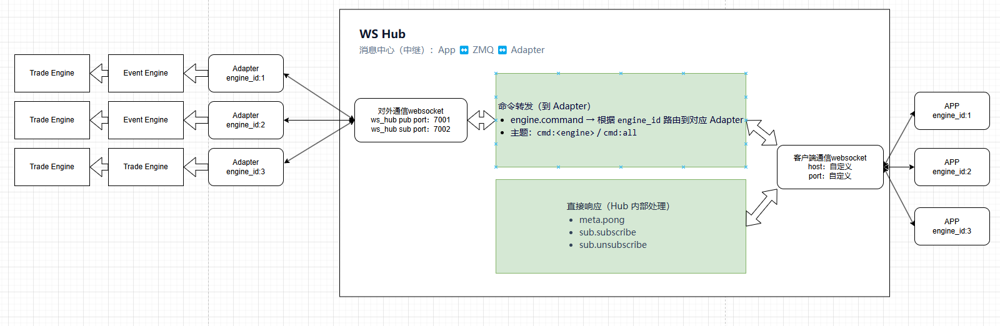

这里介绍几种情况下消息的传递过程：

**APP向TRADE ENGINE发送命令（method == "engine.command"）**

1. 消息会先通过websocket发送至ws_hub
2. ws_hub根据对应engine_id发布topic为engine_id的广播
3. 订阅此engine_id消息的Adapter接收到信息会通过事件引擎发布命令(目前仅为eng
4. TRADE ENGINE会订阅EVENT CMD并处理对应的命令。

**Adapter向APP推送消息**

1. 消息会通过zmq发送至ws_hub
2. ws_hub接收后通过websocket转发给APP

> 由于推送消息主要是OMS相关，Adapter中的OMS就足够，Trade Engine并不会直接向APP发送消息。


## 7.1 ws_hub

**ws_hub** 是系统的**消息中继中心**：中间承接所有 App 的 WebSocket 连接，向内通过 ZMQ 和各个引擎适配器（Adapter）通信，实现**命令下行**与**事件上行**的解耦与分发。

- **鉴权**：HTTP `/login` 获取 JWT，`/refresh` 刷新；WebSocket 首帧 `auth.login` 完成会话认证。
- **订阅/推送**：客户端订阅 `order:<engine_id>` 主题后，ws_hub 将 ZMQ 上行事件转为 `event.emit` 推送。
- **命令路由**：客户端通过 `engine.command` 下发命令，ws_hub 按 `cmd:<engine_id>`（或 `cmd:all`）转发到 ZMQ。
- **心跳与清理**：周期下发 `meta.ping`，客户端回 `meta.pong`；慢连接与超时会被自动清理。
- **多端并发**：支持**多个 App** 与**多个 Adapter** 同时在线；ws_hub 统一中枢、无状态路由。

------

### 7.1.1 端口与主题（可按需修改）

**外网服务**（由 `__main__` 启动参数决定）：

```
host = "0.0.0.0"   # 或你的域名绑定
port = 8000
```

**ZMQ（内网总线）**：

```
EVENTS_BIND = "tcp://*:7001"  # Adapter PUB.connect -> Hub SUB.bind
CMDS_BIND   = "tcp://*:7002"  # Hub PUB.bind -> Adapter SUB.connect
EVENT_PREFIX = "order:"       # 事件主题前缀
CMD_PREFIX   = "cmd:"         # 命令主题前缀
```

------

### 7.1.2 HTTP 接口

**POST `/login`** → 返回 `{"access_token","refresh_token"}`
 **POST `/refresh`** → 返回 `{"access_token"}`

示例：

```
curl -X POST http://<host>:<port>/login \
  -H "Content-Type: application/json" \
  -d '{"username":"testuser","password":"testpassword"}'
```

------

### 7.1.3 WebSocket（`/ws`，JSON-RPC 2.0）

**auth.login**（首帧登录）：

```
{"jsonrpc":"2.0","id":1,"method":"auth.login","params":{"access_token":"<JWT>"}}
```

**sub.subscribe**（订阅主题）：

```
{"jsonrpc":"2.0","id":2,"method":"sub.subscribe","params":{"topics":["order:engineA"]}}
```

**sub.unsubscribe**（取消订阅）：

```
{"jsonrpc":"2.0","id":3,"method":"sub.unsubscribe","params":{"topics":["order:engineA"]}}
```

**engine.command**（向某引擎/所有引擎下发命令，ws_hub 转发到 ZMQ）：

```
{"jsonrpc":"2.0","id":4,"method":"engine.command",
 "params":{"engine":"engineA","cmd":"order.cancel","data":{"vt_orderid":"FUTU.123"}}}
```

------

### 7.1.4 心跳

**Hub → Client**：周期推送 `meta.ping`（默认 15s）
 **Client → Hub**：回 `meta.pong`（Hub 立即 `{"ok":true}`）

------

### 7.1.5 Hub 主动推送

**event.emit**（当订阅的 `order:<engine>` 有新事件时，原样透传）：

```
{"jsonrpc":"2.0","method":"event.emit",
 "params":{"topic":"order:engineA",
           "data":{"type":"order","engine":"engineA","ts":1736570000,"epoch":2,"seq":18,"data":{...}}}}
```

------

### 7.1.6 与 Adapter 的协作（ZMQ）

**Adapter → ws_hub（事件上行）**：
 以 `order:<engine_id>` 主题 **PUB**（载荷 `{type,engine,ts,epoch,seq,data}`），ws_hub 订阅并转推 WebSocket。

**ws_hub → Adapter（命令下行）**：
 将 `engine.command` 转为 `cmd:<engine_id>`（或 `cmd:all`）主题 **PUB**，Adapter 侧 **SUB** 并执行。

------

### 7.1.7 运行与快速体验

```
# 依赖（示例）
pip install fastapi uvicorn[standard] pyjwt pyzmq bcrypt

# 运行（示例里会预置 testuser/testpassword）
python -m conn.ws_hub
# 或
uvicorn conn.ws_hub:app --host 0.0.0.0 --port 8000
```

**WebSocket 体验（wscat）**：

```
wscat -c ws://<host>:<port>/ws
> {"jsonrpc":"2.0","id":1,"method":"auth.login","params":{"access_token":"<ACCESS>"}}
> {"jsonrpc":"2.0","id":2,"method":"sub.subscribe","params":{"topics":["order:engineA"]}}
> {"jsonrpc":"2.0","id":3,"method":"meta.pong","params":{}}
> {"jsonrpc":"2.0","id":4,"method":"engine.command","params":{"engine":"engineA","cmd":"snapshot","data":{}}}
```

------

### 7.1.8 健壮性与默认限值

**发送超时清理**：`WS_SEND_TIMEOUT = 1.0s`（单帧向客户端发送超时即清理该连接）
 **应用层心跳**：`WS_PING_INTERVAL = 15s`
 **闲置踢除**：`WS_CLIENT_TIMEOUT = 45s`
 **ZMQ 高水位**：`ZMQ_RCVHWM/ZMQ_SNDHWM = 100000`


## 7.2 EngineMesAdapter

从实例化来看，EngineMesAdapter除了engine_id以外最重要的就是两个外部参数：OMS和EventEngine

```
    def __init__(
            self,
            engine_id: str,
            event_engine: EventEngine,
            oms: OmsBase,
            pub_endpoint: str = "tcp://127.0.0.1:7001",  # 引擎 -> 中心 (Hub SUB.bind)
            sub_endpoint: str = "tcp://127.0.0.1:7002",  # 中心 -> 引擎 (Hub PUB.bind)
    ) 
```

OMS主要是方便获取订单和快照数据，而EventEngine则起到接收订单持仓回报、发送订单请求的作用

### 7.2.1 交易推送与防抖机制

EngineMesAdapter和策略、TRADE ENGINE、GATEWAY共享同一个事件引擎，并且内部订阅了EVENT ORDER 和EVENT POSITION。当GATEWAY推送交易和持仓回报时，EngineMesAdapter会收到对应的交易信息，并通过上述的流程推送给APP

```
    def start(self) -> None:
        if self._running.is_set():
            return
        self._running.set()

        if not self._registered:
            self.event_engine.register(EVENT_ORDER, self.on_order)
            self.event_engine.register(EVENT_POSITION, self.on_position)
            self._registered = True
```

为了防止网络抖动造成订单信息丢失，EngineMesAdapter和APP会各自维护一个自增的epoch和seq，并且和消息内容一起发送给APP。当APP收到的seq和EngineMesAdapter发送的消息中的seq对不上时，APP会主动发起一次快照请求(7.2.3中介绍)以同步消息。

```
                # 在同一把锁内：读当前纪元、判断是否丢弃、递增 seq、回填 epoch/seq
                with self._epoch_lock:
                    current_epoch = self._epoch
                    if enq_epoch < current_epoch:
                        continue
                    self._seq += 1
                    payload["epoch"] = current_epoch
                    payload["seq"] = self._seq
```

### 7.2.2 订单修改

EngineMesAdapter会处理三类订单和持仓请求：

- 订单修改
- 订单取消
- 持仓平仓

EngineMesAdapter在接收到CMD后并不会主动调用GATEWAY，而是生成REQUEST DATA,并在事件引擎中发布EVENT_ORDER_REQ\EVENT_ORDER_REQ\EVENT_CANCEL_REQ,TRADE ENGINE接收到相应的事件后会再调用GATEWAY处理对应的订单请求

```
                elif cmd == 'order.modify':
                    vt_orderid = data.get('vt_orderid')
                    order = self.oms.get_order(vt_orderid)
                    if not order:
                        return

                    qty = data.get('qty')
                    trigger_price = data.get('trigger_price')
                    price = data.get('price')
                    if not price and not qty and not trigger_price:
                        return

                    if not qty:
                        qty = order.volume
                    if not trigger_price:
                        trigger_price = order.trigger_price
                    if not price:
                        price = order.price

                    req_modify = ModifyRequest(orderid=order.orderid, symbol=order.symbol, qty=qty,
                                               trigger_price=trigger_price, price=price, exchange=order.exchange, )
                    self.event_engine.put(Event(EVENT_MODIFY_REQ,req_modify))

                elif cmd == 'order.cancel':
                    vt_orderid = data.get('vt_orderid')
                    order = self.oms.get_order(vt_orderid)
                    if not order:
                        return
                    req_cancel = CancelRequest(orderid=order.orderid, symbol=order.symbol, exchange=order.exchange, )
                    self.event_engine.put(Event(EVENT_CANCEL_REQ,req_cancel))

                elif cmd == 'position.close':
                    vt_positionid = data.get('vt_positionid')
                    l_position = [p for p in self.oms.get_all_positions() if p.vt_positionid == vt_positionid]
                    if not l_position:
                        return
                    position = l_position[0]
                    direction = Direction.LONG if position.direction == Direction.SHORT else Direction.SHORT

                    req_order = OrderRequest(symbol=position.symbol, exchange=position.exchange, direction=direction,
                                             volume=position.volume,
                                             type=OrderType.MARKET, reference='Engine_Close')
                    self.event_engine.put(Event(EVENT_ORDER_REQ,req_order))

```


### 7.2.3 快照\历史订单请求

```
                if cmd == "snapshot":
                    self._do_snapshot()
                elif cmd == 'order.query':
                    self._handle_order_query(data)
```

正如7.2.1 中提到的，当APP接收到的消息中seq和其自身维护的seq对不上时，APP会被动触发一次快照请求；用户也可以通过APP主动提出快照请求。快照主要包括当前活跃订单和持仓信息。与事件引擎一样，EngineMesAdapter和其他模块共享同一个OMS，所以通过直接查询OMS中的信息可以得到订单和持仓信息

```
    def _make_snapshot_payload(self) -> Dict[str, Any]:
        """
        从 OMS 提取当前完整快照；返回 {"data": {...}}。
        Any 为 None/空都按空列表处理。
        """
        try:
            orders_raw = self.oms.get_all_active_orders() if self.oms else []
            positions_raw = self.oms.get_all_positions() if self.oms else []
            orders = [o.to_dict() for o in (orders_raw or [])]
            positions = [p.to_dict() for p in (positions_raw or [])]
            return {"data": {"orders": orders, "positions": positions, "snapshot_at": _now_ts()}}
        except Exception as e:
            return {"data": {"orders": [], "positions": [], "snapshot_at": _now_ts(),
                             "error": f"snapshot build failed: {e}"}}
```


APP可以查询OMS中的历史订单信息，当cmd == 'order.query'时，EngineMesAdapter会和快照请求一样把订单信息发送给APP。这里APP可以查询特定日期范围内的全部订单数据

```
            result = self.oms.filter_orders(limit=limit, start_date=start_param, end_date=end_param)

```


### 7.2.4 日志查询请求

在 `_sub_loop` 里接收到 `"cmd": "log.query"` 的命令时，会调用 `_handle_log_query(data)`，整个流程可以拆成 5 步：

------

1) 参数解析

```python
path = (data.get("path") or "").strip()
start_s = (data.get("start") or "").strip()
end_s = (data.get("end") or "").strip()
date_s = (data.get("date") or "").strip()
limit = int(data.get("limit") or self._default_log_limit)
```

- **path**：日志文件路径（可选，没传就用 `engine_id + 日期` 推断）。
- **start / end**：时间范围过滤。
- **date**：日期，优先级比 start 高。
- **limit**：返回的最大行数，默认 500，上限 10000。

同时还会处理：

- `include`：关键字列表，任意命中即可。
- `level`：日志等级过滤，例如 `["ERROR","WARNING"]`。

------

2) 路径推断

如果没传 `path`，会调用 `_default_log_path()`：

- 当天 → `logs/{engine_id}.log`
- 历史 → `logs/{engine_id}.log.YYYY-MM-DD`
   （这个符合常见的 `TimedRotatingFileHandler` 命名方式）

------

3) 日志文件读取与过滤

调用 `_read_log_range()`：

- **逐行读取日志**，用正则 `_log_re` 提取：

  ```
  YYYY-MM-DD HH:MM:SS,mmm [LEVEL] logger: message
  ```

- **过滤条件**：

  - 关键字（include_terms）
  - 等级（level_set）
  - 时间范围（start_dt / end_dt）

- 符合条件的行会被加入 `matched`。

- 最后只保留 **最后 N 行（tail 语义）**，N = limit。

------

4) 组装响应 Payload

构造一个 `"type": "log"` 的事件：

```python
payload = {
    "type": "log",
    "engine": self.engine_id,
    "ts": _now_ts(),
    "data": {
        "path": path,
        "count": len(lines),
        "range": {
            "start": start_dt.isoformat() if start_dt else None,
            "end": end_dt.isoformat() if end_dt else None,
        },
        "lines": lines,
    },
}
```

其中 `lines` 就是符合条件的日志原文。

------

5) 回发到消息队列

最后把这个 `payload` 入队，交给 `_pub_loop` 去带上 `epoch/seq` 发出去：

```python
self._send_q.put((f"order:{self.engine_id}", payload, enq_epoch))
```

------


# S 8 APP 模块

本项目提供一套面向量化交易/撮合监控的前端页面与通信层封装，支持查看实时订单与持仓、查询日志与历史订单，并可直接下发撤改单、平仓以及引擎开关等命令。前端以 Flutter 实现，持久化使用 Hive；与服务端通过 WebSocket(JSON-RPC)交互。

------

## 8.1 总览

- 引擎管理
  - 新建/打开/删除引擎页面（本地持久化）
  - 可视化编辑 `engine id`
  - 引擎开关：一键启停（发送 `engine.switch`，`data: { "on": true|false }`）
- 实时监控（“实时数据”页）
  - 订单实时流：动态列、自适应横向滚动、分页、操作列（撤单/改单）
  - 持仓实时流：动态列、分页、操作列（平仓）
  - 状态栏：一键刷新快照；连接指示；**epoch/seq** 仅在此页显示
- 日志查询（“日志”页）
  - 条件：日期/级别/关键字/路径/limit
  - 统一通过 `log.query` 下发，结果以 `event.emit(type='log')` 返回
- 历史订单（“历史订单”页）
  - 条件：`start_date`/`end_date`/`limit`
  - 统一通过 `order.query` 下发，结果以 `event.emit(type='orders')` 返回

------

**目录结构（Flutter 侧）**

```
lib/
├─ main.dart                         # Hive 初始化、迁移、MaterialApp
├─ models/
│  └─ strategy.dart                  # Strategy 模型：id/title/engineId/时间戳
├─ data/
│  └─ strategy_repo.dart             # Hive 封装：list/create/upsert（监听用 listenable）
├─ services/
│  ├─ auth_service.dart              # 账号/Token/多账号存储与登录
│  └─ ws_service.dart                # WebSocket(JSON-RPC) 客户端与事件分发
└─ pages/
   ├─ home_page.dart                 # 引擎列表抽屉；新建/删除；进入详情页
   ├─ settings_page.dart             # 服务器地址/账号/密码；登录并保存
   └─ strategy_editor_page.dart      # 三个 Tab（实时/日志/历史）、命令操作、引擎开关
```

------

## 8.2 核心数据与持久化

- Hive box
  - `auth`：`server`、`username`、兼容字段 `password` / `token`，以及多账号聚合 `accounts`
  - `strategies`：以 `id` 为 key，value 为 `{title, engineId, createdAt, updatedAt}`
- `Strategy` 模型
   `id/title/engineId/createdAt/updatedAt`，转换方法：`fromMap()` / `toMap()`
- 本地监听
   `StrategyRepo.listenable()` 提供 `ValueListenable<Box>` 给列表自动刷新

------

## 8.3 运行与配置

1. 启动前端
   - Flutter 3.x+
   - `main.dart` 会初始化 Hive 并打开 `auth`、`strategies`（兼容从旧 `pages` 迁移）
2. 配置服务端
   - 打开 **设置** 页（`SettingsPage`）
   - 填写 `服务器地址`（Android 模拟器访问宿主机使用 `http://10.0.2.2:8000`）、用户名、密码
   - 点击“登录并保存”，成功后会缓存 token 与密码并设为“当前账号”
3. 新建引擎页面
   - 在 **首页** 右下角 `+` 新建
   - 输入“策略名称”和与后端一致的 `engine id`
   - 创建后自动进入详情页并建立订阅
4. 删除引擎页面
   - 在首页左上角菜单打开“引擎列表”，点击某项右侧垃圾桶图标 → 确认后删除本地记录

------

## 8.4 交互协议（WS / JSON-RPC）

### 8.4.1 连接与登录

- `auth.login`
   请求：`{"method":"auth.login","params":{"access_token":"..."},"id":N}`
   成功后：`connectedListenable = true`
- 心跳
   收到：`meta.ping {ts}` → 立即发送：`meta.pong {ts}`

### 8.4.2 订阅与命令

- 订阅引擎事件

  ```
  {"method":"sub.subscribe","params":{"topics":["order:<engineId>"]},"id":N}
  ```

- 统一命令入口

  ```
  {
    "method": "engine.command",
    "params": {"engine":"<engineId>","cmd":"<command>","data":{...}},
    "id": N
  }
  ```

常用 `cmd` 与 `data`：

| 命令             | data 示例                                                    |
| ---------------- | ------------------------------------------------------------ |
| `snapshot`       | `{}`                                                         |
| `order.cancel`   | `{"vt_orderid":"CTP.xxxx"}`                                  |
| `order.modify`   | `{"vt_orderid":"CTP.x","qty":1,"price":123.45,"trigger_price":123.0}` |
| `position.close` | `{"vt_positionid":"CTP.xxxx","qty":10}`（`qty` 可空=全平）   |
| `log.query`      | `{"date":"YYYY-MM-DD","level":["INFO"],"include":"kw","path":"/var/...","limit":200}` |
| `order.query`    | `{"start_date":"YYYY-MM-DD HH:mm:ss","end_date":"...","limit":200}` |
| `engine.switch`  | `{"on": true}` 或 `{"on": false}`                            |

### 8.4.3 事件推送（统一经 `event.emit` 下发）

`ws_service` 会将 `event.emit` 转为 `WsEvent`（`type/engine/payload`）。

典型负载（摘要）：

- `snapshot`：`{type:"snapshot", engine, epoch, seq:0, data:{orders:[...], positions:[...]}}`
- `order`：`{type:"order", engine, epoch, seq, data:{...单条订单...}}`
- `position`：`{type:"position", engine, epoch, seq, data:{...单条持仓...}}`
- `log`：`{type:"log", engine, epoch, seq, data:{lines:[...]}}`
- `orders`：`{type:"orders", engine, epoch, seq, data:{orders:[...]}}`

> 说明：`epoch/seq` 由后端在“切换纪元+快照+增量”流程中维护；前端仅展示，不参与计算。

------

## 8.5 前端页面说明

### 8.5.1 HomePage

- 左上角抽屉展示本地保存的“引擎页面列表”
- 右上角进入“设置”
- 支持新建与删除：
  - 新建：弹出表单，写入 `strategies`，跳转详情页
  - 删除：弹出确认后直接 `box.delete(id)`

### 8.5.2 SettingsPage

- 负责录入 `serverBase`/`username`/`password`
- 登录成功后持久化 token，并设置为当前账号
- 支持历史账号聚合（可扩展选择器）

### 8.5.3 StrategyEditorPage

- 顶部 AppBar
  - 页面标题 + `engine` 可编辑芯片（点击/编辑图标均可触发）
  - **引擎开关**：`Switch` → 发送 `engine.switch`，`data:{on:true|false}`
- Tab 结构
  1. **实时数据**
     - 上：Orders 表格（动态列 + 操作列）
       - 操作：撤单/改单（弹框收集 `qty/price/trigger_price`）
     - 下：Positions 表格（动态列 + 操作列）
       - 操作：平仓（可选 `qty`）
     - 顶部状态栏（仅此页可见）：
       - “刷新订单持仓”（发送 `snapshot`）
       - 连接指示灯
       - **epoch/seq**（仅在实时页展示）
  2. **日志**
     - 查询条件面板（可折叠）
     - 点击“查询日志”发送 `log.query`
     - 返回 `log` 事件后以行文本显示
  3. **历史订单**
     - 输入时间区间/limit，发送 `order.query`
     - 返回 `orders` 事件后分页展示
- 事件处理
  - `snapshot`：清空并重建 `orders/positions` 映射，分页跳到最后一页
  - `order/position`：增量合并，维持最大缓存量
  - `log/orders`：切换到对应 Tab 并渲染结果
- 细节
  - `engine id` 更改后：重置本地状态（包括 `_engineOn`）、重订阅并拉取 `snapshot`
  - `epoch/seq` 文本仅在 Tab=“实时数据”时渲染（避免在日志、历史页出现）

------


## 8.6 扩展指南

- 新增命令
  - 前端：在相应操作处调用
     `WsService.I.sendEngineCommand(engine: eng, cmd: '<new.cmd>', data: {...})`
  - 中间层：在服务端路由 `<new.cmd>` 到目标引擎或适配器
  - 引擎：在 `process_cmd` 或更上层逻辑中处理并落地到网关/策略
- 新增数据流事件
  - 后端：通过事件总线/适配器广播 `event.emit`
  - 前端：在 `StrategyEditorPage._onWsEvent` 增加 `type` 分支并渲染


