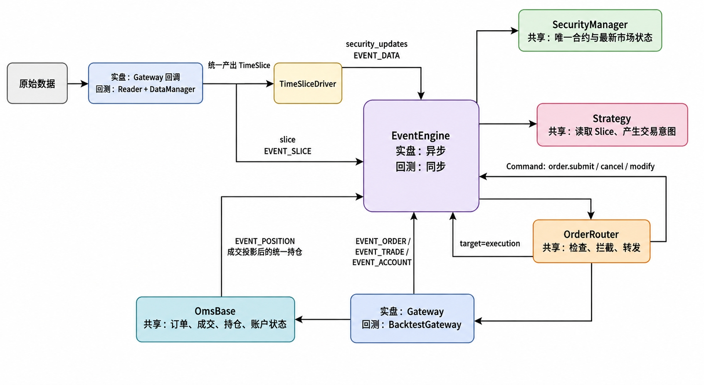
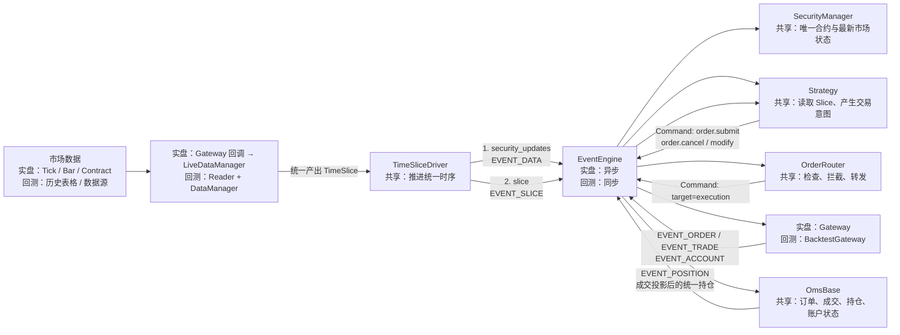
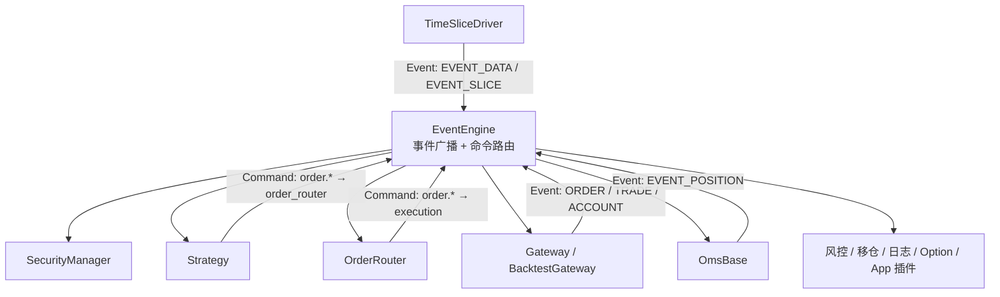
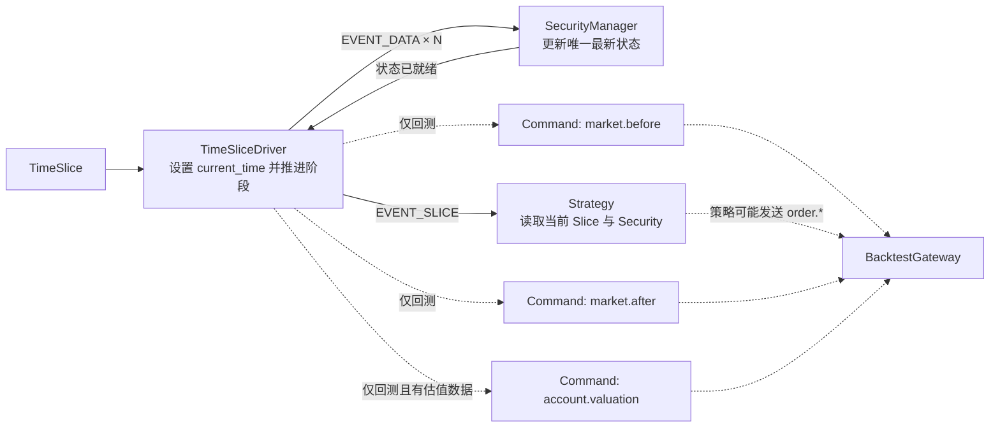
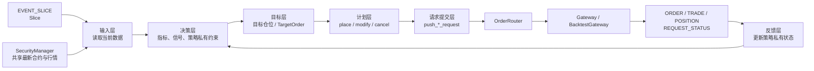
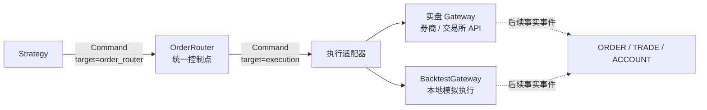
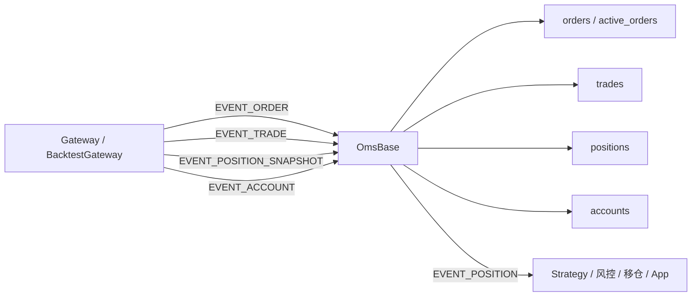
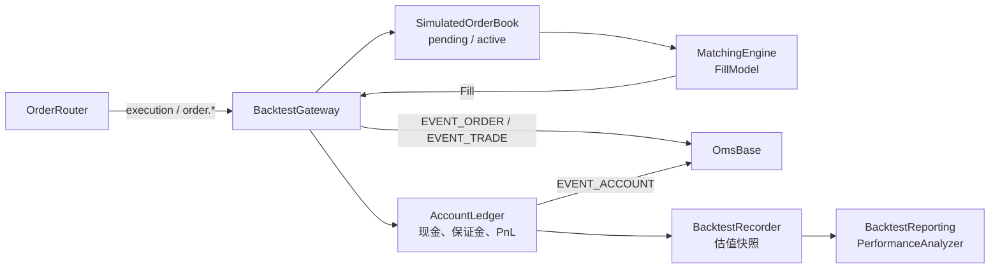
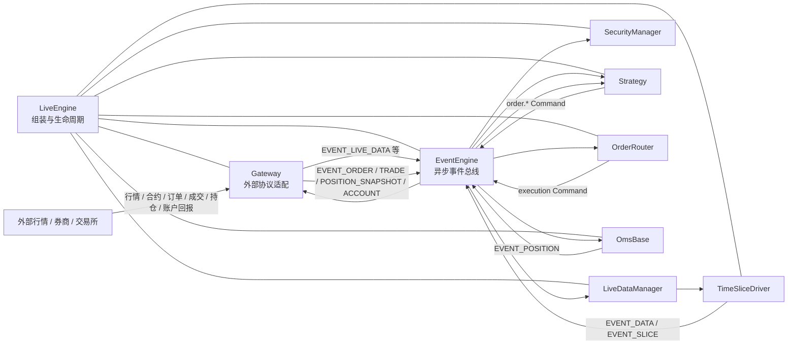
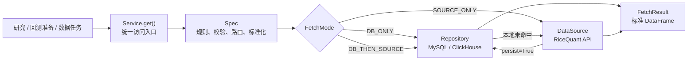

# Autotrade

Autotrade 是一个以事件驱动为通信核心的量化交易框架。它保留了交易系统所需的
行情、订单、成交、持仓、账户和 Gateway 边界，但不把策略、实盘执行和回测实现
绑成两套独立系统；所有组件围绕同一个 EventEngine 协作，并通过标准化的
`TimeSlice`、`Event` 与 `Message` 交换信息。

框架有两个核心目标：

1. **最小化实盘与回测差异。** 策略、SecurityManager、OMS、OrderRouter、
   TimeSliceDriver 和事件/命令协议在两种运行环境中保持一致；切换时主要替换
   数据来源与执行 Gateway。
2. **模块解耦且可插拔。** 模块通过事件广播已发生的事实，通过定向命令请求动作，
   不直接修改其他模块的权威状态。因此策略、风控、移仓、日志、监控和 App 适配器
   都可以作为独立组件安装或移除。

# 0. 快速开始：从零到第一个可运行策略

本章是操作入口，而不是另一套架构说明。它使用仓库内可重复生成的数据，跑通当前代码中
一条完整的回测链路；随后说明将示例替换为自己的数据、策略和实盘 Gateway 时应保持的边界。
数据、事件、策略、订单、OMS、回测和实盘的细节分别见第 1～8 章。

```text
安装项目
  → 生成或直接使用合成数据
  → Reader + DataManager 产生 TimeSlice
  → BacktestEngine 运行 Strategy
  → 查看订单、成交和账户结果
  → 替换自己的数据 / Strategy / Gateway
```

## 0.1 安装与示例环境

项目要求 Python 3.10 或更高版本。在仓库根目录以可编辑方式安装：

```bash
pip install -e .
```

快速开始中的示例不连接外部行情、券商账户或数据库。它们使用
`example/generate_synthetic_data.py` 生成 Reader 可读取的 xlsx 文件，默认输出到
`example/data/`；该目录已被 Git 忽略，可以安全地重复生成。

先确认生成器及其参数可用：

```bash
python -m example.generate_synthetic_data --help
```

## 0.2 五分钟跑通：合成数据 SMA 回测

最快的端到端验证是直接运行仓库提供的示例：

```bash
python -m example.synthetic_sma_cross_backtest
```

该脚本会在 `example/data/synthetic_sma_cross/` 中生成 480 根一分钟合成期货 Bar 与对应的
合约状态 xlsx，随后运行一个均线交叉策略，并写出：

| 文件 | 内容 |
| --- | --- |
| `future_instruments.xlsx` | 合约与保证金、乘数等状态数据 |
| `future_bars.xlsx` | Reader 可读取的一分钟行情 Bar |
| `trades.csv` | OMS 确认并记录的成交 |
| `account_daily.csv` | 每次估值记录的账户历史 |

脚本结束时会打印生成路径、处理的 TimeSlice 数量、确认成交数和总收益。合成价格只是用于验证
数据、策略、撮合和报告链路，不能用于判断策略的真实收益能力。

如果只想生成不同规模的数据而暂不运行策略，可单独执行：

```bash
python -m example.generate_synthetic_data \
  --kind futures --frequency 1m --periods 480 --num-futures 1
```

生成器还支持 `options`、`greeks` 和 `all`，以及 1 分钟、5 分钟、15 分钟、30 分钟、1 小时
与日线频率。完整参数以 `--help` 输出和 `SyntheticDataConfig` 为准。

## 0.3 这段示例实际运行了什么

`example/synthetic_sma_cross_backtest.py` 不是旁路演示，而是当前标准回测路径的最小实现：

```text
合成 xlsx
  → FutureStateReader / TradeBarReader
  → DataManager
  → TimeSlice 流
  → BacktestEngine + TimeSliceDriver
  → Strategy
  → OrderRouter
  → BacktestGateway
  → OMS
  → trades.csv / account_daily.csv
```

核心装配代码如下；它表明回测引擎接收的是 `DataManager.stream()` 生成的 TimeSlice，而不是旧式
DataFrame 直接加载接口：

```python
engine = BacktestEngine(initial_cash=100_000)
strategy = SyntheticSmaCrossStrategy(
    engine.event_engine,
    engine.security_manager,
    instrument_id="SYNF001",
)
strategy.initialize()

result = engine.run(manager.stream())
strategy.stop()
```

示例中的 `DataRoutingConfig` 明确了每个命名数据流的职责：`future_1m` 同时进入策略、
SecurityManager 和估值；`future_states` 只用于更新合约与 Security 状态。有关 Reader、
路由与 TimeSlice 字段，见第 1 章；有关每个 TimeSlice 内的处理顺序，见第 3 章。

## 0.4 从示例改成自己的历史数据

保留 `BacktestEngine` 和 Strategy，先替换输入数据即可。当前回测数据的标准步骤是：

1. 用相应 Reader 将表格转换为标准数据对象；
2. 为每条数据流指定稳定的 `data_name`；
3. 用 `DataRoutingConfig` 声明它是否进入策略、SecurityManager 和估值；
4. 用 `DataManager.add_data()` 加入数据，并将 `manager.stream()` 交给 `engine.run()`。

```python
manager = DataManager(
    DataRoutingConfig(
        strategy_data_names={"future_1m"},
        security_data_names={"future_states", "future_1m"},
        valuation_data_names={"future_1m"},
    )
)
manager.add_data("future_states", future_state_records)
manager.add_data("future_1m", bar_records)

engine.run(manager.stream())
```

| 你的输入 | 处理方向 |
| --- | --- |
| 合约定义、乘数、保证金等状态 | 使用对应的状态 Reader，加入 `security_data_names` |
| Tick 或 Bar 行情 | 使用市场数据 Reader；需要策略消费时加入 `strategy_data_names` |
| 用于盯市的价格流 | 加入 `valuation_data_names` |
| 期权合约、行情、Greeks | 使用 Option Reader 和 analytics 数据流，见第 1 章与 Option 章节 |
| 多周期或多源数据 | 为每条流使用不同名称；必要时在回测设置中指定 `execution_data_name` |

不要通过手工修改 DataFrame 列来模拟旧接口，也不要让策略根据文件来源分支。Reader 与
DataManager 的职责就是将不同来源收敛为同一种 TimeSlice 输入。

## 0.5 编写自己的 Strategy

Strategy 应继承 `StrategyBase`。最小策略通常在 `on_data(slice_)` 中读取明确命名的数据流，
在需要时提交标准 `OrderRequest`，并通过订单、成交和持仓回调确认执行事实：

```python
class MyStrategy(StrategyBase):
    def on_data(self, slice_):
        bar = slice_.get_bar("SYNF001", data_name="future_1m")
        if bar is None:
            return

        self.push_order_request(
            OrderRequest(
                instrument_id="SYNF001",
                exchange=bar.exchange,
                direction=Direction.LONG,
                type=OrderType.MARKET,
                volume=1,
                reference="my_strategy",
            )
        )

    def on_order(self, order):
        ...

    def on_trade(self, trade):
        ...

    def on_position(self, position):
        ...
```

编写时保持四条边界：

1. 从 `Slice` 读取策略数据；
2. 从 `SecurityManager` 读取共享的合约和最新市场状态；
3. 只用 `push_order_request()`、`push_cancel_request()`、`push_modify_request()` 发送交易意图；
4. 只依据订单、成交和 OMS 发布的持仓回调确认执行结果，不自行伪造成交或修改 OMS。

`example/synthetic_sma_cross_backtest.py` 展示了一个完整、可运行的实例。策略层次、回调顺序和
`OptionStrategy` 的额外约定见第 4 章；订单命令和回报语义见第 5、6 章。

## 0.6 从回测切换到实盘

当 Strategy 遵守上述边界时，切换实盘不需要把策略改写为另一套 API。运行时的替换关系是：

```text
回测：Reader + DataManager + BacktestEventEngine + BacktestGateway
实盘：Gateway 回调 + LiveDataManager + EventEngine + Gateway

共享：TimeSliceDriver + SecurityManager + Strategy + OrderRouter + OMS
```

实盘 Gateway 必须遵守 `BaseGateway` 的统一契约：将外部行情和合约数据发布到实时数据入口，
消费 `execution` 目标的订单命令，并将订单、成交、持仓和账户的外部回报转换为标准事件。
Strategy 不应识别 Gateway 类型，也不能假定“下单函数返回”就是“订单已成交”。实盘装配、启动、
停止、回调线程与 Gateway 接入规则见第 8 章。

## 0.7 开发者与 AI 工作约定

以下约定用于快速定位正确扩展点，并防止新代码重新引入实盘/回测分叉：

1. **代码是行为事实来源。** README 和 `docs/` 用于解释、示例与导航；接口冲突时以当前源码和测试为准。
2. **事实用 Event，动作用 Command。** 已发生的数据、订单、成交和账户变化可以广播；下单、撤单、改单必须发送到明确目标。
3. **不要跨越边界直接调用。** Strategy 不依赖具体 Gateway；Gateway 不依赖具体 Strategy；OMS 与 SecurityManager 各自拥有不同的状态。
4. **先复用，再扩展。** 优先继承或组合现有 Reader、StrategyBase、报告与模型；只在职责明确不同的时候替换整个组件。
5. **新数据先定义职责。** 明确其是否应进入 `Slice`、`security_updates` 和 `valuation_updates`，以及它在实盘与回测中的等价入口。
6. **示例必须可复现。** 优先使用 `example/generate_synthetic_data.py`，不将本地私有行情或账户文件作为示例前提。

## 0.8 阅读地图

| 目标 | 推荐章节 |
| --- | --- |
| Reader、数据路由与 TimeSlice | 第 1 章 |
| Event / Command 的通信语义 | 第 2 章 |
| 时间推进与状态更新顺序 | 第 3 章 |
| Strategy 架构与期权策略入口 | 第 4 章 |
| 订单、撤单与改单 | 第 5 章 |
| OMS、成交、持仓与账户 | 第 6 章 |
| 撮合、估值和报告 | 第 7 章 |
| LiveEngine 与 Gateway 生命周期 | 第 8 章 |

完成本章的合成数据示例后，建议先阅读第 1、3、4、7 章，再替换为自己的数据和策略。

## 核心一：一条共享主链，两个受控分叉点

无论实盘还是回测，框架都先将外部数据标准化为 `TimeSlice`，再由
`TimeSliceDriver` 按固定顺序推进。它先将 `security_updates` 作为 `EVENT_DATA`
发布，让 `SecurityManager` 更新唯一的合约和市场状态；随后将策略可见的 `slice`
作为 `EVENT_SLICE` 发布给策略。这样策略处理当前 Slice 时，读取到的共享
Security 已经是该时点的最新状态。




```mermaid
flowchart LR
    M["市场数据<br/>实盘：Tick / Bar / Contract<br/>回测：历史表格 / 数据源"]

    M --> IN["实盘：Gateway 回调 → LiveDataManager<br/>回测：Reader + DataManager"]
    IN -->|"统一产出 TimeSlice"| TD["TimeSliceDriver<br/>共享：推进统一时序"]
    E["EventEngine<br/>实盘：异步<br/>回测：同步"]

    TD -->|"1. security_updates<br/>EVENT_DATA"| E
    E --> SM["SecurityManager<br/>共享：唯一合约与最新市场状态"]

    TD -->|"2. slice<br/>EVENT_SLICE"| E
    E --> ST["Strategy<br/>共享：读取 Slice、产生交易意图"]

    ST -->|"Command: order.submit<br/>order.cancel / modify"| E
    E --> OR["OrderRouter<br/>共享：检查、拦截、转发"]
    OR -->|"Command: target=execution"| E

    E --> G["实盘：Gateway<br/>回测：BacktestGateway"]

    G -->|"EVENT_ORDER / EVENT_TRADE<br/>EVENT_ACCOUNT"| E
    E --> OMS["OmsBase<br/>共享：订单、成交、持仓、账户状态"]
    OMS -->|"EVENT_POSITION<br/>成交投影后的统一持仓"| E
    E --> ST
```

### 实盘：一条原始数据如何穿过框架

以一条 Tick、Bar 或合约状态为例，实盘 Gateway 从券商、交易所或行情服务收到
原始回调后，不直接调用策略或修改 OMS。Gateway 将其发布为 `EVENT_LIVE_DATA`；
`LiveDataManager` 订阅该事件并将数据包装为标准 `TimeSlice`，再交给
`TimeSliceDriver`。

Driver 首先发布 TimeSlice 的 `security_updates`。`SecurityManager` 订阅
`EVENT_DATA`，据此创建或更新唯一的 `Security`、`FutureContract` 或
`OptionContract`，并维护最新价格、OHLC、盘口、成交量及合约属性。随后 Driver
发布 `EVENT_SLICE`；策略订阅它并只读取当前时点可见的 `Slice`，据此形成交易意图。

策略也不直接调用 Gateway。它向 EventEngine 发出 `order.submit`、`order.cancel`
或 `order.modify` 命令，命令先由 `OrderRouter` 接收。Router 是统一控制点：它可以
检查运行开关、拦截被 mute 的标的，并将通过检查的命令转发给逻辑目标
`execution`。实盘 Gateway 绑定该目标，最终调用真实券商或交易所 API。

订单受理、撤改单结果、成交和账户变化再由 Gateway 以 `EVENT_ORDER`、
`EVENT_TRADE`、`EVENT_ACCOUNT` 等事实事件发布。`OmsBase` 订阅这些事件，维护
订单、成交、持仓和账户的统一运行时视图；确认成交后，OMS 还会发布
`EVENT_POSITION`，供策略与其他插件读取。实盘 Gateway 的券商持仓快照只作为
`EVENT_POSITION_SNAPSHOT` 的对账输入，不替代由成交投影产生的统一持仓事件。

### 回测为何可以复用同一策略

回测与实盘的共有主链从 `TimeSliceDriver` 开始，到 `SecurityManager`、策略、
`OrderRouter` 和 `OmsBase` 为止保持不变。区别只收敛在两个边界：

1. **数据来源不同。** 实盘由 Gateway 的实时 API 回调经 `LiveDataManager` 进入；
   回测由 Reader 读取本地或历史数据，再由 `DataManager` 生成有序的 TimeSlice 流。
2. **执行 Gateway 不同。** 实盘 Gateway 将订单交给真实券商或交易所，由外部市场
   撮合并异步回报订单、成交、账户和持仓信息；回测的 `BacktestGateway` 消费同一种
   执行命令、发布同一种订单/成交/账户事件，但将本应由券商和交易所完成的订单管理、
   撮合、手续费、保证金、盯市和账户计算留在本地模拟完成。

因此，从策略的视角看，订单始终经 `OrderRouter` 发送给逻辑执行目标，结果始终以
订单、成交、账户与持仓事件返回。策略无需知道撮合发生在 Futu、Interactive
Brokers、其他实盘 Gateway，还是本地 `BacktestGateway`；新增 Gateway 的要求也正是
遵守这套输入、命令和回报协议，而不是改变策略接口。

唯一的运行方式差异是事件分发：实盘 `EventEngine` 使用异步队列，避免 API 回调被
策略或下游处理阻塞；回测 `BacktestEventEngine` 使用同步排空队列，使一个
TimeSlice 及其派生事件处理完成后才推进下一片数据。二者的事件类型、命令路由、
组件关系和策略接口保持一致。

## 核心二：像乐高积木一样组合模块

Autotrade 的第二个核心不是“所有模块都能互相调用”，而是相反：每个模块只拥有
自己负责的状态，通过共享的 EventEngine 与其他模块协作。模块可以被加入、替换或
移除，而不应迫使策略、Gateway 或其他核心组件改写实现。这种关系更接近乐高积木：
积木只需要遵守连接接口，不需要知道另一块积木内部如何实现。

```text
Strategy ── Command ──> OrderRouter ── Command ──> Gateway
   ▲                                                      │
   │               EventEngine                            │
   └──── ORDER / TRADE / POSITION / ACCOUNT ──────────────┘

SecurityManager ── EVENT_DATA ──> 最新合约与市场状态
Strategy ── 只读访问 ───────────> SecurityManager
```

### 模块之间只约定协议，不互相绑定实现

`StrategyBase` 的构造函数接收共享 `EventEngine` 和可选的 `SecurityManager`，但不
接收 Gateway。策略提交订单时，调用 `push_order_request()` 等接口，向目标为
`order_router` 的 `order.submit`、`order.cancel` 或 `order.modify` 命令发送请求；
它既不知道 Gateway 的类型，也不关心订单最终由 Futu、Interactive Brokers 或本地
回测撮合执行。

反过来，Gateway 也不持有或调用具体策略。它只绑定逻辑执行目标 `execution`，消费
订单命令，并将订单、成交、账户和持仓快照作为标准事件返回。`OrderRouter` 位于两者
之间，负责运行开关、标的 mute 与命令转发。因而替换策略不会改变 Gateway，替换
Gateway 也不应改变策略；二者只要继续遵守命令与回报协议即可。

`SecurityManager` 展现了另一种解耦。它独占“合约是什么、当前市场状态是什么”的
维护职责，订阅 `EVENT_DATA` 并更新唯一的运行时 Security。策略可以持有它的引用，
但该引用只用于读取当前状态；策略不应自行更新 Security，也不应依赖其内部何时从
Tick、Bar 或合约状态完成更新。`TimeSliceDriver` 已保证本时点的
`security_updates` 在策略收到 `EVENT_SLICE` 前先进入事件队列，这使策略可以依赖
状态可见性，而不需要依赖具体更新实现。

`OmsBase` 同样只处理交易事实：它订阅订单、成交、账户和券商持仓快照，维护统一的
订单、成交、持仓与账户视图；它不接管行情或合约状态。状态所有权被明确拆开，模块
之间便不需要维护彼此的副本。

### 可插拔性在代码中的体现

`RuntimeEngine` 把共享的 `EventEngine`、`SecurityManager`、`OmsBase`、
`OrderRouter`、`TimeSliceDriver`、Gateway 与 `LogEngine` 组装为明确的
`RuntimeComponents`。扩展模块完成自身事件订阅后，可以用
`engine.install(plugin)` 纳入运行时生命周期，并在 `engine.uninstall(plugin)` 或
引擎停止时移除；扩展不必修改 Engine 的主流程。

例如移仓、风控、日志和 App 通信都应以这种方式加入：监听自己需要的事件，必要时
发送标准命令，而不是直接调用策略或 Gateway 的业务方法。期权领域的
`autotrade.option` 也体现了这个边界：`OptionStrategy` 在 `StrategyBase` 之上增加
策略私有的期权面板；`OptionPanelAssembler` 只读当前 `Slice` 中的 analytics 与
`SecurityManager` 中的 `OptionContract`，拼装后交给期权策略使用。它不会将 Greeks
或曲面结果写回通用 Security，也不会让撮合、OMS 或通用 Engine 依赖期权模块。

### 复用优先，但不为继承而继承

框架在“结构确实相同、仅运行方式不同”的场景优先复用基类：

- `BacktestEventEngine` 继承 `EventEngine`，保留完全相同的事件注册、广播和命令
  路由规则，只把队列推进改为同步排空。
- `OptionStrategy` 继承 `StrategyBase`，只增加期权 analytics 到策略面板的组装；
  它不重写通用策略的事件与下单协议。
- `OptionBacktestReporting` 继承 `BacktestReporting`，复用基础回测的绩效、账户、
  成交、持仓表及 Excel 导出流程，只在其上追加期权 Greek 风险与归因工作表。
- 具体实盘 Gateway 继承 `BaseGateway`，复用执行命令绑定和标准事件发布入口，并仅在
  适配层处理外部 API 差异。

但继承不是唯一目标。当前 `BacktestGateway` **不继承** `BaseGateway`：它额外拥有
本地订单簿、撮合与账本等模拟职责，强行继承会让实盘接口承担不必要的模拟细节。它
与实盘 Gateway 复用的是更稳定的边界——同一个 `execution` 命令目标，以及
`EVENT_ORDER`、`EVENT_TRADE`、`EVENT_ACCOUNT` 等回报事件。这说明框架的原则是：
能共享结构时继承，职责明显不同但对外行为一致时使用共享协议与组合。

### 后续开发原则

新增模块时，应优先遵守以下规则：

1. **先确定状态所有者。** 不在策略、Gateway、OMS、SecurityManager 之间复制或
   交叉修改同一份权威状态。
2. **事实用 Event，动作用 Command。** 已发生的订单、成交、账户或数据变化可以
   广播；下单、撤单、改订单必须定向发送给明确目标。
3. **依赖协议，不依赖具体实现。** 策略不应识别 Gateway 类型；Gateway 不应识别
   策略类型；扩展不应假设自己运行在实盘还是回测。
4. **优先组合与订阅。** 新能力应作为订阅事件的插件接入；只有确实扩展稳定基类
   行为时才使用继承，避免为了复用而形成错误的父子关系。
5. **优先复用，让改动可控。** 已有基类、报告、数据对象或稳定流程能够覆盖需求时，
   应在其上扩展而非复制重写；替换数据源、Gateway、撮合模型、风控或领域模块时，
   应只影响其职责边界，而不改变共享的 `TimeSlice`、事件、命令和策略接口。

# 第 1 章：统一输入——数据标准化与 TimeSlice

本章说明外部数据如何成为 Autotrade 运行时唯一接受的输入。无论数据来自实盘 API、
CSV、数据库、内存缓存还是研究计算结果，进入共享运行时前都必须被组织为
`TimeSlice`。本章只讨论“如何组装输入”；下一章再讨论 `TimeSliceDriver` 如何推进
这些输入，以及 SecurityManager、策略和 Gateway 如何消费它们。

## 1.1 为什么所有数据都要先变成 TimeSlice

Autotrade 最早沿用较细粒度的市场数据对象，例如 `BarData`、`TickData`、
`TradeData`。这些对象仍然保留为标准数据载体；变化不在于取消细粒度数据，而在于
不再把每一条数据都直接作为一次策略事件推进。

以期权为例：若同一分钟有 1,000 个期权合约分别产生一条 Bar，旧式“每条 Bar
发布一次事件”的模型会产生 1,000 次 `EVENT_BAR` 分发，所有订阅 Bar 的模块都会
被调用 1,000 次。若模块每次回调又扫描完整合约集合，整体开销会进一步接近
`O(N²)`；即使不扫描全量集合，事件分发也会随数据条数和订阅者数量增长。这种模式
还会迫使只关心日线或分钟线的策略跟随高频 tick 逐条执行。

现在，回测 `DataManager` 会将同一时点的记录同步为一个 `TimeSlice`；实盘
`LiveDataManager` 也会将单条或同一时点的一批 Gateway 回调包装为相同结构。这
1,000 条期权行情可以作为同一个时间片中的 `security_updates` 交给
`SecurityManager` 逐条更新最新状态；而策略可见的 `slice` 则完全由
`DataRoutingConfig` 决定。例如 tick 可以只更新 SecurityManager，1 分钟或日线数据
才进入策略 Slice。

因此，框架将“必须逐条维护的市场状态更新”与“策略何时、看见哪些数据”分开：
SecurityManager 按需处理 1,000 条更新，策略在该时点只收到一次 `Slice`，不会因
1,000 条数据而收到 1,000 次 `on_bar()` 调用。若该时点没有任何策略路由数据，当前
实现仍会向策略发布一次空 `Slice`；优化点是按**时间片**而不是按**单条市场数据**
推进，策略不会被迫遍历全部 tick 或期权合约。

## 1.2 TimeSlice：一个时点的三类数据

`TimeSlice` 是一个时点的统一运行时信封：

```python
TimeSlice(
    time=when,
    slice=strategy_visible_data,
    security_updates=(...),
    valuation_updates=(...),
    is_bootstrap=False,
)
```

它明确区分四项信息：

- `time`：时间片的统一时间。
- `slice`：策略可见的 `Slice`，由 `TimeSliceDriver` 作为 `EVENT_SLICE` 发布。
- `security_updates`：合约状态或市场状态更新，由 Driver 逐条作为 `EVENT_DATA`
  发布给 `SecurityManager`。
- `valuation_updates`：估值价格更新；回测中用于盯市、保证金刷新和账户历史记录，
  不是普通策略数据。
- `is_bootstrap`：无时间的启动合约状态。bootstrap 只初始化 SecurityManager，
  不运行策略、不撮合，也不估值。

同一条行情可以同时进入 `slice`、`security_updates` 与 `valuation_updates`。这不是
重复保存，而是同一条事实在不同消费者中的不同职责：策略决策、运行时状态维护与
账户估值应由显式路由决定，不能互相替代。

## 1.3 Slice：策略实际收到的命名数据集合

策略不直接接收完整 `TimeSlice`，而是接收其中的 `Slice`。`Slice` 是当前时点策略
可见的数据集合，以 `data_name` 组织，而非只按数据类型或频率组织。因此一个 Slice
可以同时包含 `"1m"`、`"5m"`、`"tick"`、`"option_analytics"` 和自定义数据：

```python
Slice.from_named_data(
    when,
    [
        ("1m", bar_1m),
        ("5m", bar_5m),
        ("option_analytics", option_analytics),
    ],
)
```

`Slice` 对不同标准对象建立合适的索引：Bar 按 `data_name + instrument_id` 存储，
Tick 和 `CustomData` 保留同一标的的记录列表，`OptionAnalyticsData` 则按合约保存最新
分析记录。策略通过数据名读取自己关心的周期、资产或分析结果，而不应扫描无关的
原始市场数据。

## 1.4 实盘数据组装：Gateway → LiveDataManager → TimeSlice

实盘数据入口为：

```text
券商 / 交易所 / 行情服务
→ Gateway 回调
→ EVENT_LIVE_DATA
→ LiveDataManager
→ TimeSlice
```

Gateway 从外部 API 收到 Tick、Bar 或合约定义后，只发布 `EVENT_LIVE_DATA`，不直接
调用策略或修改 OMS。`LiveDataManager` 订阅该事件，将单条 `TickData`、`BarData`、
`ContractData`，或同一时点的一批数据规范为 `TimeSlice`，再交给
`TimeSliceDriver`。

`LiveDataManager.push()` 适用于单条实时数据；`push_batch()` 适用于同一时点的多源
同步数据。调用方可以明确指定数据是否对策略可见，以及是否产生估值更新。合约状态
也必须走这条数据边界，而不应直接修改 `security_manager.securities`。

## 1.5 回测数据组装：Reader → DataManager → TimeSlice 流

回测数据入口为：

```text
DataFrame / 文件 / 数据库结果
→ Reader
→ 标准数据对象流
→ DataManager
→ 有序 TimeSlice 流
```

### 1.5.1 Reader：外部表格到标准数据对象

Reader 只负责把外部表格解释为框架标准对象，不创建运行时 Security，也不决定数据
给哪个模块消费。常用 Reader 包括：

- 市场与自定义数据：`TradeBarReader`、`TickReader`、`CustomDataReader`；
- 标的状态：`EquityStateReader`、`FutureStateReader`、`OptionStateReader`；
- 期权模型输出：`OptionAnalyticsReader`。

标的状态 Reader 输出的是带生效时间的完整状态快照。无时间状态会成为 bootstrap；
有 `list_date`、`delist_date` 或属性变动的信息会被标准化为定时状态事件。Reader
不依据行情缺失推断标的是否退市。

Reader 默认识别常见列别名。例如 `instrument_id` 可以使用 `symbol`、
`order_book_id`、`code`；`time` 可以使用 `datetime`、`timestamp`、`date`；OHLC
可以使用 `open_price`、`high_price`、`low_price`、`close_price`。但推荐在进入
Reader 前统一成清晰的标准列名，并确保每个输入流已经按
`(time, instrument_id)` 升序排列。`DataManager` 会校验顺序，不会替调用方重新排序。

`TradeBarReader` 的必填列为 `instrument_id`、`time`、`open`、`high`、`low`、
`close`；`volume`、`turnover`、`open_interest` 可选。`TickReader` 至少需要
`instrument_id` 与 `time`，价格、数量和盘口字段可选。若原始字段名称无法由默认
别名识别，显式传入 `schema`：

```python
reader = TradeBarReader(
    schema={
        "instrument_id": "code",
        "time": "bar_end",
        "open": "open_px",
        "high": "high_px",
        "low": "low_px",
        "close": "close_px",
    }
)
bars = reader.read(raw_frame, interval=Interval.K_1M, exchange=Exchange.SSE)
```

### 1.5.2 DataRoutingConfig：一条数据的用途声明

数据源名称决定路由用途。`DataRoutingConfig` 将每个 `data_name` 显式分配到策略、
SecurityManager 或估值消费者：

```python
DataRoutingConfig(
    strategy_data_names={"1m", "5m"},
    security_data_names={"instruments", "1m"},
    valuation_data_names={"1m"},
)
```

路由关系为：

| 配置 | 去向 | 典型用途 |
| --- | --- | --- |
| `strategy_data_names` | `TimeSlice.slice` | 策略周期 Bar、期权分析、自定义因子 |
| `security_data_names` | `TimeSlice.security_updates` | Tick、Bar、合约状态，更新最新 Security |
| `valuation_data_names` | `TimeSlice.valuation_updates` | 回测盯市、保证金、账户快照 |

Reader 不决定消费者；`DataRoutingConfig` 是数据用途的唯一声明位置。期权
`OptionAnalyticsData` 只能进入策略 Slice，不能作为 Security 或估值数据；合约状态
必须进入 `security_updates`，不能作为估值数据。

### 1.5.3 DataManager：同步、合并与流式输出

`DataManager.add_data(data_name, records)` 接收已标准化且按
`(time, instrument_id)` 有序的数据流。它会：

1. 隔离无时间的 bootstrap 标的状态；
2. 合并所有有时间的数据流；
3. 将同一 `time` 的全部记录同步为一批；
4. 依据 `DataRoutingConfig` 路由这些记录；
5. 输出完整、有序的 `TimeSlice` 流。

默认 `stream()` 是一次性惰性流，适合低内存回测。需要重复运行同一批数据时，可在
消费前调用 `materialize()`；物化后的 `DataManager` 可以 `save()` 为缓存，或通过
`load()` 恢复。缓存保存的是 TimeSlice，而不是原始 DataFrame 或 Reader generator。

### 1.5.4 完整演示：生成混合数据、Reader、TimeSlice

下面的示例不依赖外部数据。它先用仓库的生成器创建两组本地 Excel 数据：一组包含
**2 个期货、期权链、1 分钟 Bar 和 Greeks**，另一组包含相同期货的**日线 Bar**；再经
不同 Reader 读入、按用途路由，并循环打印生成的 `TimeSlice`。运行前不需要下载或提交
任何数据文件。

```python
from collections import Counter
from pathlib import Path

import pandas as pd

from autotrade.backtest.data import (
    DataManager,
    DataRoutingConfig,
    FutureStateReader,
    OptionAnalyticsReader,
    OptionStateReader,
    TradeBarReader,
)
from autotrade.coreutils.constant import Exchange, Interval
from example.generate_synthetic_data import SyntheticDataConfig, write_synthetic_dataset


def type_counts(items):
    return dict(Counter(type(item).__name__ for item in items))


# 1. 每次运行都生成可复现的本地数据；example/data 已被 .gitignore 忽略。
data_root = Path("example/data/reader_walkthrough")
minute_files = write_synthetic_dataset(
    SyntheticDataConfig(
        kind="all",
        frequency="1m",
        periods=3,
        num_futures=2,
        num_underlyings=1,
        num_strikes=3,  # 每个行权价会生成 Call 和 Put，共 6 个期权合约
        maturities=1,
        seed=7,
    ),
    data_root / "minute",
)
daily_files = write_synthetic_dataset(
    SyntheticDataConfig(
        kind="futures",
        frequency="1d",
        periods=2,
        num_futures=2,  # 与分钟数据使用相同的 SYNF001、SYNF002
        seed=11,
    ),
    data_root / "daily",
)

# 2. xlsx 是普通表格；Reader 接收 DataFrame，并将它们变成框架标准对象流。
read_xlsx = pd.read_excel
routing = DataRoutingConfig(
    # 策略同时看分钟期货、日期期货、分钟期权和 Greeks。
    strategy_data_names={"future_1m", "future_1d", "option_1m", "option_greeks"},
    # SecurityManager 维护合约状态与所有可交易 Bar 的最新状态。
    security_data_names={
        "future_states", "option_states", "future_1m", "future_1d", "option_1m",
    },
    # 本例只用分钟 Bar 为回测账户估值。
    valuation_data_names={"future_1m", "option_1m"},
)
manager = DataManager(routing)

manager.add_data(
    "future_states",
    FutureStateReader().read(
        read_xlsx(minute_files["future_instruments"]), exchange=Exchange.CFFEX
    ),
)
manager.add_data(
    "option_states",
    OptionStateReader().read(
        read_xlsx(minute_files["option_instruments"]), exchange=Exchange.CFFEX
    ),
)
manager.add_data(
    "future_1m",
    TradeBarReader().read(
        read_xlsx(minute_files["future_bars"]),
        interval=Interval.K_1M,
        exchange=Exchange.CFFEX,
    ),
)
manager.add_data(
    "future_1d",
    TradeBarReader().read(
        read_xlsx(daily_files["future_bars"]),
        interval=Interval.K_DAY,
        exchange=Exchange.CFFEX,
    ),
)
manager.add_data(
    "option_1m",
    TradeBarReader().read(
        read_xlsx(minute_files["option_bars"]),
        interval=Interval.K_1M,
        exchange=Exchange.CFFEX,
    ),
)
manager.add_data(
    "option_greeks",
    OptionAnalyticsReader().read(
        read_xlsx(minute_files["option_analytics"]),
        model_id="synthetic",
        model_version="v1",
        exchange=Exchange.CFFEX,
    ),
)

# 3. DataManager 同步同一时点的所有流，并输出 TimeSlice。
for index, time_slice in enumerate(manager.stream()):
    strategy_slice = time_slice.slice
    print(f"#{index}: time={time_slice.time}, bootstrap={time_slice.is_bootstrap}")
    print("  Slice.bar sources:", {name: len(items) for name, items in strategy_slice.bars.items()})
    print("  Slice.analytics:", {name: len(items) for name, items in strategy_slice.option_analytics.items()})
    print("  Slice.all_data:", len(strategy_slice.all_data))
    print("  security_updates:", type_counts(time_slice.security_updates))
    print("  valuation_updates:", len(time_slice.valuation_updates))
    if index == 4:  # 仅展示前 5 个时间片
        break
```

输出的前两个时间片通常只含合约生命周期更新（例如期货上市、期权上市），随后在
`2025-01-02 09:30:00` 会出现一个合并时间片，近似如下：

```text
#2: time=2025-01-02 09:30:00, bootstrap=False
  Slice.bar sources: {'future_1m': 2, 'future_1d': 2, 'option_1m': 6}
  Slice.analytics: {'option_greeks': 6}
  Slice.all_data: 16
  security_updates: {'TradeBar': 10}
  valuation_updates: 8
```

这里 `TimeSlice` 的成分和职责是：

- `time`：本片的统一时点。来自不同流、但 `time` 相等的记录只生成一个 TimeSlice。
- `slice`：策略可见的数据。上例中 `slice.bars["future_1m"]`、
  `slice.bars["future_1d"]`、`slice.bars["option_1m"]` 分别按数据源和合约 ID 索引；
  `slice.option_analytics["option_greeks"]` 保存每份期权的最新 Greeks；`all_data` 是本片
  策略可见对象的完整列表。
- `security_updates`：供 `SecurityManager` 在策略执行前维护最新合约/行情状态的记录。
  上例有 10 个 Bar（2 份分钟期货、2 份日线期货、6 份分钟期权）。
- `valuation_updates`：由路由生成的 `ValuationUpdate`，仅供回测账本盯市；上例刻意只让
  2 份分钟期货和 6 份分钟期权进入估值，因此为 8 条。
- `is_bootstrap`：仅对没有时间的初始合约状态为 `True`。本例的生成数据含明确的
  `list_date`，所以先生成定时生命周期更新；若输入的是无日期合约快照，首片会是
  `time=None`、`is_bootstrap=True`，且 `slice` 为空。

将 `manager.stream()` 直接传给 `BacktestEngine.run()`，便能以完全相同的时间片输入
启动回测；策略不需要知道这些数据来自 Excel、真实历史库还是本地生成器。

### 1.5.5 无需下载真实数据：生成模拟数据集

仓库提供 [`example/generate_synthetic_data.py`](./example/generate_synthetic_data.py)，可在
本地生成当前 Reader 直接可读取的期货合约信息、期货 Bar、期权合约信息、期权 Bar 与
期权 Greeks。它用于验证数据管线、策略、报告和 UI，不用于替代真实市场数据或验证
定价模型的准确性。

生成 100 个期货合约及 22 个交易日的日线数据：

```bash
python -m example.generate_synthetic_data \
  --kind futures --num-futures 100 \
  --frequency 1d --periods 22
```

生成一个标的、100 个行权价、看涨和看跌各一份、60 根 1 分钟 Bar 的完整期权数据集：

```bash
python -m example.generate_synthetic_data \
  --kind all --num-strikes 100 --maturities 1 \
  --frequency 1m --periods 60
```

`--num-strikes 100` 表示每个到期日有 100 个行权价；每个行权价同时生成 Call 与 Put，
因此一个标的、一个到期日会生成 200 份期权合约。常用参数还包括：

- `--kind futures|options|greeks|all`：选择只生成期货、期权价格、期权 Greeks 或完整
  数据集；
- `--frequency 1m|5m|15m|30m|1h|1d` 与 `--periods`：控制时间粒度与范围；
- `--num-futures`、`--num-underlyings`、`--num-strikes`、`--maturities`：控制合约范围；
- `--seed`：固定随机种子，复现同一数据；
- `--format xlsx|pickle|csv`：选择文件格式，默认 `xlsx`。

默认输出目录为 `example/data`，该目录保存本地生成的数据且不纳入版本控制。后续示例也
可以在运行前直接调用生成器，而无需随代码提交数据文件：

```python
from example.generate_synthetic_data import SyntheticDataConfig, write_synthetic_dataset

files = write_synthetic_dataset(
    SyntheticDataConfig(kind="all", frequency="1m", periods=60, num_strikes=100)
)
# files["future_bars"]、files["option_bars"] 等为本次生成文件的 Path。
```

如需写入其他位置，CLI 传入 `--output-dir <path>`，或在代码中传入第二个参数
`write_synthetic_dataset(config, output_dir)`。

输出目录会包含以 Reader 对应数据源命名的文件，例如
`future_instruments.xlsx`、`future_bars.xlsx`、`option_instruments.xlsx`、
`option_bars.xlsx`、`option_analytics.xlsx`，以及记录全部生成参数的 `manifest.json`。

## 1.6 实盘与回测在输入端的共同点和差异

| 项目 | 实盘 | 回测 | 共同结果 |
| --- | --- | --- | --- |
| 原始来源 | Gateway/API 回调 | 表格、文件、数据库等历史数据 | 标准市场或标的状态对象 |
| 组装者 | `LiveDataManager` | `DataManager` 与 Reader | `TimeSlice` |
| 时间特性 | 持续到达，可批量同步 | 有限且有序的历史流 | 同一时点的数据对齐 |
| 后续消费者 | `TimeSliceDriver` | `TimeSliceDriver` | 同一运行时主链 |

到达 `TimeSliceDriver` 后，数据来源的差异已经被隔离。下一章开始，实盘与回测均由
同一套时间片协议推进，只在事件分发方式和执行 Gateway 上保留必要差异。

## 1.7 本章不变量与常见错误

- 不将 `DataFrame` 直接交给 `BacktestEngine.run()`；应先经 Reader 与 DataManager
  生成 `TimeSlice`。
- 不让 Gateway 直接调用策略；实盘数据应经 `EVENT_LIVE_DATA` 与
  `LiveDataManager` 组装。
- 不让 Reader 决定策略、SecurityManager 或估值消费者；用途由路由配置声明。
- 不从普通行情缺失推断合约退市；生命周期必须由显式标的状态数据描述。
- 不将模型分析结果写回 `Security`；期权 Greeks 等策略分析数据应进入 `Slice`。
- 不绕过 `LiveDataManager`、`DataManager` 或 `TimeSliceDriver` 直接修改运行时状态。

# 第 2 章：运行时通信中枢——EventEngine

第一章解决“外部数据如何变成 `TimeSlice`”；本章解决“运行时模块如何协作”。
`EventEngine` 是 Autotrade 的通信中枢：`TimeSliceDriver`、
`SecurityManager`、策略、`OrderRouter`、Gateway、`OmsBase` 和扩展插件各自拥有职责，
但不通过彼此的业务方法直接调用。它们只把事实和动作请求送入同一个 EventEngine。

时间片进入后具体经过哪些阶段、何时更新 Security、回测何时撮合，将在第三章说明；
本章只建立所有章节共用的通信规则。


```mermaid
flowchart TB
    EE["EventEngine<br/>事件广播 + 命令路由"]

    TD["TimeSliceDriver"] -->|"Event: EVENT_DATA / EVENT_SLICE"| EE
    GW["Gateway / BacktestGateway"] -->|"Event: ORDER / TRADE / ACCOUNT"| EE
    ST["Strategy"] -->|"Command: order.* → order_router"| EE
    OR["OrderRouter"] -->|"Command: order.* → execution"| EE

    EE --> SM["SecurityManager"]
    EE --> ST
    EE --> OR
    EE --> GW
    EE --> OMS["OmsBase"]
    OMS -->|"Event: EVENT_POSITION"| EE
    EE --> PLUGIN["风控 / 移仓 / 日志 / Option / App 插件"]
```

## 2.1 中枢只传递消息，不拥有业务状态

EventEngine 知道“消息应交给谁”，但不知道“当前价格、订单、持仓或账户是什么”。这些
权威状态分别属于明确的模块：

| 状态 | 唯一权威模块 | EventEngine 的角色 |
| --- | --- | --- |
| 合约定义、最新 Tick / Bar / 市场状态 | `SecurityManager` | 分发 `EVENT_DATA` |
| 订单、成交、统一持仓、账户快照 | `OmsBase` | 分发 Gateway 回报及 `EVENT_POSITION` |
| 实盘 API 会话与外部回报 | 实盘 Gateway | 转送输入与回报 |
| 本地订单簿、撮合、账本 | `BacktestGateway` | 路由模拟执行命令 |
| 指标、信号、参数和策略内部状态 | Strategy | 分发策略可见 `EVENT_SLICE` 与交易回报 |

因此，EventEngine 不是“全局状态对象”，也不应被当作跨模块查询数据库。模块需要市场
状态时读 `SecurityManager`；需要订单或持仓时读 `OmsBase`；需要触发动作时发送命令。
这种状态所有权划分使一个模块可以替换、测试或卸载，而不要求其他模块理解其内部实现。

## 2.2 两种通信语义：Event 与 Command

### Event：广播已经发生的事实

`Event(type, data)` 用于描述已经发生的状态变化。一个事件可以有多个订阅者，发送者
不需要知道谁会消费它。例如 Gateway 收到成交后发布 `EVENT_TRADE`；OMS 更新成交与
持仓，策略收到成交回调，日志、风险或 App 插件也可以同时订阅。

常用 Event 如下：

| Event | 事实 | 主要订阅者 |
| --- | --- | --- |
| `EVENT_LIVE_DATA` | 实盘 Gateway 收到原始行情或合约数据 | `LiveDataManager` |
| `EVENT_DATA` | 一条标准合约/市场状态更新 | `SecurityManager` |
| `EVENT_SLICE` | 当前时点策略可见的 `Slice` | Strategy |
| `EVENT_ORDER` | 订单状态更新 | `OmsBase`、Strategy、插件 |
| `EVENT_TRADE` | 已确认成交 | `OmsBase`、Strategy、插件 |
| `EVENT_POSITION_SNAPSHOT` | 券商持仓快照，对账输入 | `OmsBase` |
| `EVENT_POSITION` | OMS 投影后的统一持仓 | Strategy、风控、应用 |
| `EVENT_ACCOUNT` | 账户状态更新 | `OmsBase`、插件 |
| `EVENT_LOG` | 日志事实 | `LogEngine`、应用 |

`EVENT_POSITION_SNAPSHOT` 与 `EVENT_POSITION` 必须区分：前者是券商或 Gateway 的外部
输入，后者是 OMS 基于成交投影或对账后发布的框架统一持仓。策略与扩展通常订阅后者。

### Command：定向请求某个动作

`Message(kind=MessageKind.COMMAND, ...)` 不表示事实，而是“请某个明确目标执行动作”。
Command 必须同时有 `name`、`source` 与 `target`；EventEngine 以 `(target, name)` 查找
唯一处理者。没有消费者会抛出 `RouteNotFoundError`，同一路由注册两个不同消费者会抛出
`DuplicateHandlerError`，从而避免订单请求悄悄丢失或被多处执行。

订单命令的实际路径是：

```text
Strategy
→ Command(target="order_router", name="order.submit" | "order.cancel" | "order.modify")
→ OrderRouter（active / mute 检查）
→ Command(target="execution", 同一 name)
→ Gateway 或 BacktestGateway
```

策略不知道 `execution` 背后是 Futu、其他券商还是本地回测；Gateway 也不知道请求来自
哪一个具体策略。这正是实盘/回测可切换与模块可插拔的通信基础。

## 2.3 一个最小、可运行的通信示例

下面使用同步 `BacktestEventEngine`，以便在命令行立即看到处理顺序；生产实盘只需将它
换成 `EventEngine` 并调用 `start()`，注册和消息协议不变。

```python
from autotrade.backtest import BacktestEventEngine
from autotrade.engine.event_engine import Event, Message, MessageKind


engine = BacktestEventEngine()

# Event 可以有多个订阅者；发布者不需要引用这些函数。
def security_plugin(event):
    print("security receives:", event.type, event.data)


def audit_plugin(event):
    print("audit receives:", event.type, event.data)


engine.register("demo.market", security_plugin)
engine.register("demo.market", audit_plugin)
engine.put(Event("demo.market", {"instrument_id": "SYNF001", "price": 5000.0}))

# Command 只有一个明确目标处理者；发送方不直接调用执行模块。
def execution_handler(message):
    request = message.data
    print(f"execute {message.name}: {request['instrument_id']}")


engine.register_command("execution", "demo.order.submit", execution_handler)
engine.put(
    Message(
        kind=MessageKind.COMMAND,
        name="demo.order.submit",
        data={"instrument_id": "SYNF001", "volume": 1},
        source="strategy.demo",
        target="execution",
    )
)
```

输出顺序为：

```text
security receives: demo.market {'instrument_id': 'SYNF001', 'price': 5000.0}
audit receives: demo.market {'instrument_id': 'SYNF001', 'price': 5000.0}
execute demo.order.submit: SYNF001
```

示例刻意不直接调用 `execution_handler()`：只要策略、风控或回测 Gateway 遵守相同的
目标和命令名，就可以替换处理者而不修改发送方。

## 2.4 同一消息协议，两个调度方式

实盘和回测不维护两套事件协议；差异只在队列如何推进。

| 项目 | 实盘 `EventEngine` | 回测 `BacktestEventEngine` |
| --- | --- | --- |
| 队列 | 线程安全 `Queue` | 调用线程中的 `deque` |
| 启动 | `start()` 启动事件线程与定时器线程 | `start()` / `stop()` 为兼容性空操作 |
| `put()` 返回时 | 消息可能仍在队列等待 | 当前消息及其处理期间派生的全部消息已排空 |
| 用途 | 不阻塞券商/API 回调 | 保证历史时间片逐片、确定性执行 |
| 注册 Event、注册 Command、消息名称 | 相同 | 相同 |

回测同步并不代表可以绕过 EventEngine 直接调用模块。同步队列的价值正是让
`TimeSliceDriver`、策略、撮合器和 OMS 仍使用实盘同一套消息边界，同时保证当前时间片
完成后才读取下一片。实盘则由单独的事件线程依次消费入队消息；因此，外部 Gateway
回调刚入队后，不能在同一回调线程假定 `SecurityManager` 已立即更新。

## 2.5 RuntimeEngine：确保所有组件连接到同一中枢

`RuntimeEngine` 通过 `RuntimeComponents` 组装共享的 `EventEngine`、
`SecurityManager`、`OmsBase`、`OrderRouter`、`TimeSliceDriver`、Gateway 与
`LogEngine`。构建时会校验 OMS、Router、Driver、日志和 Gateway 使用的是同一个
EventEngine；把某个组件接到另一条事件总线会直接报错，而不是留下难以定位的失联状态。

扩展模块的接入方式是：构造时使用运行时的 EventEngine，自行注册自己关心的 Event 或
Command，然后由 `engine.install(plugin)` 纳入生命周期管理。`install()` 只登记插件，
不会替插件猜测应订阅什么；移除时 `engine.uninstall(plugin)` 会优先调用插件的 `stop()`，
否则调用 `unregister()`，由插件注销自己的订阅。

```python
from autotrade.engine.event_engine import EVENT_TRADE


class TradeAuditPlugin:
    def __init__(self, event_engine):
        self.event_engine = event_engine
        self.event_engine.register(EVENT_TRADE, self.on_trade)

    def on_trade(self, event):
        print("audit", event.data.tradeid)

    def stop(self):
        self.event_engine.unregister(EVENT_TRADE, self.on_trade)


runtime_engine.install(TradeAuditPlugin(runtime_engine.event_engine))
```

## 2.6 通信边界：后续开发必须遵守的规则

1. **事实用 Event，动作用 Command。** 成交、行情、订单更新是事实；下单、撤单、改单、
   撮合和估值是请求动作。
2. **Command 指向能力，不指向具体实现。** 订单先发往 `order_router`，Router 再发往
   `execution`；策略不得识别或直接调用某个 Gateway。
3. **只订阅所需事件。** 插件不应通过全局轮询或扫描其他组件来猜测状态变化。
4. **不复制权威状态。** 行情和合约归 SecurityManager；订单、成交、持仓、账户归 OMS；
   插件如需缓存，必须把它视为派生视图而非第二权威来源。
5. **注册必须可撤销。** 每次 `register` / `register_command` 都应有对应的
   `unregister` / `unregister_command`，避免热加载、回测重复运行或插件卸载后留下旧处理者。
6. **不要依赖订阅注册顺序表达业务顺序。** 跨模块的阶段顺序由下一章的
   `TimeSliceDriver` 和消息队列推进保证；同一 Event 的多个订阅者应各自独立处理事实。

# 第 3 章：时间片推进与状态一致性——TimeSliceDriver

第一章将外部记录组装为 `TimeSlice`，第二章定义组件通信规则。本章沿着**一份已经
生成的 TimeSlice** 前进，说明它如何成为一次确定的运行时推进：先更新共享市场状态，
再让策略决策；只有回测才在这个共享主线中插入本地模拟市场。

`TimeSliceDriver` 是这一过程的编排者。它不读取 DataFrame、不创建策略、不持有订单簿，
也不直接调用 `SecurityManager`、Strategy 或 Gateway 的业务方法；它只把 TimeSlice
拆成第二章定义的 Event 与 Command，并以固定顺序投入共享 EventEngine。


```mermaid
flowchart LR
    TS["TimeSlice"] --> TD["TimeSliceDriver<br/>设置 current_time 并推进阶段"]
    TD -->|"EVENT_DATA × N"| SM["SecurityManager<br/>更新唯一最新状态"]
    SM -->|"状态已就绪"| TD
    TD -->|"EVENT_SLICE"| ST["Strategy<br/>读取当前 Slice 与 Security"]

    TD -. "仅回测" .-> MB["Command: market.before"]
    MB -.-> BT["BacktestGateway"]
    ST -. "策略可能发送 order.*" .-> BT
    TD -. "仅回测" .-> MA["Command: market.after"]
    MA -.-> BT
    TD -. "仅回测且有估值数据" .-> AV["Command: account.valuation"]
    AV -.-> BT
```

## 3.1 `process()` 的输入、输出与职责边界

Driver 的公开入口是：

```python
time_slice_driver.process(time_slice)
```

它只接受 `TimeSlice`；传入其他对象会立即抛出 `TypeError`。按当前实现，Driver 的
动作可概括为：

```python
context.current_time = time_slice.time

for update in time_slice.security_updates:
    event_engine.put(Event(EVENT_DATA, update))

if time_slice.is_bootstrap:
    return

if simulated_broker:
    send_command("market.before", time_slice, target="simulated_broker")

event_engine.put(Event(EVENT_SLICE, time_slice.slice))

if simulated_broker:
    send_command("market.after", time_slice, target="simulated_broker")
    if time_slice.valuation_updates:
        send_command("account.valuation", time_slice, target="simulated_broker")
```

这里的 `send_command()` 是概念化写法；实际代码创建 `MessageKind.COMMAND` 并以
`target="simulated_broker"` 定向投递。Driver 不解析 Bar 的 OHLC、不判断订单能否成交，
也不计算 PnL。这些职责分别属于 `SecurityManager` 和 `BacktestGateway` 的内部协作者。

`RuntimeContext.current_time` 是可观察的当前运行时刻，不驱动任何数据源或定时器。它在
bootstrap 和普通 TimeSlice 开始时都会更新，供日志和运行时组件标记当前处理时点。

## 3.2 第一处分叉：bootstrap 与普通 TimeSlice

`is_bootstrap` 决定当前片是否只用于初始化状态：

| 类型 | 典型来源 | Driver 行为 | 不会发生的事 |
| --- | --- | --- | --- |
| bootstrap | 无 `time` 的初始合约快照 | 发布全部 `security_updates` 后返回 | 策略、撮合、估值 |
| 普通 TimeSlice | 某一具体时点的行情、合约生命周期或分析数据 | 先更新状态，再进入实盘或回测主链 | 无 |

这保证第一根行情出现前，`SecurityManager` 已拥有可交易标的的合约定义，例如期货的
乘数与保证金率、期权的标的/行权价/到期日。bootstrap 的 `slice` 通常为空；即使调用方
错误地填入策略数据，Driver 也会在发布 `security_updates` 后直接返回，因此不能用它驱动
策略。

有 `list_date`、`delist_date` 或其他生效时间的 `InstrumentStateData` 不属于 bootstrap：
它们是普通时间轴上的状态事件，应与对应时点的行情一起推进。第一章模拟数据中最早出现的
只含 `security_updates` 的片正是这种合约生命周期更新，而不是 bootstrap。

## 3.3 共享前半段：状态先更新，策略后读取

无论实盘还是回测，也无论 TimeSlice 内有分钟 Bar、日线、Tick、期权合约还是期权分析，
普通片都先执行相同的前半段：

```text
TimeSlice.security_updates
→ EVENT_DATA（每条更新各发布一次）
→ SecurityManager
→ TimeSlice.slice
→ EVENT_SLICE
→ Strategy
```

`SecurityManager` 是 `EVENT_DATA` 的订阅者。它会根据输入类型创建或更新同一
`instrument_id` 对应的唯一运行时对象：

| `security_updates` 中的对象 | SecurityManager 的结果 |
| --- | --- |
| `FutureStateData` | 创建或更新 `FutureContract`；应用乘数、保证金、到期日、生命周期等状态 |
| `OptionStateData` | 创建或更新 `OptionContract`；应用标的、行权价、Call/Put、到期日等状态 |
| `EquityStateData` / 通用状态 | 创建或更新对应 `Security` |
| `TradeBar` / `Tick` 等 `MarketData` | 更新同一对象的最新价格、OHLC、盘口、成交量等市场状态 |
| 兼容的 `ContractData`、`BarData`、`TickData` | 先转为标准状态或市场对象后，按上述规则处理 |

同一次 `process()` 调用中，Driver 总是先投递全部 `EVENT_DATA`，再投递
`EVENT_SLICE`。回测的 `BacktestEventEngine` 会同步排空每次投递的派生消息；实盘事件
队列也按 Driver 的入队顺序处理。因此策略的 `on_data(slice_)` 被调用时，当前 TimeSlice
内属于 `security_updates` 的状态已经先被 `SecurityManager` 消费。

策略由 `StrategyBase` 订阅 `EVENT_SLICE`。默认 `on_data()` 会遍历当前 Slice 中的 Tick，
再遍历 `slice.bar_list` 并调用 `on_tick()` / `on_bar()`；领域策略可以重写 `on_data()`，
直接读取命名数据与期权 analytics。无论采用何种策略写法，读取边界相同：

```python
def on_data(self, slice_):
    # 本片明确交给策略的分钟 Bar。
    future_bar = slice_.get_bar("SYNF001", data_name="future_1m")

    # 同一时点已由 security_updates 更新的共享合约与市场状态。
    future = self.security_manager["SYNF001"]

    # Greeks 是策略分析数据，保留在 Slice，而不写入 SecurityManager。
    greeks = slice_.option_analytics.get("option_greeks", {})
```

这条顺序只保证“策略看见本片已完成的共享状态”，不代表所有数据都必须进入策略：一条
Tick 可以只放在 `security_updates` 以维护最新市场状态；期权 Greeks 可以只放在 `slice`
供策略使用。第一章的 `DataRoutingConfig` 正是定义这三类用途的地方。

## 3.4 实盘：推进到策略，随后等待外部事实

实盘 `LiveEngine` 创建的 Driver 使用 `simulated_broker=False`。因此普通 TimeSlice 的
实盘推进严格止于策略入口：

```text
Gateway 回调
→ EVENT_LIVE_DATA
→ LiveDataManager.push() / push_batch()
→ TimeSliceDriver
→ EVENT_DATA
→ SecurityManager
→ EVENT_SLICE
→ Strategy
→ （策略可发出 order.* Command）
→ 等待 Gateway 未来的 ORDER / TRADE / ACCOUNT 回报
```

实盘 Driver 不发送 `market.before`、`market.after` 或 `account.valuation`。策略发出订单
Command 后，真实 Gateway 将请求交给券商/交易所；订单受理、成交、账户变化和券商持仓
快照何时返回，均是之后独立到达的外部事实。它们通过 `EVENT_ORDER`、`EVENT_TRADE`、
`EVENT_ACCOUNT`、`EVENT_POSITION_SNAPSHOT` 再进入第二章的通信主线，而不是由当前
TimeSliceDriver 伪造结果。

由于实盘 EventEngine 在独立事件线程中消费队列，Gateway 回调刚刚入队后，不应在该回调
线程立即读取 SecurityManager 并假设状态已经改变。策略通过后续 `EVENT_SLICE` 运行时，
才获得由 Driver 顺序建立的“本片状态已就绪”保证。

## 3.5 回测：共享主线中插入模拟市场

`BacktestEngine` 使用同一个 `TimeSliceDriver`，但以 `simulated_broker=True` 构造。它遍历
`Iterable[TimeSlice]`，每一片只调用一次 `driver.process()`；差异由 Driver 发送给
`BacktestGateway` 的三个定向 Command 表达，而不是由 BacktestEngine 直接调用撮合方法。

```text
1. security_updates → EVENT_DATA → SecurityManager
2. market.before    → BacktestGateway
3. slice             → EVENT_SLICE → Strategy
4. market.after      → BacktestGateway
5. account.valuation → BacktestGateway（仅 valuation_updates 非空）
```

三个回测阶段的当前实现语义为：

| 阶段 | BacktestGateway 的动作 | 意义 |
| --- | --- | --- |
| `market.before` | 将时间早于当前片的 pending 订单激活，发布订单状态，并使用当前 TimeSlice 尝试撮合 | 历史挂单在策略看到当前 Bar 前得到执行机会 |
| `market.after` | 默认直接返回；仅 `cheat_on_close=True` 时激活当前时点提交的订单，并只撮合这些订单 | 可选的当根收盘成交语义 |
| `account.valuation` | 仅有估值更新时盯市、发布账户事件，并由 Recorder 写入一份快照 | 将行情价格投影为回测账户状态 |

`BacktestGateway` 内部拥有 `SimulatedOrderBook`、可替换的 `MatchingEngine` / `FillModel`、
`AccountLedger` 与 `BacktestRecorder`。但它对其他模块仍只暴露标准订单、成交、账户和
持仓相关事件；策略无须知道成交是交易所返回，还是本地订单簿和撮合模型计算出来的。

回测使用同步 `BacktestEventEngine`：一个阶段中产生的订单、成交、持仓、账户及其派生事件
全部处理完成后，`put()` 才返回，Driver 才会继续本片下一阶段，最终才由
`BacktestEngine` 读取下一份 TimeSlice。这是回测可重复、时序确定的基础。

## 3.6 跟踪一片混合数据

沿用第一章 `reader_walkthrough` 生成的数据。在 `2025-01-02 09:30:00`，其中一份普通
TimeSlice 包含：2 条期货分钟 Bar、2 条期货日线、6 条期权分钟 Bar 和 6 条期权 Greeks。
按该示例的路由，它会经历：

```text
TimeSlice(time=2025-01-02 09:30:00)
├─ security_updates: TradeBar × 10
│  └─ EVENT_DATA × 10 → SecurityManager 更新 2 份期货与 6 份期权的最新市场状态
├─ 回测：market.before → 处理更早提交但尚未执行的订单
├─ slice
│  ├─ bars: future_1m × 2, future_1d × 2, option_1m × 6
│  └─ option_analytics: option_greeks × 6
│  └─ EVENT_SLICE → Strategy
├─ 回测：market.after → 仅 cheat_on_close 时处理当前片新订单
└─ 回测：valuation_updates × 8 → 账户盯市与 Recorder 快照
```

注意 `slice` 中有 16 个策略可见对象，`security_updates` 只有 10 条，
`valuation_updates` 有 8 条；这不是遗漏，而是路由刻意表达的职责差异：Greeks 只服务
策略，日线不参与本例估值，分钟期货与分钟期权用于估值。TimeSlice 不要求三个区域中的
对象数量相同。

调试时间片顺序时，可在不修改 Driver 的情况下订阅阶段入口：

```python
from autotrade.engine.event_engine import EVENT_DATA, EVENT_SLICE


def trace_data(event):
    print("data", type(event.data).__name__, event.data.instrument_id)


def trace_slice(event):
    print("slice", event.data.time, len(event.data.all_data))


engine.event_engine.register(EVENT_DATA, trace_data)
engine.event_engine.register(EVENT_SLICE, trace_slice)
```

在回测中，这些输出会在 `BacktestEngine.run(manager.stream())` 的调用线程按阶段立即出现；
实盘中它们由事件线程输出。此类观测插件应只读取和记录事件，不应在处理函数中手动推进
下一片数据或修改 SecurityManager。

## 3.7 本章不变量与常见错误

1. **一份 TimeSlice 只应由 Driver 推进一次。** 不要既手动调用 `process()`，又把同一片
   交给 `BacktestEngine.run()` 或 `LiveDataManager`。
2. **状态更新永远先于策略。** 若策略读取到旧价格，先检查该行情是否被路由到
   `security_updates`，而不是在策略中手动调用 `security_manager.on_data()`。
3. **bootstrap 只初始化状态。** 不用它触发策略信号、撮合、账户估值或报告记录。
4. **策略只消费 Slice 和共享只读状态。** 不直接推进时钟、不直接更新 Security，也不把
   Greeks、因子或策略私有计算写回通用 Security。
5. **实盘不模拟回测阶段。** 实盘成交和账户更新必须等待真实 Gateway 回报；不能因为
   当前 TimeSlice 已结束就假定订单成交。
6. **回测阶段不应绕过 Command。** `market.before`、`market.after`、估值必须经
   `simulated_broker` 路由，避免 Engine 与 Gateway 产生第二套调用路径。
7. **不要用订阅先后取代阶段顺序。** 模块若有“必须先发生”的关系，应放入 Driver 的阶段
   或明确 Command，而不是依赖两个 `EVENT_SLICE` 订阅者的注册顺序。

# 第 4 章：策略架构——从市场状态到交易意图

策略不是 Gateway 的包装器，也不是小型 OMS。它的职责是将“当前可见的数据、共享运行时
状态和策略私有状态”转化为交易意图；订单如何拦截、路由、执行、撮合和结算分别属于
`OrderRouter`、Gateway / `BacktestGateway` 与 OMS。本章先给出策略的完整位置和层次，
再逐层深入当前 `StrategyBase` 提供的接口。


```mermaid
flowchart LR
    SLICE["EVENT_SLICE<br/>Slice"] --> INPUT["输入层<br/>读取当前数据"]
    SM["SecurityManager<br/>共享最新合约与行情"] --> INPUT
    INPUT --> DECISION["决策层<br/>指标、信号、策略私有约束"]
    DECISION --> TARGET["目标层<br/>目标仓位 / TargetOrder"]
    TARGET --> PLAN["计划层<br/>place / modify / cancel"]
    PLAN --> SUBMIT["请求提交层<br/>push_*_request"]
    SUBMIT --> ROUTER["OrderRouter"]
    ROUTER --> GATEWAY["Gateway / BacktestGateway"]
    GATEWAY --> FEEDBACK["ORDER / TRADE / POSITION<br/>REQUEST_STATUS"]
    FEEDBACK --> STATE["反馈层<br/>更新策略私有状态"]
    STATE --> DECISION
```

主线是一个持续闭环：

```text
收到 Slice
→ 读取本片数据与共享状态
→ 形成信号和目标
→ 生成最小订单变更计划
→ 提交标准请求
→ 接收执行事实并修正策略私有状态
→ 等待下一份 Slice
```

## 4.1 Strategy 在系统中的职责与边界

策略应拥有的是**决策状态**，而不是系统交易状态。

| 内容 | 权威归属 | Strategy 可以做什么 |
| --- | --- | --- |
| 指标窗口、因子、信号、冷却时间、pending 标记 | Strategy | 创建、更新、删除 |
| 策略目标仓位、目标订单、Plan | Strategy | 创建、比较、提交请求 |
| 合约定义、最新 Tick / Bar、乘数、保证金、可交易状态 | `SecurityManager` | 只读访问 |
| 系统订单、成交、统一持仓、账户快照 | `OmsBase` | 通过回报读取和对账 |
| 订单开关、静默标的、命令转发 | `OrderRouter` | 发送标准请求，不能绕过 |
| 券商 API、交易所回报、真实执行 | 实盘 Gateway | 不直接访问 |
| 本地订单簿、撮合、手续费、保证金、账本 | `BacktestGateway` | 不直接访问 |

这张边界表导出四条硬规则：

```text
Strategy 不接收 Gateway；
Strategy 不直接调用 Gateway；
Strategy 不直接修改 OMS、SecurityManager 或 AccountLedger；
Strategy 只发送标准请求，并消费标准回报。
```

因此，同一策略类可被安装在 `LiveEngine` 或 `BacktestEngine`：策略不需要知道订单最终
交给 Futu、其他券商，还是本地模拟市场。

## 4.2 策略内部的五层架构

旧 README 的“市场层、目标层、协调层、执行层”仍是有价值的组织思想，但在当前架构中
应按输入和输出重新划分。特别是策略中的“执行”只表示**提交订单请求**，并不是真实
成交执行。

| 层 | 输入 | 输出 | 典型职责 |
| --- | --- | --- | --- |
| 输入层 | `Slice`、SecurityManager、订单/成交回报 | 当前策略上下文 | 从命名数据读取 Bar / Tick / Analytics，读取共享合约状态 |
| 决策层 | 上下文、指标、策略私有状态 | 信号或判断 | 计算均线、波动率、横截面信号、风控约束 |
| 目标层 | 信号、预期持仓、策略约束 | 目标仓位或 `TargetOrder` | 描述“希望最终处于什么状态” |
| 计划层 | 目标、策略已知订单状态 | `place` / `modify` / `cancel` Plan | 只产生必要的最小变更 |
| 请求提交层 | Plan 或直接交易意图 | 标准请求 Command | 调用 `push_*_request()`，到此结束 |

简单策略可以直接从决策层进入请求提交层；多标的、做市、网格或需要撤改单协调的策略，
则应显式保留目标层和计划层。无论复杂度如何，Gateway、撮合和 OMS 都不应被放入策略
内部。

## 4.3 `StrategyBase`：最小外壳与生命周期

所有通用策略从 `StrategyBase` 继承。构造函数只接收共享 EventEngine 和可选的
`SecurityManager`：

```python
from autotrade.strategy.strategy_base import StrategyBase


class MyStrategy(StrategyBase):
    def __init__(self, event_engine, security_manager):
        super().__init__(event_engine, security_manager)

    def on_data(self, slice_):
        pass


strategy = MyStrategy(engine.event_engine, engine.security_manager)
strategy.initialize()  # 或 strategy.start()
```

`initialize()` 注册下列标准回报和数据入口；构造策略本身不会自动注册：

| Event | 转入的策略回调 |
| --- | --- |
| `EVENT_SLICE` | `on_data(slice_)` |
| `EVENT_ORDER` | `on_order(order)` |
| `EVENT_TRADE` | `on_trade(trade)` |
| `EVENT_POSITION` | `on_position(position)` |
| `EVENT_REQUEST_STATUS` | `on_request_status(status)` |

停止策略时调用 `stop()`，它会注销同一组订阅。策略可作为运行时插件安装，但
`engine.install(strategy)` 只管理生命周期引用；策略仍需要自行 `initialize()`，或由自身
`start()` 完成注册。

`StrategyBase` 提供事件接入、默认 Tick / Bar 分发和请求提交辅助方法；它**不会**替
具体策略计算指标、生成目标仓位、比较活动订单，或自动维护复杂撤改单状态。

## 4.4 输入层：`on_data(Slice)` 是标准市场入口

当前策略不以旧式 `EVENT_BAR` 或 `EVENT_TICK` 作为标准市场入口，而是只接收
`EVENT_SLICE`。`StrategyBase.on_data()` 的默认行为是先从 Slice 中分发 Tick 到
`on_tick()`，再遍历 `slice.bar_list` 并调用 `on_bar()`：

```python
class SingleBarStrategy(StrategyBase):
    def on_bar(self, bar):
        if bar.instrument_id != "SYNF001":
            return
        # 单标的、单周期的简单信号
```

这种默认分发适合简单策略。多资产、多周期或需要 Analytics 的策略应直接重写
`on_data()`，通过 `data_name` 精确读取，而不是猜测回调次数：

```python
class MultiInputStrategy(StrategyBase):
    def on_data(self, slice_):
        fast_bar = slice_.get_bar("SYNF001", data_name="future_1m")
        slow_bar = slice_.get_bar("SYNF001", data_name="future_5m")
        option_greeks = slice_.option_analytics.get("option_greeks", {})
        if fast_bar is None:
            return
        # 决策层从 fast_bar、slow_bar、option_greeks 构建策略上下文
```

策略在一个时间片内通常读取两种不同性质的信息：

```python
def on_data(self, slice_):
    # Slice：本片明确交给策略的原始数据。
    bar = slice_.get_bar("SYNF001", data_name="future_1m")

    # SecurityManager：本片 security_updates 已先完成后的共享状态。
    security = self.security_manager["SYNF001"]

    # Analytics：策略输入，不写入通用 Security。
    greeks = slice_.option_analytics.get("option_greeks", {})
```

`Slice` 只包含第一章路由给策略的数据；`SecurityManager` 反映第三章中已经先更新的
共享合约与市场状态。行情只进入 Slice 时策略能看见原始记录，但 Security 不会更新；
行情只进入 `security_updates` 时，策略可读最新 Security，却不会在 Slice 的 Bar / Tick
索引中找到那条记录。

## 4.5 决策层：从市场事实到策略目标

决策层只处理策略自己的计算和约束：更新指标窗口，产生信号，检查冷却、风险预算或
pending 状态，最后表达希望达到的持仓或订单状态。以
[`example/macd.py`](./example/macd.py) 为例，它在 `on_bar()` 中更新 `_closes`，计算
金叉/死叉，将结果保存为 `_pending_signal`，再请求一次订单对齐。

当前 `StrategyBase._request_realign()` 会直接进入 `_on_reconcile()` 的同步合并循环：它在
同一线程内反复消费 `_realign_pending`，每轮调用 `_build_plan()` 与 `_execute(plan)`。
代码中虽仍定义 `EVENT_RECONCILE`，但当前实现**没有**注册或投递这个事件；它不是一个
独立的 EventEngine 阶段。新策略不应依赖该旧常量，除非同时自行实现完整的注册和调度。

策略的本地 `position`、`pending` 或“上一次已发信号”可以用于决策，但属于派生视图。真实
系统持仓应以 `on_position()` 收到的 OMS 统一持仓为准；已确认成交以 `on_trade()` 为准。

## 4.6 目标层与计划层：从“想要什么”到“改什么”

交易信号不是订单动作。比如“希望持有 1 手多头”是一个目标；在已经有 1 手多头、存在
未成交买单或刚收到撤单回报时，下一步应做什么取决于策略自己的已知状态。

复杂策略推荐显式使用如下结构：

```text
信号 / 风险约束
→ TargetOrder 或目标仓位
→ 与策略已知订单状态比较
→ Plan: place / modify / cancel
→ 标准请求
```

`TargetOrder` 是当前策略包提供的轻量目标描述，字段为：

```text
reference, instrument_id, direction, price,
trigger_price, volume, type
```

Plan 使用如下形式：

```python
plan = [
    ("place", order_request),
    ("modify", modify_request),
    ("cancel", cancel_request),
]
```

`StrategyBase._execute(plan)` 已会按动作调用对应的 `push_order_request()`、
`push_modify_request()`、`push_cancel_request()`。`_mk_place_req()`、`_mk_modify_req()`、
`_mk_cancel_req()` 也可用于构造标准请求。

但必须以当前代码为准：基类 `_build_plan()` 只是骨架，没有实现通用的“目标订单与活动
订单 diff”；`TargetOrder` 也不维护状态。复杂策略必须自己实现目标计算、已知订单追踪、
幂等和最小变更计划。`MACDStrategy` 重写 `_compute_desired_entry()` 与 `_build_plan()`，
展示的是可复用的组织模式，而不是完整通用订单协调器。

## 4.7 请求提交层：策略的动作边界

无论 Plan 如何形成，策略的动作出口只有三类标准请求：

```python
self.push_order_request(order_request)
self.push_modify_request(modify_request)
self.push_cancel_request(cancel_request)
```

它们会创建目标为 `order_router` 的 `order.submit`、`order.modify`、`order.cancel` Command。
策略不能改为调用 `gateway.send_order()`；从这三种方法开始，后续路径属于下一章：

```text
Strategy
→ Command(target="order_router")
→ OrderRouter 的 active / mute 检查
→ Command(target="execution")
→ Gateway / BacktestGateway
```

`OrderRequest` 至少需要 `instrument_id`、`direction`、`type` 与 `volume`；可附带
`exchange`、`price`、`trigger_price`、`offset` 和 `reference`。`reference` 应表达策略意图，
例如 `"macd.entry"`、`"market_maker.quote"`、`"risk.exit"`；它帮助日志、策略自身的
计划逻辑和 Router 的内部订单放行规则区分订单来源。

## 4.8 反馈层：请求之后如何收敛策略状态

提交请求不代表订单已被接受或成交。StrategyBase 订阅的回报应各司其职：

| 回调 | 表示的事实 | 策略通常更新 |
| --- | --- | --- |
| `on_request_status(status)` | 请求被接受、拒绝或失败 | 发送中标记、拒绝原因、请求 ID 与订单 ID 的关联 |
| `on_order(order)` | 订单生命周期状态变化 | pending、可撤改单判断、策略订单索引 |
| `on_trade(trade)` | 已确认成交 | 策略私有成交视图、后续目标或保护单 |
| `on_position(position)` | OMS 发布的统一持仓 | 预期持仓对账、风险和仓位约束 |

[`example/multi_period_bollinger_backtest.py`](./example/multi_period_bollinger_backtest.py)
展示了最小的 pending 模式：发送市价单前将标的标记为 pending；订单进入终态或收到成交时
清除标记。这样在下一份 Slice 到来前，策略不会重复发送同方向订单。

回测中，`BacktestEventEngine` 同步处理这些回报；实盘中，它们随 Gateway 的异步 API 回调
到达。策略应以回报事实修正本地状态，而不是假设 `push_order_request()` 返回就意味着成交。

## 4.9 期权策略：在通用策略之上的受控扩展

期权模块不引入独立的策略通信机制。`OptionStrategy` 继承 `StrategyBase`，其
`on_data()` 固定执行：

```text
StrategyBase.on_data(slice_)
→ 从 slice.option_analytics 取配置的 data_name
→ OptionPanelAssembler 关联 SecurityManager 中的 OptionContract
→ on_option_panel(panel, slice_)
```

因此期权策略通常只需重写 `on_option_panel()`：

```python
from autotrade.option import OptionStrategy


class MyOptionStrategy(OptionStrategy):
    def on_option_panel(self, panel, slice_):
        for view in panel.contracts.values():
            if view.security.is_tradable and view.analytics.delta is not None:
                pass  # 期权横截面信号与目标生成
```

若确实需要重写 `on_data()`，必须显式调用 `super().on_data(slice_)`，否则会跳过默认 Tick /
Bar 分发以及 Option Panel 组装。Panel 只表示当前回调时点的策略分析视图；不要把它作为
另一份长期权威市场状态保存。

## 4.10 完整可运行示例：生成数据并运行策略

[`example/synthetic_sma_cross_backtest.py`](./example/synthetic_sma_cross_backtest.py)
是第四章的完整最小示例。它不依赖下载的数据或第三方行情 API，直接复用
[`example/generate_synthetic_data.py`](./example/generate_synthetic_data.py)：

```bash
python -m example.synthetic_sma_cross_backtest
```

该脚本依次完成：

```text
SyntheticDataConfig
→ 生成 SYNF001 的 480 根 1 分钟期货 Bar 与合约信息（xlsx）
→ FutureStateReader / TradeBarReader
→ DataManager + DataRoutingConfig
→ TimeSlice 流
→ BacktestEngine + SyntheticSmaCrossStrategy
→ trades.csv / account_daily.csv
```

策略本身是一个不依赖 TA-Lib 的 SMA 交叉示例：

- `on_data()` 只读取名为 `"future_1m"` 的 Bar；
- `closes`、`net_position`、`pending` 是策略私有状态；
- 短均线与长均线决定目标净仓为 `+1` 或 `-1`；
- 只对目标与当前净仓的差值发送市价 `OrderRequest`；
- `on_position()` 接收 OMS 统一持仓，`on_trade()` / `on_order()` 解除 pending 标记。

它因此覆盖本章的输入、决策、目标、请求提交和反馈五层，而没有直接调用 Gateway 或
BacktestGateway。生成的数据及回测输出默认位于 `example/data/synthetic_sma_cross/`，该目录
已被 Git 忽略，可反复运行覆盖。

## 4.11 策略开发不变量

1. `on_data()` 是标准市场入口；不要以旧 `EVENT_BAR` / `EVENT_TICK` 作为新策略入口。
2. 多周期、多资产策略按 `data_name` 读取 Slice，不依赖 `bar_list` 或回调次数猜测周期。
3. 策略只读共享状态；不直接修改 SecurityManager、OMS 或账本。
4. 策略发送请求，不直接执行订单；所有下单、撤单、改单都经过 `push_*_request()`。
5. 本地持仓和 pending 只是决策视图；系统持仓和成交以 OMS / Gateway 回报为准。
6. 简单策略可直接提交请求；复杂策略先定义目标，再形成最小变更 Plan。
7. 当前基类不提供完整自动 Plan diff；继承 `_build_plan()` 时必须实现自己的订单状态协调。
8. 策略不实现撮合、手续费、保证金或账户估值；这些属于执行与回测边界。

# 第 5 章：订单命令与执行适配——Strategy → OrderRouter → Gateway

第四章的策略只负责形成交易意图；本章从 `push_*_request()` 开始，说明意图如何到达一个
可替换的执行适配器。本章的终点是 Gateway 收到执行请求，**不**讨论订单是否成交、持仓
如何变化或账户如何结算——这些分别属于第六章和第七章。


```mermaid
flowchart LR
    ST["Strategy"] -->|"Command<br/>target=order_router"| OR["OrderRouter<br/>统一控制点"]
    OR -->|"Command<br/>target=execution"| EX["执行适配器"]
    EX --> LIVE["实盘 Gateway<br/>券商 / 交易所 API"]
    EX --> BT["BacktestGateway<br/>本地模拟执行"]

    LIVE -. "后续事实事件" .-> RESULT["ORDER / TRADE / ACCOUNT"]
    BT -. "后续事实事件" .-> RESULT
```

这一层的关键抽象是能力名称，而不是类名称：策略只请求 `order_router`，Router 只请求
`execution`。因此换掉 Futu Gateway、接入新的券商，或改用 BacktestGateway 时，策略代码
不需要识别或保存 Gateway 实例。

## 5.1 三类标准订单请求

策略的动作出口固定为三种请求对象：

| 动作 | 请求对象 | StrategyBase 方法 | Command 名称 |
| --- | --- | --- | --- |
| 新建订单 | `OrderRequest` | `push_order_request()` | `order.submit` |
| 撤销订单 | `CancelRequest` | `push_cancel_request()` | `order.cancel` |
| 修改订单 | `ModifyRequest` | `push_modify_request()` | `order.modify` |

`OrderRequest` 的必填字段是 `instrument_id`、`direction`、`type` 与 `volume`；可选字段
包括 `exchange`、`price`、`trigger_price`、`offset` 与 `reference`：

```python
from autotrade.coreutils.constant import Direction, Exchange, OrderType
from autotrade.coreutils.object import OrderRequest

request = OrderRequest(
    instrument_id="SYNF001",
    exchange=Exchange.CFFEX,
    direction=Direction.LONG,
    type=OrderType.LIMIT,
    volume=2,
    price=5_000.0,
    reference="spread.entry",
)
self.push_order_request(request)
```

`CancelRequest` 使用已有的 `orderid` 和对应 `instrument_id`；`ModifyRequest` 使用
`orderid`、`instrument_id`、新的 `qty` 和 `price`，并可携带新的 `trigger_price`。请求
只表达策略希望执行的动作，不应由策略预先填入券商订单状态、成交数量或账户计算结果。

`push_*_request()` 返回本次 Command 的 `message_id`，可用于策略私有的请求追踪；它不是
券商订单 ID，也不表示请求已被接受或订单已成交。接受、拒绝和后续订单状态应从第六章的
`EVENT_REQUEST_STATUS`、`EVENT_ORDER`、`EVENT_TRADE` 回报读取。

## 5.2 Strategy 到 OrderRouter：请求而非直接调用

以提交订单为例，`StrategyBase.push_order_request()` 创建的实际消息语义是：

```python
Message(
    kind=MessageKind.COMMAND,
    name="order.submit",
    data=order_request,
    source="strategy.<策略类名>",
    target="order_router",
)
```

Strategy 不持有 Router 的引用，也不调用 Gateway 的 `send_order()`。EventEngine 根据
`(target="order_router", name="order.submit")` 找到唯一消费者；这让所有策略、App、
风控或移仓插件都经过同一入口。请求路径发生错误时，缺少路由会显式触发
`RouteNotFoundError`，而不是静默跳过执行。

从策略视角，提交请求后应等待事实回报：

```text
push_order_request()
→ Command message_id
→ 请求接受 / 拒绝 / 失败（如执行适配器发布）
→ 订单状态更新
→ 成交事实
```

策略不能把方法返回或本地 `pending=True` 当作“订单已进入市场”的证明。

## 5.3 OrderRouter：执行前的唯一公共控制点

`OrderRouter` 在构造时向 EventEngine 注册三个 `order_router` Command 路由。它不维护
订单簿、不做撮合、不识别具体券商；它只执行公共控制规则并将通过的请求转发为同名的
`execution` Command。

```text
target=order_router, name=order.submit
→ OrderRouter._submit()
→ target=execution, name=order.submit
```

其当前控制语义如下：

| 情况 | submit | modify | cancel |
| --- | --- | --- | --- |
| `router.active=False` | 拦截 | 拦截 | 拦截 |
| 标的被 `mute()`，普通策略请求 | 拦截并写 `EVENT_LOG` | 拦截并写 `EVENT_LOG` | 转发 |
| 标的被 mute，`reference` 以 `ENGINE:`、`ROLL:`、`RISK:` 开头 | 放行 | 仍拦截 | 转发 |
| 正常状态 | 转发 | 转发 | 转发 |

这一区分允许移仓或风险组件暂停普通策略在某标的上的开新单和改单，同时仍可撤掉已有订单；
全局 `active=False` 则是完整的执行开关。内部前缀放行只在 `_submit()` 中实现，不能假定
它同样适用于 modify。

Router 转发时保留请求对象和命令名，但将 `source` 改为 `order_router`、`target` 改为
`execution`，并把原始 Command 的 `message_id` 写入新消息的 `correlation_id`。这使后续
执行适配器可以知道该动作来自统一 Router，而无需知道具体策略类。

## 5.4 `execution`：可替换的执行能力

EventEngine 只允许一个 `(target, name)` Command 消费者。因此一个运行时中，以下三条
路由各有一个执行适配器：

```text
execution / order.submit
execution / order.cancel
execution / order.modify
```

实盘 `BaseGateway.bind_execution()` 将它们绑定到：

```text
order.submit → send_order(OrderRequest)
order.cancel → cancel_order(CancelRequest)
order.modify → modify_order(ModifyRequest)
```

`LiveEngine` 在创建 Gateway 后调用 `bind_execution()`；停止时调用 `unbind_execution()`。
回测 `BacktestGateway` 也绑定相同的 `execution` 路由，但将在第七章说明它如何把请求转成
本地订单簿和撮合过程。

这就是“Gateway 可替换”的具体含义：实现可以不同，但对上游必须消费相同的三个
`execution` Command，对下游必须发布同一组订单、成交和账户事实。策略和 Router 均不应
根据 Gateway 类型写分支。

## 5.5 实盘 Gateway 的职责与实现边界

`BaseGateway` 是实盘适配器的抽象基类。它已经提供 EventEngine 绑定、执行 Command
绑定，以及统一的 `on_*` 事件发布方法；具体 Gateway 需要实现外部 API 的连接与转换。

| Gateway 方法 / 回调 | 实盘适配器的职责 |
| --- | --- |
| `connect(setting)` | 建立连接；初始化时查询并经 `on_contract`、`on_account`、`on_position`、`on_order`、`on_trade` 发布已有状态 |
| `close()` | 关闭 API 会话和资源 |
| `subscribe(request)` | 订阅外部行情 |
| `send_order(request)` | 转换标准请求、提交给外部系统、发布本地已知订单状态 |
| `cancel_order(request)` | 请求外部撤单 |
| `modify_order(request)` | 请求外部改单；基础类提供空实现，具体 Gateway 按券商能力覆盖 |
| `on_tick` / `on_contract` | 发布 `EVENT_LIVE_DATA`，进入第一章的实时数据管线 |
| `on_order` / `on_trade` / `on_position` / `on_account` | 发布标准交易事实，进入第六章的 OMS 管线 |

Gateway 的 API 回调应尽量只完成对象转换和 Event 投递，不在回调线程直接运行策略、修改
OMS 或做耗时计算。实盘下单提交成功也不能等同成交；Gateway 应随后以订单、成交、持仓和
账户回报表达实际状态变化。

`BaseGateway.send_order()` 的抽象约定是返回 Gateway 本地订单 ID，但 Command 路径不依赖
这个返回值：`_process_order_command()` 只负责调用 `send_order()`。因此上游策略的可靠
确认机制仍应是后续回报事件，而不是依赖某个特定 Gateway 的同步返回形式。

## 5.6 本章的边界：请求、接受与成交不是同一件事

订单链中至少有三个不同事实，不应混用：

| 阶段 | 含义 | 本章是否展开 |
| --- | --- | --- |
| 请求发送 | Strategy / 插件已通过 Router 请求执行 | 是 |
| 请求接受或拒绝 | Gateway / BacktestGateway 已处理请求 | 仅定义回报入口 |
| 订单状态、成交、持仓、账户变化 | 外部系统或本地模拟市场产生结果 | 第六、七章 |

在回测中，`BacktestGateway` 会在收到执行 Command 后创建 pending 订单并发布请求状态与
订单状态；在实盘中，不同券商 API 的同步确认能力不同。无论环境如何，策略都必须把
`EVENT_ORDER`、`EVENT_TRADE`、`EVENT_POSITION` 和 `EVENT_ACCOUNT` 当作状态事实，而不是
从一次方法调用推断结果。

## 5.7 执行链开发不变量

1. 所有策略、App、风控和移仓模块都向 `order_router` 发送订单 Command，不直接调用
   Gateway。
2. Router 是公共控制点；Gateway 不应重复实现策略级 mute 或识别具体策略类型。
3. Gateway 只消费 `execution` Command，不接收 Strategy 实例或策略私有状态。
4. 新 Gateway 必须使用运行时同一个 EventEngine，并在生命周期中正确 bind / unbind
   execution 路由。
5. 执行请求与成交事实分离；不能因 `send_order()` 返回或 Command 入队成功就更新系统持仓。
6. 同一运行时同一 Command 路由只能有一个消费者；多 Gateway 场景应新增显式路由层或
   Gateway 聚合器，而不是让多个 Gateway 竞争同一个 `execution` 目标。

# 第 6 章：交易事实与统一状态——Gateway → OMS → Position / Account

第五章结束于 Gateway 收到订单请求。本章从执行结果开始：无论结果来自券商 API 还是
后续会在第七章介绍的本地回测，Gateway 都将订单、成交、账户和持仓快照作为事实事件
发布；`OmsBase` 消费这些事实，维护框架内可查询的统一交易视图，并将成交投影为统一
持仓事件。


```mermaid
flowchart LR
    GW["Gateway / BacktestGateway"] -->|"EVENT_ORDER"| OMS["OmsBase"]
    GW -->|"EVENT_TRADE"| OMS
    GW -->|"EVENT_POSITION_SNAPSHOT"| OMS
    GW -->|"EVENT_ACCOUNT"| OMS

    OMS --> ORD["orders / active_orders"]
    OMS --> TRD["trades"]
    OMS --> POS["positions"]
    OMS --> ACC["accounts"]
    OMS -->|"EVENT_POSITION"| USERS["Strategy / 风控 / 移仓 / App"]
```

本章的核心区分是：**Gateway 报告外部或模拟执行事实；OMS 不执行交易，而是接收事实、
维护统一视图、并投影持仓。** OMS 也不读取行情或计算账户 PnL，合约/市场状态仍属于
SecurityManager，实盘账户数据来自券商，回测账户数据由第七章的 `AccountLedger` 计算。

## 6.1 Gateway 回报：执行边界之外发生的事实

实盘 `BaseGateway` 通过统一回调将外部变化送入 EventEngine：

| Gateway 回调 | 发布的 Event | 含义 |
| --- | --- | --- |
| `on_order(order)` | `EVENT_ORDER` | 某张订单的最新状态 |
| `on_trade(trade)` | `EVENT_TRADE` | 一笔已确认成交 |
| `on_position(position)` | `EVENT_POSITION_SNAPSHOT` | 券商当前持仓快照，对账输入 |
| `on_account(account)` | `EVENT_ACCOUNT` | 券商当前账户快照 |
| `on_quote(quote)` | `EVENT_QUOTE` | 双边报价状态 |

订单、成交、持仓和账户回报可在不同时间到达，不能由一次下单调用推导。例如订单可以先
经历提交、挂单、部分成交、完全成交或撤销；成交也可能在订单状态更新之前或之后抵达。
Gateway 只应如实发布自己已经获知的外部事实，不直接调用策略或修改 OMS。

`EVENT_POSITION_SNAPSHOT` 的命名刻意强调它是输入：它不是策略应直接依赖的统一持仓
事件。Gateway 的 `on_position()` 不发布 `EVENT_POSITION`，后者只由 OMS 在处理成交投影
或快照对账后统一发布。

## 6.2 OmsBase：统一交易视图，而非第二个执行系统

`OmsBase` 构造时注册以下订阅：

```text
EVENT_ORDER
EVENT_TRADE
EVENT_POSITION_SNAPSHOT
EVENT_ACCOUNT
EVENT_QUOTE
```

它维护的主要内存视图为：

| 视图 | 键 | 更新规则 |
| --- | --- | --- |
| `orders` | `orderid` | 每次 `EVENT_ORDER` 覆盖为该订单最新状态 |
| `active_orders` | `orderid` | `order.is_active()` 时保留；终态时移除 |
| `trades` | `tradeid` | 首次收到时记录；重复 trade ID 被忽略 |
| `positions` | `instrument_id` | 由成交投影或券商快照更新 |
| `accounts` | `accountid` | 每次 `EVENT_ACCOUNT` 覆盖为该账户最新快照 |
| `quotes` / `active_quotes` | `quoteid` | 与订单相同的最新状态 / 活动态视图 |

常用只读查询包括：

```python
engine.oms.get_order(orderid)
engine.oms.get_trade(tradeid)
engine.oms.get_position(instrument_id)
engine.oms.get_account(accountid)
engine.oms.get_all_active_orders()
engine.oms.trade_log
```

这些是运行时最新视图，不是历史数据库。OMS 不负责读取市场数据、不提交订单、不决定撮合
规则，也不维护手续费、保证金、浮动盈亏或绩效曲线。

## 6.3 订单与成交：两种不同粒度的事实

订单和成交不能互相替代：

| Event | 粒度 | OMS 行为 | 策略典型用途 |
| --- | --- | --- | --- |
| `EVENT_ORDER` | 一张订单的生命周期状态 | 更新 `orders` 与 `active_orders` | pending、撤改单、订单状态展示 |
| `EVENT_TRADE` | 一笔已确认成交 | 去重、写入 `trades`、投影持仓 | 确认实际成交、策略成交统计 |

`OmsBase.process_trade_event()` 以 `tradeid` 去重：同一成交重复回放不会重复改变持仓。
因此策略不能仅依据 `on_order()` 的 “已提交” 或 “已挂单” 状态更新仓位；系统仓位变化以
`EVENT_TRADE` 为依据，随后由 OMS 产生 `EVENT_POSITION`。

## 6.4 成交如何投影为统一 Position

收到一笔之前未见过的 `EVENT_TRADE` 后，OmsBase 计算该标的的净变化：

```text
LONG  成交 → net volume 增加
SHORT 成交 → net volume 减少
```

标准成交投影生成 `PositionData(direction=Direction.NET)`：`volume` 可以为正、负或零。
同向加仓时，OMS 以成交量加权更新平均价；反向但未反手时保留原平均价；完全平仓时平均价
置零；发生反手时平均价切换为本次成交价格。净数量变为零时，OMS 从 `positions` 删除该
标的，但仍发布一条 `volume=0` 的 `EVENT_POSITION`，使策略和应用能观察到平仓事实。

```text
TradeData
→ OmsBase.trades[tradeid]
→ 根据方向更新 positions[instrument_id]
→ EVENT_POSITION（deep copy）
→ Strategy / 风控 / 应用
```

`_after_trade_applied()` 是 OMS 的扩展钩子：只有成交被成功投影后才调用，参数包含本次
成交、投影前持仓和投影后持仓。扩展应把它作为派生行为入口，不能在其中重新发布或篡改
同一笔成交事实。

## 6.5 券商持仓快照与对账：`EVENT_POSITION_SNAPSHOT`

成交投影是运行期间的增量路径；连接、重连或显式查询时，券商会返回当前持仓快照。该快照
必须通过 `EVENT_POSITION_SNAPSHOT` 输入 OMS：

```text
Gateway.on_position(snapshot)
→ EVENT_POSITION_SNAPSHOT
→ OmsBase.process_position_snapshot_event()
→ positions[instrument_id] 更新或删除
→ EVENT_POSITION
```

标准 `OmsBase` 对单条快照按 `instrument_id` 更新：零数量删除该标的，非零数量替换该标的
当前持仓，然后发布统一 `EVENT_POSITION`。`reconcile_positions(positions, replace=True)` 可用于
一次完整对账：先清空已有 `positions`，再逐条按相同快照路径处理；`replace=False` 则保留
未出现在本批快照中的标的。

这意味着策略、风控和 App 应订阅 `EVENT_POSITION`，而不是分别处理成交投影和券商快照。
OMS 负责把两种输入收敛为同一个对外持仓事件。若业务需要按多头/空头腿分别维护持仓，应
在 OMS 子类或专用插件中明确建模，不能假设标准 OmsBase 的成交投影保存双向持仓明细。

## 6.6 Account：OMS 缓存快照，不计算账户

`EVENT_ACCOUNT` 到达时，OmsBase 仅执行：

```python
self.accounts[account.accountid] = account
```

这是一份按 `accountid` 索引的最新账户视图。它不根据订单或成交自行推导现金、保证金、
手续费、可用资金或 PnL。

| 运行环境 | AccountData 的计算 / 来源 | OMS 的作用 |
| --- | --- | --- |
| 实盘 | 券商或交易所 API 回报 | 缓存最新账户快照 |
| 回测 | `BacktestGateway.account_ledger` 盯市和成交后计算 | 接收并缓存模拟账户快照 |

因此，账户状态改变的可靠信号是 `EVENT_ACCOUNT`；策略若只根据本地成交估算资金，结果可能
忽略佣金、保证金、汇率、券商冻结资金或回测模型配置。

## 6.7 策略、风控与应用如何读取执行结果

不同消费者应订阅最贴合其语义的事实：

| 需求 | 推荐 Event / 查询 | 不应使用 |
| --- | --- | --- |
| 判断订单是否仍可撤改 | `EVENT_ORDER`、`oms.get_order()`、`active_orders` | 仅看策略已发送请求 |
| 确认一笔成交 | `EVENT_TRADE`、`oms.get_trade()` | 订单已提交状态 |
| 获得当前统一净仓 | `EVENT_POSITION`、`oms.get_position()` | 策略私有 position 变量 |
| 启动或重连后恢复持仓 | Gateway 快照 → `EVENT_POSITION` | 手工修改 `oms.positions` |
| 查询账户当前快照 | `EVENT_ACCOUNT`、`oms.get_account()` | 根据成交自行推算 |

策略本地的 `pending`、预期仓位或订单索引仍有价值，但只用于控制自身决策；它们与 OMS
产生分歧时，应优先以 OMS 收到的执行事实为准，再记录或处理差异。

## 6.8 本章不变量与常见错误

1. Gateway 发布执行事实，不直接调用策略或修改 OMS。
2. OMS 只消费和投影事实，不发送订单、不撮合、不读取行情。
3. 订单状态不等于成交；成交才触发标准净持仓投影。
4. `EVENT_POSITION_SNAPSHOT` 是外部对账输入，`EVENT_POSITION` 才是框架统一输出。
5. 标准 OmsBase 使用每标的净持仓，不承担双向腿、组合风险或策略私有仓位语义。
6. OMS 缓存账户快照，但不计算账户；实盘依赖券商，回测依赖账本。
7. 消费者不应直接写 `oms.orders`、`oms.positions` 或 `oms.accounts`；应等待对应 Event，
   或使用 `reconcile_positions()` 进行明确对账。

# 第 7 章：回测执行边界——BacktestGateway、撮合、估值与报告

回测不是另一套 Strategy 或 OMS。它只在第五章的 `execution` 边界替换实盘 Gateway：实盘
把请求交给券商/交易所并等待外部回报；回测由 `BacktestGateway` 在本地管理订单、决定
成交、计算模拟账户，然后发布**同一组**订单、成交和账户事实。


```mermaid
flowchart LR
    OR["OrderRouter"] -->|"execution / order.*"| BT["BacktestGateway"]
    BT --> BOOK["SimulatedOrderBook<br/>pending / active"]
    BOOK --> MATCH["MatchingEngine<br/>FillModel"]
    MATCH -->|"Fill"| BT
    BT -->|"EVENT_ORDER / EVENT_TRADE"| OMS["OmsBase"]
    BT --> LEDGER["AccountLedger<br/>现金、保证金、PnL"]
    LEDGER -->|"EVENT_ACCOUNT"| OMS
    LEDGER --> REC["BacktestRecorder<br/>估值快照"]
    REC --> REPORT["BacktestReporting<br/>PerformanceAnalyzer"]
```

第 3 章已经定义时间片的阶段顺序，第 5 章定义订单 Command，第 6 章定义 OMS 如何消费
结果。本章只深入说明 BacktestGateway 在这些既定边界内做了什么，以及当前 Bar 回测模型
明确模拟和未模拟什么。

## 7.1 回测组件与状态所有权

`BacktestEngine` 是有限、同步回测的组合根。它共享 `SecurityManager`、`OmsBase`、
`OrderRouter`、`TimeSliceDriver` 和日志组件，只替换 EventEngine 与执行 Gateway：

```text
BacktestEngine
├─ BacktestEventEngine
├─ SecurityManager
├─ OmsBase
├─ OrderRouter
├─ TimeSliceDriver(simulated_broker=True)
├─ BacktestGateway
│  ├─ SimulatedOrderBook
│  ├─ MatchingEngine
│  │  └─ FillModel（默认 BarFillModel）
│  ├─ AccountLedger
│  └─ BacktestRecorder
└─ BacktestReporting
   └─ PerformanceAnalyzer
```

这些对象不能互相替代，尤其是两份“持仓”视图：

| 组件 | 拥有的职责 / 状态 |
| --- | --- |
| `SimulatedOrderBook` | 回测 pending、active 订单 |
| `MatchingEngine` | 判断当前 TimeSlice 中哪些 active 订单可以成交 |
| `FillModel` | 对某张订单给出 `Fill` 或不成交；不修改任何状态 |
| `AccountLedger` | 回测现金、账本持仓、保证金、已实现/未实现 PnL、权益 |
| `OmsBase` | 标准订单、成交、统一运行时持仓和账户快照视图 |
| `BacktestRecorder` | 估值时刻的账本历史副本 |
| `BacktestReporting` | 历史表、Excel 导出和报告门面 |
| `PerformanceAnalyzer` | 对 Recorder 权益序列做纯统计，不修改运行时状态 |

Ledger 是回测账户权威，OMS 是实盘与回测共享的交易事实视图。成交发生后，Ledger 和 OMS
都会根据同一 `TradeData` 更新各自职责内的净持仓：前者用于资金和估值，后者用于向策略、
风控和应用发布统一 `EVENT_POSITION`。

## 7.2 最小回测配置与运行入口

回测输入仍是第一章构造的 `Iterable[TimeSlice]`；Engine 不读取 DataFrame 或 Reader。
第四章的完整可运行示例已提供从生成数据到策略运行的入口：

```bash
python -m example.synthetic_sma_cross_backtest
```

通常只需配置初始资金、撮合数据源与市场单规则：

```python
from autotrade.backtest import BacktestEngine
from autotrade.backtest.gateway import BacktestSettings

settings = BacktestSettings(
    cheat_on_close=False,
    market_fill_price="next_open",
    stop_limit_same_bar="conservative",
    execution_data_name="future_1m",
)
engine = BacktestEngine(
    initial_cash=1_000_000,
    settings=settings,
)
result = engine.run(data_manager.stream())
```

`execution_data_name` 在多周期 Slice 中尤其重要：它指定哪一路命名 Bar 可用于撮合。若
设置为 `"future_1m"`，该时间片没有这一路 Bar 时，MatchingEngine 不撮合任何订单；不会
退回使用其他周期。若为 `None`，MatchingEngine 使用 `Slice` 的主 Bar 索引；主 Bar 是同一
标的当前可见的最小 Interval Bar，复杂多周期回测通常应显式指定数据名。

`BacktestEngine(mkt_order_match_mode="CURRENT_BAR_CLOSE")` 是兼容快捷参数：仅在没有传入
`settings` 时，它会创建 `BacktestSettings(cheat_on_close=True)`。更复杂的配置应直接传入
`BacktestSettings`，不要同时假定该快捷参数会覆盖已提供的 settings。

## 7.3 从执行 Command 到本地订单簿

BacktestGateway 同时注册两类 Command 路由：

```text
execution / order.submit | order.cancel | order.modify
simulated_broker / market.before | market.after | account.valuation
```

接到第五章转发的 `execution` Command 后，它先将 Command 包装为 `Request`，再走统一的
请求处理入口：

```text
execution / order.submit
→ Request(type=ORDER, request_id=message_id)
→ BacktestGateway.process_request_event()
→ ACCEPTED / REJECTED / FAILED 的 EVENT_REQUEST_STATUS
→ EVENT_ORDER
```

新 `OrderRequest` 被接受时：

1. `request.create_order_data()` 生成本地 `orderid`；
2. `order.datetime` 设为 Gateway 当前时间；
3. `status` 设为 `PENDING`；
4. 标的被加入 SecurityManager（若此前不存在）；
5. 订单加入 `SimulatedOrderBook.pending_orders`；
6. Gateway 发布 accepted 的 `RequestStatus` 与 `EVENT_ORDER`。

`SimulatedOrderBook` 将订单按 `instrument_id` 分为两组：

| 集合 | 含义 |
| --- | --- |
| `pending_orders` | 已接受但尚未到可撮合时刻的订单 |
| `active_orders` | 已激活，可由 MatchingEngine 在当前片检查的订单 |

撤单会在 pending 与 active 两个集合中查找订单；订单不存在或已经完全成交/完全撤销时，请求
被拒绝。成功撤单后订单从订单簿移除并变为 `ALLCANCELLED`。改单要求订单存在、未进入完全
成交/完全撤销/部分撤销终态，且新总量必须大于已成交量；它会重置止损限价单的
`stop_triggered` 标记、更新价格/数量/触发价，并重新放入 pending 集合。

当前实现的订单簿只维护订单状态，不计算价格、不查看行情、不发布持仓或账户；这些职责
分别属于撮合器、Ledger 和 OMS。

## 7.4 撮合时机：`market.before`、`market.after` 与估值

普通回测 TimeSlice 在第三章已定义的固定阶段中进入 BacktestGateway：

```text
1. security_updates → SecurityManager
2. market.before    → 激活旧订单并撮合
3. EVENT_SLICE      → Strategy 可能产生新订单
4. market.after     → 可选的当前片市场单撮合
5. account.valuation → 可选的盯市、账户事件、历史快照
```

`market.before` 执行：

```python
order_book.activate(time_slice.time)  # 仅 order.datetime < 当前时间
matching_engine.match(time_slice, active_orders)
```

因此策略在当前 TimeSlice 内刚提交的订单，其 `datetime == 当前时间`，不能在本片的
`market.before` 被激活；默认会等待下一片。这避免 Strategy 使用当前 Bar 完整 OHLC 后又在
同一根 Bar 的开盘价成交，形成明显的前视偏差。

`market.after` 每片都会收到 Command，但仅当 `settings.cheat_on_close=True` 时实际执行：

```python
order_book.activate(time_slice.time, include_current=True)
matching_engine.match(time_slice, active_orders, same_time_only=True)
```

它只激活并检查当前时点新提交的订单。默认 `cheat_on_close=False` 时方法立即返回，当前片
策略订单保持 pending，等待下一片 `market.before`。

`account.valuation` 仅在 TimeSlice 含 `valuation_updates` 时由 Driver 发送。BacktestGateway
据此调用 Ledger 盯市、发布 `EVENT_ACCOUNT`、调用 Recorder 保存快照。没有估值更新就没有
账户历史点，即使该片发生了策略或行情事件。

## 7.5 `BacktestSettings`：每项设置的实际作用

```python
BacktestSettings(
    cheat_on_close=False,
    market_fill_price="next_open",
    stop_limit_same_bar="conservative",
    execution_data_name=None,
)
```

| 设置 | 默认值 | 当前代码中的精确作用 |
| --- | --- | --- |
| `cheat_on_close` | `False` | 为 `True` 时启用 `market.after`，允许**本片新提交的市价单**按当前 Bar `close` 成交 |
| `market_fill_price` | `"next_open"` | 对非同片的市价单，`"next_close"` 使用撮合 Bar 的 `close`；其他值（包括默认）使用 `open` |
| `stop_limit_same_bar` | `"conservative"` | 对历史已激活的 Stop Limit，触发 stop 的同一根 Bar 不再立刻尝试 limit；取非 `"conservative"` 值时允许同 Bar 再按 limit 条件检查 |
| `execution_data_name` | `None` | 指定撮合使用的命名 Bar 数据源；没有该数据源时整片不撮合 |

注意两个常见误解：

1. `cheat_on_close` 不是“所有订单都可当前 Bar 成交”。当前 `BarFillModel` 只为同片
   `MARKET` 订单指定 `close` 成交；同片 Limit、Stop Market、Stop Limit 都会因
   `order.datetime == time` 返回不成交。
2. `stop_limit_same_bar` 处理的是**此前已经存在**的 Stop Limit 在某根后续 Bar 被触发时的
   保守性；它不绕过“本片新订单不撮合”的保护。

## 7.6 `BarFillModel`：逐类订单的成交机制

默认 `BarFillModel` 是保守的 OHLC Bar 模型。MatchingEngine 为每张 active 订单构造
`FillContext(time, order, security, slice, securities, settings)`，调用 FillModel；模型只返回
`Fill(order_id, instrument_id, price, quantity, time)` 或 `None`。它不修改订单簿、OMS 或
Ledger，状态写入由 BacktestGateway 在收到 Fill 后统一完成。

### 市价单 `MARKET`

| 条件 | 成交价格 |
| --- | --- |
| 当前片新单且 `cheat_on_close=False` | 不成交，等待下一片 |
| 当前片新单且 `cheat_on_close=True` | 当前撮合 Bar 的 `close` |
| 历史订单且 `market_fill_price="next_close"` | 当前撮合 Bar 的 `close` |
| 历史订单且其他值（默认 `next_open`） | 当前撮合 Bar 的 `open` |

### 限价单 `LIMIT`

同片新单不成交。对历史 active 订单：

| 方向 | 触发条件 | 成交价 |
| --- | --- | --- |
| `LONG` | `bar.low <= order.price` | `min(bar.open, order.price)` |
| `SHORT` | `bar.high >= order.price` | `max(bar.open, order.price)` |

这个价格规则会对跳空提供较优的开盘价：买入限价若开盘更低，按更低开盘价成交；卖出限价若
开盘更高，按更高开盘价成交。

### 止损市价单 `STP_MKT`

同片新单不成交。对历史 active 订单：

| 方向 | 触发条件 | 成交价 |
| --- | --- | --- |
| `LONG` | `bar.high >= trigger_price` | `max(trigger_price, bar.open)` |
| `SHORT` | `bar.low <= trigger_price` | `min(trigger_price, bar.open)` |

因此向上跳空触发买入止损时，成交价会反映更差的高开；向下跳空触发卖出止损时，成交价会
反映更差的低开。

### 止损限价单 `STP_LMT`

Stop Limit 在 OrderData 上维护 `stop_triggered` 状态：未触发时先检查 trigger，触发后才
按普通 Limit 规则检查。

```text
未触发
→ 当前 Bar 触发 stop
→ stop_triggered=True
→ 同 Bar 是否继续检查 limit，取决于 stop_limit_same_bar
→ 后续 Bar 一直按 limit 规则等待成交
```

默认 `stop_limit_same_bar="conservative"` 时，触发 stop 的那根 Bar 直接返回不成交，即使
OHLC 同时满足限价条件；从下一根 Bar 开始再按 Limit 规则检查。若设为其他值，则此前已
激活订单可以在触发的同一根 Bar 继续进行 Limit 检查。它仍可能不成交并保持 active，直到
后续 Bar 满足限价条件。

### 成交数量、数据选择与当前限制

`_full_fill()` 总是返回订单剩余数量；BacktestGateway 会校验 Fill 数量必须等于剩余数量，
否则抛出异常。因此当前默认模型及 Gateway **不支持部分成交**。它也没有成交量约束、
盘口深度、排队优先级、冲击成本、交易所撮合排序、滑点、延迟或拒单概率。

撮合只在可取到目标标的 `TradeBar` 时发生。若 `execution_data_name` 指定，模型使用：

```python
slice_.get_bar(order.instrument_id, data_name=execution_data_name)
```

未指定时使用 Slice 的主 Bar。自定义 `FillModel` 应返回合法的完整 Fill 或 `None`，并将
流动性、部分成交或滑点等扩展规则放在该模型中；不要修改 Strategy、MatchingEngine 或
AccountLedger 来伪造成交。

## 7.7 Fill 如何成为订单、成交与账户事实

MatchingEngine 返回匹配结果后，BacktestGateway 逐个应用：

```text
Fill
→ 校验 order_id、instrument_id、正价格、全额数量
→ OrderData: ALLTRADED、traded、avgFillPrice、datetime
→ 创建 TradeData
→ AccountLedger.apply_trade(trade)
→ EVENT_ORDER
→ EVENT_TRADE
→ EVENT_ACCOUNT
→ 从 SimulatedOrderBook.active_orders 移除订单
```

`EVENT_TRADE` 随后由第六章的 OMS 去重并投影统一 `EVENT_POSITION`。BacktestGateway 不把
Ledger 持仓直接塞入 OMS；二者通过共享 `TradeData` 和标准 Event 协议保持一致。

## 7.8 AccountLedger：手续费、保证金与 PnL

Ledger 是回测账户的权威对象。每次成交时，`apply_trade()` 先投影账本净持仓，再按当前
Security 的合约参数计算交易影响：

```text
turnover   = abs(volume) × fill_price × multiplier
commission = turnover × commission_rate
margin     = abs(net_position) × mark_price × multiplier × margin_rate
```

手续费率优先使用 Security 的 `long_commission_rate` / `short_commission_rate`；该方向费率为
`None` 时才回退到通用 `commission_rate`。反向成交平掉旧仓的部分会产生：

```text
realized_pnl = (fill_price - previous_average_price)
               × close_quantity × multiplier × old_position_sign
```

成交后 Ledger 更新现金、累计已实现 PnL、每标的 turnover / commission、mark price、保证金、
权益和可用资金。当前模型的组合公式为：

```text
equity    = cash + unrealized_pnl
available = equity - margin
```

它将期货类保证金视图纳入 `margin`，但不会在开仓时从 `cash` 扣除完整名义本金；现金主要因
已实现 PnL 与手续费变化。这是当前简化账本模型，股票现货、融资利息、借券、跨币种、每日
结算、分红、强平与券商冻结资金等规则需要通过模型扩展或专用 Ledger 实现。

估值由 `mark_to_market(valuation_updates)` 执行：每条更新覆盖该标的 mark price，随后：

```text
unrealized_pnl
= (mark_price - average_position_price) × signed_net_volume × multiplier
→ 刷新每个持仓保证金
→ 刷新 account.margin / equity / available
```

`valuation_updates` 的频率完全由第一章 `DataRoutingConfig` 决定。把每个 Tick 放入估值会
得到高频账户点和更高的记录成本；只用日线或分钟 Bar 估值则得到相应粒度的权益曲线。

## 7.9 Recorder：估值时刻的历史快照

当且仅当 `account.valuation` 被执行时，BacktestGateway 执行：

```text
AccountLedger.mark_to_market()
→ EVENT_ACCOUNT
→ BacktestRecorder.snapshot(time, ledger, security_manager)
```

Recorder 保存的是深拷贝历史，不计算资金：

| 历史容器 | 每次快照保存内容 |
| --- | --- |
| `account_daily` | cash、margin、realized_pnl、unrealized_pnl、equity、available |
| `position_daily` | Ledger 全部持仓副本 |
| `contract_daily` | 每标的 volume、margin、已实现/未实现 PnL、turnover、commission、最新 Security 价格 |

名称中的 `daily` 是历史命名，不保证数据天然按日。Recorder 每次估值都记录一次；没有
`valuation_updates` 时既不会产生快照，也不会有可用于绩效计算的权益序列。

## 7.10 Reporting 与绩效分析

`BacktestEngine.run()` 遍历完 TimeSlice 后调用 `BacktestReporting.calculate()`。如果 Recorder
没有账户快照，结果是空字典；否则 `PerformanceAnalyzer` 基于 `account_daily["equity"]`
计算绩效。

```python
result = engine.run(data_manager.stream())

trades = engine.get_trade_log_df()
account = engine.get_account_daily_df()
positions = engine.reporting.get_position_daily_df()
engine.reporting.export_xlsx("output/backtest.xlsx")
```

| 输出 | 来源 |
| --- | --- |
| `trade_log` | OMS 已去重的 TradeData 记录 |
| `account_daily` | Recorder 的账户快照 |
| `position_daily` | Recorder 的 Ledger 持仓快照 |
| Excel | `performance`、`account_daily`、`trade_log`、`position_daily` 四个工作表 |

当前绩效指标包括总收益、年化收益、最大回撤与 Sharpe。Analyzer 会先把权益点按日重采样为
每日最后一个权益，再计算日收益；因此单日回测、估值点过少或日收益标准差为零时，年化收益
或 Sharpe 可能为 `nan`。这表示当前统计定义缺少足够样本，不代表撮合或账本运行失败。

`BacktestReporting` 可被领域报告继承。例如 `OptionBacktestReporting` 在基础报告与 Excel
导出流程之上增加期权风险和归因表；新报告应复用 Recorder / Reporting，而不是重复实现
账本、成交或绩效主流程。

## 7.11 扩展点、对齐范围与验证清单

优先替换职责最小的组件：

| 需求 | 推荐扩展点 |
| --- | --- |
| 自定义成交价格、滑点、部分成交、流动性规则 | `FillModel` |
| 自定义手续费 | `CommissionModel` |
| 自定义保证金 | `MarginModel` |
| 撮合时点与数据源 | `BacktestSettings`、`execution_data_name` |
| 额外报告工作表 | 继承 `BacktestReporting` |
| 期权风险与归因导出 | `OptionBacktestReporting` |

只有确实要替换整个“模拟经纪商”职责时才应重写 BacktestGateway；普通扩展不应让 Strategy
识别回测模式，也不应改变 `execution` Command 与订单/成交/账户 Event 协议。

回测已与实盘对齐的部分是同一 Strategy、OrderRouter、SecurityManager、OMS、TimeSliceDriver、
订单请求和执行事实协议。不可由历史 OHLC 自动消除的差异包括盘口、排队、部分成交、延迟、
交易限制、断线、拒单概率和券商实际账户规则；应显式选择更合适的模型，而不是把回测结果
当作实盘保证。

每次变更回测模型后至少检查：

1. Strategy 仍只发送标准 `order_router` Command；
2. 多周期回测显式指定 `execution_data_name`；
3. 当前 Bar 下单是否符合 `cheat_on_close` 设定；
4. Limit、Stop Market、Stop Limit 的跳空与同 Bar 触发案例；
5. Fill 是否总量合法，并确认当前模型不支持部分成交；
6. 手续费、乘数、保证金率是否已通过 Security 状态正确进入 Ledger；
7. `valuation_updates` 是否以预期频率生成账户快照；
8. 短样本报告中的年化收益和 Sharpe 是否按 `nan` 语义理解；
9. 使用固定的合成数据或测试数据重复运行，确认订单、成交、账户与报告一致。

# 第 8 章：实盘运行——LiveEngine、Gateway 与生命周期

前面章节已经分别说明了数据如何标准化为 `TimeSlice`、事件如何在运行时传递、策略如何产生
订单请求，以及 OMS 如何维护执行后的共享状态。本章只回答实盘特有的问题：**这些共享模块如何被
组装为一个长期运行的进程，并与真实的行情和交易系统相连。**

`LiveEngine` 是这件事的组装根节点。它不改变策略、订单或持仓的业务语义；它选择异步
`EventEngine`，接入一个真实 Gateway，并把外部回调接回前文已经介绍的统一数据与事件链。


```mermaid
flowchart LR
    EXT["外部行情 / 券商 / 交易所"]
    GW["Gateway\n外部协议适配"]
    LE["LiveEngine\n组装与生命周期"]
    EE["EventEngine\n异步事件总线"]
    LDM["LiveDataManager"]
    TD["TimeSliceDriver"]
    SM["SecurityManager"]
    ST["Strategy"]
    OR["OrderRouter"]
    OMS["OmsBase"]

    LE --- EE
    LE --- LDM
    LE --- TD
    LE --- SM
    LE --- ST
    LE --- OR
    LE --- OMS
    LE --- GW

    EXT -->|"行情 / 合约 / 订单 / 成交 / 持仓 / 账户回报"| GW
    GW -->|"EVENT_LIVE_DATA 等"| EE
    EE --> LDM --> TD
    TD -->|"EVENT_DATA / EVENT_SLICE"| EE
    EE --> SM
    EE --> ST
    ST -->|"order.* Command"| EE --> OR -->|"execution Command"| EE --> GW
    GW -->|"EVENT_ORDER / TRADE / POSITION_SNAPSHOT / ACCOUNT"| EE --> OMS
    OMS -->|"EVENT_POSITION"| EE --> ST
```

## 8.1 实盘与回测：同一组件图，不同运行时边界

实盘与回测不是两套策略框架。`LiveEngine` 与 `BacktestEngine` 都通过
`build_runtime_components()` 组装相同的核心组件；差异集中在事件调度、数据入口和执行出口。

| 运行时职责 | 实盘 | 回测 | 对 Strategy 的含义 |
| --- | --- | --- | --- |
| 事件调度 | 异步 `EventEngine` 队列与线程 | 同步 `BacktestEventEngine` | 都通过同一 Event / Command 协议通信 |
| 数据入口 | Gateway 回调 → `LiveDataManager` | Reader → `DataManager` | 都进入 `TimeSliceDriver` |
| 执行出口 | Gateway → 券商或交易所 | `BacktestGateway` → 本地撮合 | 都消费 `execution/order.*` Command |
| 执行回报 | 外部系统确认后回调 | 本地订单簿、撮合和账本产生 | 都是订单、成交、持仓、账户事件 |
| 共享模块 | `SecurityManager`、Strategy、OrderRouter、OMS、TimeSliceDriver | 相同 | 策略不应通过运行时类型分支逻辑 |

因此，切换运行时并不是把策略从“回测 API”改写为“实盘 API”，而是替换框架边界的实现。
实盘使用具体 Gateway；回测使用 `BacktestGateway`。二者都应保持相同的执行命令和回报形式。

## 8.2 LiveEngine：实盘组件的唯一组装根节点

`LiveEngine` 在构造时建立 `RuntimeContext(engine_id="live")`，并统一创建或接收下列组件：

```text
LiveEngine
├── EventEngine              异步消息队列、事件与命令分发
├── RuntimeContext           当前运行时标识与 current_time
├── SecurityManager          合约与最新市场状态
├── OmsBase                  订单、成交、持仓、账户状态
├── OrderRouter              下单、撤单、改单的路由与拦截
├── TimeSliceDriver          时间片推进
├── LiveDataManager          实时原始数据 → TimeSlice
├── LogEngine                事件化日志
└── Gateway                  外部交易系统适配器
```

这些组件必须共享**同一个** `EventEngine`。运行时会验证 OMS、Router、Driver、日志组件和
Gateway 使用的是否是这一个事件引擎；这避免了某个模块向一个总线发布消息，而订阅者却在另一个
总线上等待的隐蔽错误。

创建 `LiveEngine` 时必须提供 `gateway` 或 `gateway_factory`。后者接收当前的
`EventEngine`，适合在每次创建实盘运行时时构造独立的连接对象。构造完成后，
`LiveEngine` 会调用 Gateway 的 `bind_execution()`：这一步把
`execution/order.submit`、`execution/order.cancel`、`execution/order.modify` 三类命令
注册为 Gateway 的执行入口。

Gateway 是可替换组件，而不是策略的依赖。Strategy 只知道 `order_router` 命令；OMS 只知道
标准事件；更换券商、交易所或接入方式时，应替换 Gateway 适配器而非修改这些共享模块。

## 8.3 启动、运行与停止

### 启动顺序

`LiveEngine.start(setting)` 的实际顺序很短，但顺序不可颠倒：

1. 调用 `event_engine.start()`，启动事件处理线程与定时事件线程；
2. 调用 `gateway.connect(setting or {})`，由 Gateway 建立外部连接、查询初始状态并订阅数据；
3. `connect()` 正常返回后，LiveEngine 才标记为已启动。

先启动事件引擎意味着 Gateway 在连接过程中即可安全发布初始合约、账户、持仓、订单和成交回报，
这些事件会进入统一队列，而不是由连接线程直接修改 Strategy 或 OMS。

重复调用已启动实例的 `start()` 不会再次连接。若 `connect()` 抛出异常，`_started` 不会被置为
`True`；此时应由调用方处理异常并决定是否停止或重建运行时。

### 停止顺序

`LiveEngine.stop()` 按下列顺序释放资源：

1. 以安装的反序卸载插件；
2. 调用 `gateway.close()` 关闭外部连接；
3. 注销 `LiveDataManager` 对 `EVENT_LIVE_DATA` 的订阅；
4. 解绑 Gateway 的 execution 命令处理器；
5. 注销 `OrderRouter` 与 `LogEngine`；
6. 停止 `EventEngine` 的线程。

这也界定了插件的生命周期：需要长期订阅事件的扩展应通过 `engine.install(plugin)` 纳入运行时，
并实现 `stop()` 或 `unregister()`，使引擎停止时能先撤销自身订阅与资源。

## 8.4 Gateway：外部系统的适配边界

`BaseGateway` 定义的是框架与外部交易系统之间的契约。Gateway 的职责是协议、会话、订阅、
外部字段和错误码的适配；它不是策略、仓位规划或风控决策的容器。

| Gateway 面向的方向 | 统一入口 / 回调 | 职责 |
| --- | --- | --- |
| 连接外部 | `connect(setting)` | 建立连接，查询并通过回调同步初始合约、账户、持仓、订单、成交 |
| 行情与合约进入框架 | `on_tick()`、`on_contract()` 或等价的实时数据发布 | 发布 `EVENT_LIVE_DATA`，交给 LiveDataManager 标准化 |
| 外部执行事实进入框架 | `on_order()`、`on_trade()`、`on_position()`、`on_account()` | 分别发布订单、成交、持仓快照、账户事件 |
| 框架命令离开框架 | `send_order()`、`cancel_order()`、`modify_order()` | 接收 execution 命令并调用外部 API |
| 关闭外部资源 | `close()` | 关闭连接、订阅与会话 |

`BaseGateway` 要求适配器具备线程安全、非阻塞调用和断线后自动重连的能力。这里的“自动重连”是
Gateway 实现的责任：`LiveEngine` 负责生命周期与组件装配，但当前不会替某个 Gateway 自动完成
重连、重新订阅或账户重新同步。

Gateway 传给 `on_*` 回调的数据应在发布后保持不变。若适配器内部维护可变缓存，应在回调前复制
为独立的数据对象；否则异步事件队列尚未消费时，后续外部更新可能篡改已经入队的历史事实。

## 8.5 实盘数据链：外部回调到统一 TimeSlice

真实行情不应直接调用策略。Gateway 将原始数据发布为 `EVENT_LIVE_DATA` 后，
`LiveDataManager` 是实盘数据进入前述统一时序模型的唯一入口：

```text
外部行情 / 合约状态
    ↓ Gateway 回调
EVENT_LIVE_DATA
    ↓ LiveDataManager
TimeSlice(slice, security_updates, valuation_updates)
    ↓ TimeSliceDriver
EVENT_DATA（更新共享 Security） + EVENT_SLICE（驱动 Strategy）
```

### 单条回调：`push()`

`LiveDataManager` 默认订阅 `EVENT_LIVE_DATA`，收到事件后调用 `push(data)`：

- 从 `data.time` 或 `data.datetime` 取得时间；两者都不存在时才使用当前时间；
- 对 `TickData`、`BarData` 等兼容对象，转换为 Strategy 可读取的 `Tick`、`TradeBar`；
- 默认仅将市场数据放进 Strategy 可见的 `Slice`；
- 原始对象始终作为 `security_updates` 交给 `SecurityManager`；
- 可显式标记 `valuation_data=True`，附带用于估值的 `ValuationUpdate`；
- 最终立即交给同一运行时的 `TimeSliceDriver.process()`。

这一区分很重要：策略读取的是统一、面向决策的数据视图；SecurityManager 获得的是应维护状态的原始
更新。合约定义或其他状态数据可以更新共享 Security，而无需强迫策略把它当作一条市场数据处理。

### 同时刻多源数据：`push_batch()`

一个外部适配器若已经聚合了同一时刻的多条数据，应调用 `push_batch()`，而不是循环调用多次
`push()`：

```python
engine.data_manager.push_batch(
    when=timestamp,
    named_data=[("underlying", underlying_tick), ("options", option_bar)],
    security_updates=[underlying_tick, *option_contract_updates],
    valuation_data_names=["underlying"],
)
```

它会产生一个包含多个命名数据流的 TimeSlice，统一规范市场对象后再推进。这样同一时刻的数据在策略
侧仍然是一次 `EVENT_SLICE`，而 `security_updates`、策略可见数据和估值数据可以按各自职责选择。
有关 TimeSlice 的组成、数据命名和更新顺序，见第 1 章与第 3 章。

## 8.6 实盘订单与执行事实的异步闭环

第 5、6 章定义的订单链在实盘中不变，只是链路末端不再是本地撮合器：

```text
Strategy
  → Command(target="order_router")
  → OrderRouter
  → Command(target="execution")
  → Gateway.send_order / cancel_order / modify_order
  → 券商或交易所
  → Gateway.on_order / on_trade / on_position / on_account
  → EventEngine
  → OmsBase
  → EVENT_POSITION 与 Strategy 回调
```

`OrderRouter` 仍负责是否转发，而 Gateway 负责是否能向外部系统提交；二者不能互相替代。一个订单
命令被 Router 转发，只说明它通过了框架内的路由规则，并不意味着外部系统已经接受、成交或完成
持仓更新。

策略提交订单后必须等待 Gateway 回报驱动的 `on_order`、`on_trade`、`on_position` 等状态变化。
不要把“已调用 `push_order_request()`”当成“已成交”，也不要自行修改 OMS 持仓来模拟回报；实盘的
订单、成交、账户和持仓事实均以外部回报为准。

## 8.7 异步运行时的开发规则

实盘的 `EventEngine` 使用队列与独立线程分发事件，因此模块必须按异步边界设计：

1. 外部 API 回调只负责转换对象并发布事件，不直接运行策略逻辑；
2. Strategy 不假定下单后能够同步得到订单号、成交或持仓变化；
3. 所有共享市场状态从 `SecurityManager` 读取，所有已执行状态从 OMS 与事件回调确认；
4. 新功能优先通过事件订阅、Command 路由或插件安装接入，避免把 Gateway、Strategy、OMS 直接耦合；
5. Gateway 的网络连接、重连、订阅恢复与外部错误处理留在适配层，不向 Strategy 泄漏某个 API 的对象或字段；
6. 每个进入事件队列的数据对象都应视为不可变快照。

其中第 2 点尤其决定了回测与实盘能否保持一致：回测使用同步事件引擎只是为了可重复地推进历史时间，
并不授权策略依赖同步成交。策略应始终基于统一的回报事件编写，才能在 LiveEngine 中不改逻辑地运行。

## 8.8 实盘 Gateway 的实现与接入清单

新增一个真实交易通道时，应实现或继承 `BaseGateway`，并以如下清单验收，而不是修改 Strategy、
OMS 或 OrderRouter：

1. Gateway 使用 LiveEngine 的同一个 `EventEngine`；
2. `connect(setting)` 建立外部连接，完成可用的初始状态同步，并通过标准 `on_*` 回调发布；
3. 行情和合约更新发布为 `EVENT_LIVE_DATA`，使其进入 `LiveDataManager`；
4. `send_order`、`cancel_order`、`modify_order` 能消费标准请求对象，并把外部状态转回标准订单事件；
5. 成交、持仓快照和账户快照分别调用对应回调，避免用策略侧推测替代外部事实；
6. 断线后重连、重新订阅及必要的状态重同步均在适配器内实现；
7. `close()` 可以安全释放网络、订阅和后台资源；
8. 适配层不向上层暴露券商专属对象、字段名或回调线程。

上线前还应确认：Gateway 已完成预期订阅；初始账户和持仓已经进入 OMS；`OrderRouter.active`
符合当前交易权限；策略只通过订单和成交回报确认执行；停止流程能够先关闭外部连接、再注销内部订阅。
满足这些约束后，实盘 Gateway 就只是可替换的边界积木：它可以变化，框架内部的策略、时序、路由与
OMS 协议保持稳定。

# 第 9 章：期权领域扩展——数据分层、策略面板、Greek 风险与回测归因

期权模块不创建第二套交易运行时。它复用第 1～8 章的 `TimeSlice`、
`SecurityManager`、Strategy、OrderRouter、OMS、Gateway 与 BacktestEngine；只把期权独有的
分析结果、横截面视图、风险口径和归因能力作为领域扩展接入。

```text
期权状态 + 期权/标的行情 ──> security_updates ──> SecurityManager ──> OptionContract
期权 IV / Greeks / Forward ──> Slice.option_analytics ──> OptionPanelAssembler ──> OptionStrategy
OptionStrategy ──> 标准 OrderRequest ──> OrderRouter ──> Gateway / BacktestGateway ──> OMS
SecurityManager + OMS + Analytics ──> GreekRiskManager ──> Analyzer ──> OptionBacktestReporting
```

本章中“计算”与“运行时”必须区分。`autotrade.option.analytics` 是将期权横截面加工为
Forward、Greeks、IVX 的数据准备工具；它不会自动订阅 EventEngine，也不会直接下单。
运行时接收的是已经带有时间、合约 ID 与模型版本的 `OptionAnalyticsData`。

## 9.1 期权数据的三个边界

同一时点的期权信息按职责分为三类，不能因为都与“期权”相关而混在同一个权威对象中：

| 类别 | 典型内容 | TimeSlice 位置 | 所有者 |
| --- | --- | --- | --- |
| 合约状态 | 标的、到期日、行权价、Call/Put、乘数、生命周期 | `security_updates` | `OptionContract` / SecurityManager |
| 市场行情 | 期权与标的 Tick、Bar、Quote | `security_updates`，按需也进入 `slice`、估值 | SecurityManager、策略、Ledger |
| 模型分析 | Forward、IV、Greeks、利率、期限、模型版本 | `slice.option_analytics` | 策略、风险与报告的输入 |

`OptionContract` 只保存期权是什么以及它的最新市场状态：
`underlying_instrument_id`、`expiry`、`strike`、`right`、`style`，以及从通用 Security
继承的价格、乘数等交易属性。它**不**保存 IV、Delta、Gamma、Vega 或曲面结果。

模型输出使用 `OptionAnalyticsData`。除数值字段外，它要求非空的 `model_id` 和
`model_version`，从而使不同定价模型、曲面版本或输入版本能够并存和追溯。它只能路由到
`strategy_data_names`，进入 `Slice.option_analytics[data_name][instrument_id]`；不能作为
Security 更新或账户估值更新。换言之，模型分析不能改变撮合、OMS 或账户的权威状态。

这也是期权链的边界：框架没有全局、可变的 `OptionChain`。当前时点的期权横截面由策略根据
当前 `Slice` 与 SecurityManager 临时组装，避免将某一模型版本的分析结果误写入所有模块共享的
合约状态。

## 9.2 数据准备层：Forward、Greeks 与 IVX

`autotrade.option.analytics` 的输入是研究或数据工程中的 pandas 横截面；其输出需要由调用方
保存、加上运行时所需字段，并通过 `OptionAnalyticsReader` 接入。它不负责数据订阅、时间片推进、
订单或账户。

### 9.2.1 隐含 Forward Curve

对同一到期时间 (T\) 和同一行权价 (K) 的欧式 Call/Put 配对，代码使用 put-call parity：

\[
C - P = e^{-rT}(F-K)
\]

因此每个有效行权价的 Forward 候选为：

\[
F_K=K+e^{rT}(C-P),\qquad T=\frac{T_{days}}{annual\_days}
\]

`prepare_option_table()` 先标准化 `price`、`T_days`、`K`、`flag`、`r` 与可选的
`underlying_price`、`weight`；`_make_paired_cp_table()` 按 `(T_days, K, flag)` 聚合价格与
利率，只有同一 `(T_days, K)` 同时存在 Call、Put 和利率的配对才会产生 (F_K)。非有限或
非正的候选会被丢弃。

`extract_forward_one_maturity()` 对一个期限的候选进行聚合：

- 默认 `weighted_mean`：
  \[
  F=\sum_K \frac{w_K}{\sum_jw_j}F_K
  \]
  Call/Put 都存在时，配对权重 (w_K) 是两侧权重的均值；若总权重为零，退回等权均值。
- `median`：直接取全部 (F_K) 的中位数。
- 可以要求最少配对数 `min_pairs`，或要求
  \(mathrm{std}(F_K)/\mathrm{mean}(F_K)\le max\_rel\_dispersion\)。不满足时该期限不产生
  隐含 Forward。

`cal_forward_curve()` 有两个模式：

| 模式 | 原始 Forward |
| --- | --- |
| `implied_forward` | 优先用上述 Call/Put parity；失败时可退回 Spot carry |
| `exogenous_forward` | 直接使用 Spot carry |

Spot carry 的实际公式是：

\[
F=S e^{rT}
\]

它等价于假定净持有成本中的 (q=0)，只是缺失或外生模式下的工程假设，不应被误称为市场隐含
Forward。每个期限的 `maturity_table` 都保存 `F_raw`、`F_final`、方法和失败状态，便于审计。

若某些期限没有锚点而 `fill_missing=True`，`ForwardCurve.get_forward()` 在两个有效期限
`(t_0,F_0)`、`(t_1,F_1)` 之间按 log-linear 插值：

\[
\alpha=\frac{t-t_0}{t_1-t_0},\qquad
F(t)=\exp\left[\log F_0+\alpha(\log F_1-\log F_0)\right]
\]

在曲线两端则平端外推为最近的有效 Forward；若完全没有有效锚点，返回空曲线而不是制造价格。
由曲线和 Spot 可进一步得到隐含净 carry：

\[
(r-q)(T)=\frac{\log(F(T)/S)}{T}
\]

### 9.2.2 Black Greeks 的计算口径

`calculate_option_greeks_for_day()` 和 `calculate_option_greeks_for_dates()` 使用
`py_vollib.black`，输入为期权价格 (V\)、Forward (F\)、行权价 (K\)、利率 (r\)、
Call/Put 标识与 (T=T_{days}/annual\_days)。先求满足 Black 折现期权价格的隐含波动率：

\[
V=e^{-rT}\left[\phi F N(\phi d_1)-\phi K N(\phi d_2)\right],
\]

\[
d_1=\frac{\ln(F/K)+\frac12\sigma^2T}{\sigma\sqrt T},\qquad
d_2=d_1-\sigma\sqrt T,
\]

其中 Call 的 \(\phi=1\)，Put 的 \(\phi=-1\)。若价格、Forward、行权价、期限、利率或
期权方向不合法，或反解 IV 失败，代码返回 `NaN`，不采用静默替代值。

在 IV 成功后，代码输出 Black 模型的 Delta、Gamma、Vega、Theta、Rho。其数值口径专门做了
统一：

- `delta`、`gamma` 保持库的 Forward 导数口径；
- py_vollib 的 `vega`、`rho` 原本按 1 个波动率百分点或 1 个利率百分点给出，代码各除以
  `0.01`，因此输出分别对应 \(\partial V/\partial\sigma\) 与 \(\partial V/\partial r\)，
  其中 \(\sigma,r\) 都是小数；
- py_vollib 的 `theta` 按一天给出，代码乘以 `annual_days`，因此输出对应
  \(\partial V/\partial T\)，其中 \(T\) 以年计；
- `vanna` 采用中心差分近似
  \[
  \frac{\Delta(\sigma+h)-\Delta(\sigma-h)}{2h};
  \]
  `vomma` 采用
  \[
  \frac{\mathrm{Vega}(\sigma+h)-\mathrm{Vega}(\sigma-h)}{2h};
  \]
  步长为 \(h=\max(0.001\sigma,10^{-4})\)；
- `charm` 用一年少一天后的 Delta 近似：
  \[
  charm\approx[\Delta(T-1/annual\_days)-\Delta(T)]\times annual\_days.
  \]
  当 \(T\le1/annual\_days\) 时保持缺失。

这些字段只有与 `forward_price`、`underlying_price`、`risk_free_rate`、`time_to_expiry`、
`market_iv` / `surface_iv` 以及模型版本共同保存时，才构成可用于运行时风险与归因的
`OptionAnalyticsData`。

### 9.2.3 IVX：30 天方差插值

`cal_ivx()` 是按日期运行的横截面指数计算工具。它先丢弃 `T_days <= 7` 的期限，调用
`build_implied_forward_curve()` 为每个期限补齐 Forward，并只保留行权价同时覆盖
\(K\le F\) 与 \(K\ge F\) 的期限。

对一个有效期限，令 (K_0) 为不大于 Forward 的最大行权价。代码构造 OTM 期权价格
\(Q(K)\)：

\[
Q(K)=
\begin{cases}
P(K),&K<K_0\\
\frac{C(K_0)+P(K_0)}2,&K=K_0\\
C(K),&K>K_0
\end{cases}
\]

行权价间距采用首尾相邻差和中间中心差分：

\[
\Delta K_1=K_2-K_1,\quad
\Delta K_n=K_n-K_{n-1},\quad
\Delta K_i=\frac{K_{i+1}-K_{i-1}}2.
\]

期限方差由源码直接计算：

\[
\sigma^2(T)=\frac2T\sum_i\frac{\Delta K_i}{K_i^2}e^{rT}Q(K_i)
-\frac1T\left(\frac{F}{K_0}-1\right)^2.
\]

若最近有效期限已经不少于 30 天，直接返回
\(100\sqrt{\sigma^2(T)}\)。否则选择最近和次近两个有效期限，以
\(T_* =30/365\) 插值得到：

\[
\sigma^2_{30}=
\frac{T_1\sigma_1^2(T_2-T_*)+T_2\sigma_2^2(T_*-T_1)}
{(T_2-T_1)T_*},
\qquad IVX=100\sqrt{\sigma^2_{30}}.
\]

如果只有一个有效期限且短于 30 天，或计算过程异常，当前实现返回 `NaN`。IVX 是品种/日期级
研究指标，不是某一合约的执行价格，也不会自动进入 `OptionAnalyticsData`。

## 9.3 OptionStrategy：将状态与分析拼成瞬时面板

`OptionStrategy` 继承 `StrategyBase`，不改变标准事件与下单协议。它在 `on_data(slice_)`
中先调用 `super().on_data(slice_)`，保留基础 Tick/Bar 分发；随后读取配置名称
`option_analytics_data_name`（默认 `"option_analytics"`）下的
`slice_.option_analytics`。

`OptionPanelAssembler` 对每条 analytics 记录执行以下只读关联：

1. 检查字典键与 `analytics.instrument_id` 一致；
2. 从 SecurityManager 读取同 ID Security；
3. 要求其已经由状态数据初始化为 `OptionContract`；
4. 将 `OptionContract` 与 `OptionAnalyticsData` 组成 `OptionContractView`；
5. 收集为本次回调独有的 `OptionPanelView`，调用 `on_option_panel(panel, slice_)`。

因此，一个缺少合约 bootstrap 的 analytics 会明确抛出错误，而不会让策略在不完整合约信息上交易。
`OptionPanelView.to_frame()` 仅在调用时生成脱离对象的 DataFrame；它不是长期市场状态，也不会
写回 SecurityManager。

```python
class MyOptionStrategy(OptionStrategy):
    def on_option_panel(self, panel, slice_):
        chain = panel.to_frame()
        # 依据当前截面的期限、行权价、IV、Greeks 与流动性生成标准订单请求
        # self.push_order_request(OrderRequest(...))
```

若具体策略重写 `on_data()`，必须先调用 `super().on_data(slice_)`；否则既会绕过普通
Strategy 的数据分发，也会丢失 Option Panel 的组装。

## 9.4 GreekRiskManager：敏感度、持仓与现金风险

`GreekRiskManager` 不计算 Black 模型，它缓存当前 analytics，并按请求组合：

```text
SecurityManager：OptionContract、价格、multiplier
OMS：已确认的净持仓
OptionAnalyticsData：Forward / Underlying、IV、Greeks
                 ↓
GreekRiskState → GreekExposure
```

对于期权，`factor_id` 优先取 analytics 的 `underlying_instrument_id`，否则取合约的
`underlying_instrument_id`。风险因子价格必须显式选定：

- `option_factor_price="forward"`：使用 `analytics.forward_price`；
- `option_factor_price="underlying"`：使用 `analytics.underlying_price`。

期权的风险因子绝不会退回为权利金。对于非期权资产，若没有提供 Greeks，代码把其视作线性风险：
Delta 为 1，其余 Greeks 为 0；因子价格依次尝试显式 `factor_price`、`forward_price` 和资产价格。

### 风险层级

设原始 Greek 为 (g)，合约乘数为 (m)，带符号持仓为 (q)（OMS 中 `SHORT` 且 volume
为正时取 \(-volume\)），则：

| `GreekExposure.level` | 实际缩放 |
| --- | --- |
| `raw` | \(g\) |
| `contract` | \(m g\) |
| `position` | \(q m g\) |
| `contract_cash` | \(m g\) 乘以下述标准冲击 |
| `position_cash` | \(q m g\) 乘以下述标准冲击 |

默认 `GreekShock` 是：因子价格变动 1%、波动率变动 0.01、利率变动 0.0001、时间流逝
\(1/365\) 年。令 \(x\) 为选定 Forward 或 Underlying 价格，\(d x=0.01x\)，并令缩放
\(s=m\) 或 \(s=qm\)，现金风险字段的源码公式为：

\[
\begin{aligned}
Delta_{cash,1\%}&=s\Delta\,dx\\
Gamma_{cash,1\%}&=\tfrac12s\Gamma\,dx^2\\
Vega_{cash,1vol}&=s\,Vega\,(0.01)\\
Theta_{cash,1d}&=s\,Theta\,(1/365)\\
Rho_{cash,1bp}&=s\,Rho\,(0.0001)\\
Vanna_{cash}&=s\,Vanna\,dx\,(0.01)\\
Vomma_{cash}&=\tfrac12s\,Vomma\,(0.01)^2\\
Charm_{cash}&=s\,Charm\,dx\,(1/365).
\end{aligned}
\]

若合约乘数或因子价格缺失，相应暴露返回 `None` 并在 `missing` 中记录原因，不以零代替。
`portfolio_exposure()` 只在相同 `factor_id` 内求和；不同标的或不同 Forward 的风险不会被强行
合并。任一分量为缺失时，该组合分量也为缺失。

当前 RiskManager 不会自动绑定 EventEngine。典型接入是：

```python
risk_manager = GreekRiskManager(engine.security_manager, engine.oms)
engine.event_engine.register(
    EVENT_SLICE,
    lambda event: risk_manager.on_slice(event.data),
)
```

## 9.5 回测风险快照与 Greek PnL 归因

`OptionBacktestAnalyzer` 是事实记录与解释层，不是账本或重新定价器。它在明确的时点调用
`record(asof, instrument_ids=...)`，深拷贝每个资产的 `GreekRiskState` 与 OMS 的带符号持仓，
为每个资产保存独立、不等距的事件时间序列。两个相邻快照之间的归因总是使用**期初**持仓和
期初 Greeks。

对一个资产，设起点持仓为 (q)，乘数为 (m)，则 (s=qm)。令风险因子变动
\(dF=F_1-F_0\)，期限变化 \(dT=(t_1-t_0)/(365\times24\times3600)\)，波动率变化
\(d\sigma=\sigma_1-\sigma_0\)，利率变化 \(dr=r_1-r_0\)。源码使用：

\[
\begin{aligned}
PnL_{actual}&=s(V_1-V_0)\\
PnL_\Delta&=s\Delta_0dF\\
PnL_\Gamma&=\tfrac12s\Gamma_0dF^2\\
PnL_{Vega}&=sVega_0d\sigma\\
PnL_{Theta}&=sTheta_0dT\\
PnL_{Rho}&=sRho_0dr\\
PnL_{Vanna}&=sVanna_0dF d\sigma\\
PnL_{Vomma}&=\tfrac12sVomma_0d\sigma^2\\
PnL_{Charm}&=sCharm_0dF dT.
\end{aligned}
\]

其中期权的 \(F\) 是 `option_factor_price` 选定的 Forward 或 Underlying；非期权若没有
显式 Delta，归因中按线性 Delta=1 处理。近似 PnL 为全部有效 Greek 分量之和，残差为：

\[
PnL_{residual}=PnL_{actual}-PnL_{approximate}.
\]

下列任一情况会使该资产区间的 `valid=False`、`approximate_pnl=None`：起点没有状态或乘数、
起止价格缺失、期权 Delta 缺失、起止因子价格缺失，或区间内 `factor_id` 改变。实际 PnL 仍保留，
不会被混入有效近似 PnL。组合报告在后续按结束时间和因子聚合；不由 Analyzer 猜测不同资产的
时间对齐方式。

成交触发的快照可通过 `subscribe_trade_events(event_engine)` 自动记录，但必须在 OMS 已完成
事件注册后订阅。Analyzer 会检查 OMS 是否接受了该 `tradeid`，并忽略重复成交；这保证快照读取的
是 OMS 投影后的权威持仓。估值时点的快照则应由调用方显式 `record()`，使风险序列与策略选择的
估值频率一致。

## 9.6 OptionBacktestReporting：在基础报告上追加期权解释

`OptionBacktestReporting` 继承 `BacktestReporting`，不复制基础账本、成交、持仓或绩效计算。
它保留第 7 章的 `performance`、`account_daily`、`trade_log`、`position_daily`，并基于
`OptionBacktestAnalyzer` 导出：

| 工作表 / DataFrame | 内容 |
| --- | --- |
| `position_cash_greeks` | 每时点、每资产的仓位现金 Greek；可包含平仓历史 |
| `instrument_greek_pnl` | 每资产、每个区间的实际、各 Greek、近似与残差 PnL |
| `portfolio_cash_greeks` | 按精确时间与 `factor_id` 聚合的现金风险 |
| `portfolio_greek_pnl` | 按区间结束时间与 `factor_id` 聚合的 Greek PnL |
| `greek_pnl_analysis` | 期初现金风险与后续 Greek PnL 的统计配对 |

`greek_pnl_analysis` 只将一个区间的 PnL 配对到该区间**精确的期初**风险快照；它不对风险做
as-of 填充。任何组成资产的归因无效时，该结束时点的组合分析被排除，避免将缺失输入伪装为零风险。

这套组件同样需要显式装配，不是 `BacktestEngine` 的默认 Reporting：

```python
risk_manager = GreekRiskManager(engine.security_manager, engine.oms)
engine.event_engine.register(EVENT_SLICE, lambda event: risk_manager.on_slice(event.data))

option_analyzer = OptionBacktestAnalyzer(risk_manager)
option_analyzer.subscribe_trade_events(engine.event_engine)

engine.reporting = OptionBacktestReporting(
    recorder=engine.gateway.recorder,
    analyzer=PerformanceAnalyzer(initial_cash=engine.initial_cash),
    oms=engine.oms,
    option_analyzer=option_analyzer,
)
```

上例只展示依赖关系；实际策略还应在与 `valuation_updates` 相同的时点调用
`option_analyzer.record()`，以获得连续的风险与归因序列。

## 9.7 期权扩展的不变量与验证

后续开发应至少守住以下边界：

1. 新 IV、Greeks、曲面或因子结果进入版本化 `OptionAnalyticsData`，不回写 `OptionContract`；
2. 合约状态必须先于同合约的 analytics 初始化，否则 Option Panel 应明确失败；
3. 新风险字段必须声明原始单位、乘数缩放、持仓缩放和现金冲击口径；
4. 不同 `factor_id` 的风险不得直接相加；
5. 缺失 Forward、模型输入或 Greeks 时必须保留缺失原因，不能用权利金、旧值或零偷偷补齐；
6. 新期权报告应继承 `OptionBacktestReporting` 或 `BacktestReporting`，不得复制账本与基础绩效流程；
7. 合成数据只用于验证 TimeSlice、Panel、订单、风险与报告的管线；Forward、IV、曲面和实盘风险结论
   必须基于经校验的真实横截面数据；
8. 每次变更模型或归因口径后，应验证合约 bootstrap、analytics 时间对齐、风险因子选择、成交后持仓、
   快照时点、有效/无效归因以及导出表中的残差。

# 第 10 章：数据基础设施——RiceQuant 数据服务、本地存储与计算资源

`autotrade.data` 中存在历史代码；本章只以 `autotrade.data.ricequant` 的当前实现为数据层基准。
它不是简单地包装 `rqdatac`，而是将外部数据访问、本地持久化、字段规范、资源路由与计算型期权
数据组织为可重复使用的四层服务。策略、Reader 和回测不应直接调用 RiceQuant API，也不应自己
拼接数据库查询。


```mermaid
flowchart LR
    USER["研究 / 回测准备 / 数据任务"] --> SVC["Service.get()\n统一访问入口"]
    SVC --> SPEC["Spec\n规则、校验、路由、标准化"]
    SPEC --> MODE{"FetchMode"}
    MODE -->|"DB_ONLY"| REPO["Repository\nMySQL / ClickHouse"]
    MODE -->|"SOURCE_ONLY"| SRC["DataSource\nRiceQuant API"]
    MODE -->|"DB_THEN_SOURCE"| REPO
    REPO -->|"本地未命中"| SRC
    SRC -->|"persist=True"| REPO
    REPO --> RESULT["FetchResult\n标准 DataFrame"]
    SRC --> RESULT
```

## 10.1 米筐数据库：统一数据服务与双存储架构

RiceQuant 模块的目标是让调用方只面向资源和查询条件，而不必知道一次结果来自本地库还是
RiceQuant、元数据存在哪个库、分钟数据如何处理夜盘，或计算型 Greeks 怎样获得完整横截面。

目录按职责划分：

```text
autotrade.data.ricequant/
├── service/       对外资源入口：Service.get(...)
├── spec/          资源规则、字段、校验、路由与标准化
├── datasource/    RiceQuant API 调用与源数据规范化
├── repository/    MySQL / ClickHouse 本地读写
├── base.py        FetchMode、FetchResult 与各层基类
├── init_rq_data.py
├── healthy_check.py
├── backup_rq_databases.py
└── restore_rq_databases.py
```

其中 `spec/` 是资源行为的唯一规则中心；`service/` 负责调度；`datasource/` 不写库；
`repository/` 不调用 RiceQuant。这样替换 API、存储后端或增加新资产时，只影响对应层而不会让
上层研究和运行时代码耦合到具体实现。

### 10.1.1 MySQL 与 ClickHouse 的职责

模块同时维护 MySQL 与 ClickHouse，但二者不是互为备份的同一份表：

| 存储 | 当前资源类型 | 写入语义 |
| --- | --- | --- |
| MySQL | 交易日历、股票/ETF/期货/期权/指数合约与其他快照元数据 | `snapshot_upsert`，按主键更新当前快照 |
| ClickHouse | 日、周、分钟价格；官方 option Greeks；计算型 Greeks；计算型 IVX | `timeseries_append`，时序追加并由表引擎处理重灌版本 |

时序表使用 `ReplacingMergeTree(ingest_time)`，通常按月份分区。例如日频按 `date`，分钟频按
`datetime` 分区；排序键还包含合约 ID，计算型 Greeks 额外包含 `model_id` 与 `model_version`。
同一逻辑键被重新写入时，`ingest_time` 更新的记录在合并后代表最终版本。Repository 的常规
ClickHouse 查询统一追加 `FINAL`，以读取这一逻辑最终视图。它不代表每次插入都即时物理去重，
也不应把 ClickHouse append 误当成 MySQL 的逐行 upsert。

当前数据库职责如下：

| 数据库 | MySQL 快照 | ClickHouse 时序 |
| --- | --- | --- |
| `rq_data` | `trading_dates` 等公共资源 | — |
| `rq_stock_data` | 股票合约 | 股票价格 |
| `rq_etf_data` | ETF 合约 | ETF 价格 |
| `rq_future_data` | 期货合约 | 期货价格 |
| `rq_option_data` | 期权合约 | 期权价格、官方 Greeks、计算型 Greeks、IVX |
| `rq_index_data` | 指数合约 | 指数价格 |

## 10.2 统一访问协议：Service、FetchMode 与 FetchResult

每类资源都暴露一个 Service，例如 `FuturePriceService`、`OptionPriceService`、
`OptionInstrumentService`、`OptionGreeksService`、`CalculatedOptionGreeksService`。调用者
统一使用 `get()` 并检查结果状态：

```python
from autotrade.data.ricequant.base import FetchMode, FetchStatus
from autotrade.data.ricequant.service.futures import FuturePriceService

result = FuturePriceService().get(
    mode=FetchMode.DB_THEN_SOURCE,
    persist=True,
    order_book_ids=["IF2506"],
    start_date="2025-01-01",
    end_date="2025-01-31",
    frequency="1d",
)
if result.status != FetchStatus.SUCCESS:
    raise result.error
frame = result.data
```

`FetchResult` 包含 `status`、`data` 与 `error`。任何数据库、源 API、字段校验或标准化错误都会
返回 `FetchStatus.FAILED` 和原始异常；调用方不能把失败结果当作“正常的空 DataFrame”。

### 10.2.1 三种 FetchMode

| 模式 | 代码实际行为 | 常见用途 |
| --- | --- | --- |
| `DB_ONLY` | 只调用 Repository 查询本地库 | 可复现回测、离线研究、数据审计 |
| `SOURCE_ONLY` | 只调用 DataSource；`persist=True` 时写入本地库 | 首次拉取、主动刷新、核对外部源 |
| `DB_THEN_SOURCE` | 先查本地；结果为空时再访问源并可持久化 | 日常交互使用 |

对于 `DB_THEN_SOURCE`，`refresh=True` 会跳过本地查询，强制从源重新获取并按 `persist` 决定是否
落库。其回退粒度是整次查询：本地结果只要非空就直接返回；它不会自动分析某些日期、频率或合约
是否缺失后做逐行补洞。完整性补洞应使用健康检查或显式数据任务。

`DB_ONLY` 使用数据库查询语义；`SOURCE_ONLY` 与 `DB_THEN_SOURCE` 使用 RiceQuant API 语义。
因此同一资源在不同模式下允许的过滤条件、必填条件可能不同。例如价格资源从源读取通常需要
`order_book_ids` 与 `frequency`，而本地查询可以按照频率、日期、合约等本地字段组合筛选。

## 10.3 Spec：资源行为的唯一规则中心

每一种资源都由 `BaseRQSpec` 的子类定义规则。Service、DataSource 和 Repository 都依赖同一
Spec，因此不会各自保存一套字段名、默认值和表名。

Spec 的主要职责包括：

| 规则 | 作用 |
| --- | --- |
| `API_PARAMS`、`API_REQUIRED_FILTERS` | 源 API 可接受且必须提供的参数 |
| `DB_QUERY_FIELDS`、`DB_REQUIRED_FILTERS` | 本地查询允许且必须提供的条件 |
| `DEFAULT_FILTERS` | 统一默认频率、市场、价格类型、模型版本等 |
| `resolve_database()`、`resolve_table()` | 根据资源及频率路由到正确数据库和表 |
| `resolve_db_filter_specs()` | 将逻辑过滤条件映射到数据库列和比较运算符 |
| `normalize_query_filters()` | 归一化外部别名，例如单个 ID 转为 ID 列表 |
| `normalize_db_query_filters()` | 将日期、分钟时间段转换为存储层可执行条件 |
| `normalize_df()` | 将源 API 或库查询结果整理为稳定字段结构 |
| `split_filters()` | 区分应传给源 API 的条件与本地后置过滤条件 |

过滤运算符由基类统一限制为 `eq`、`in`、`gte`、`lte`、`gt`、`lt`；分钟数据资源还使用
`time_between` 和 `datetime_intervals`。新增字段或查询能力时，应先修改资源 Spec，而不是在
调用方、Service 或 SQL 字符串中散布资产特例。

## 10.4 DataSource 与 Repository：源数据、规则和本地库分离

### 10.4.1 DataSource：只适配 RiceQuant API

`BaseRQDataSource.fetch()` 的流程是：规范查询条件 → 填充默认值 → 按 `SOURCE_ONLY` 规则校验
→ 用 Spec 拆分 API 参数和后置条件 → 调用 `_call_api()` → 标准化 DataFrame → 应用后置过滤。

DataSource 负责将 RiceQuant 返回的索引、列名、日期与频率形式收敛为框架字段；它不读取或写入
MySQL/ClickHouse，也不决定持久化策略。

### 10.4.2 Repository：只负责本地持久化

`BaseRQRepository` 负责 MySQL：通过参数化 SQL 查询，按 Spec 对齐列，快照资源以主键执行
`INSERT ... ON DUPLICATE KEY UPDATE`。数值、`NaN`、`NaT`、numpy 类型与 pandas 时间均先经过
`normalize_mysql_value()`，避免把无效值以字符串或非法数值写入。

`BaseClickHouseRepository` 负责时序资源：根据 Spec 构造查询、对超过 5,000 个元素的 `IN` 条件
分块、使用 `SELECT ... FINAL` 查询，并将 DataFrame 对齐到表列后写入。`ClickHouseClient` 会将
pandas/numpy 的日期、时间与数值转为 ClickHouse 类型；若一次插入涉及过多月分区，先按时间分区
分批重试，仍失败才按每批 5,000 行回退写入。

调用方不应绕过 Service 直接拼接 SQL 或直接调用 `rqdatac`。那会跳过 Spec 的字段标准化、模式校验、
表路由与可复现持久化边界。

## 10.5 当前资源、频率与价格语义

当前已实现的资源按资产族划分：

| 资源族 | 主要 Service | 内容 |
| --- | --- | --- |
| 公共资源 | `TradingDatesService` 等 | 交易日历与公共数据 |
| 期货 | `FutureInstrumentService`、`FuturePriceService` | 合约快照、多频价格 |
| 期权 | `OptionInstrumentService`、`OptionPriceService`、`OptionGreeksService` | 合约、价格、RiceQuant 官方 Greeks |
| 股票 | 股票 Instrument / Price Service | 合约与复权价格 |
| ETF | ETF Instrument / Price Service | 合约与复权价格 |
| 指数 | 指数 Instrument / Price Service | 合约与价格 |

价格资源当前支持 `1d`、`1w`、`1m`、`5m`、`15m`、`30m`、`60m`；Tick 不在当前 RiceQuant
本地资源的支持范围。日/周频通过 `date` 路由，分钟频通过 `datetime` 与 `trading_date` 路由。

股票和 ETF 的价格表将 `adjust_type` 作为持久化键的一部分，支持 `none`、`pre`、`post` 三种复权
模式，默认是 `none`。同一代码、日期和复权方式是不同的逻辑数据，不可把前复权与不复权结果互相
覆盖。期货、期权和指数价格没有这一复权维度。

## 10.6 分钟数据、交易日与夜盘

分钟数据同时保存实际发生时间 `datetime` 与归属交易日 `trading_date`。二者不能等同：中国期货
夜盘可能在自然日 D 的晚上发生，却属于交易日 D+1。

当按 `start_date`、`end_date` 查询分钟数据时，Spec 会先把交易日范围扩展为一个包含前一自然日的
粗略 `datetime` 扫描区间，再以 `trading_date` 作为准确归属条件。这样不会因自然日边界错误漏掉
夜盘数据。

分钟资源还支持闭区间 `time_slice=(start_time, end_time)`。它只接受分钟频率和两个可解析的时刻；
Spec 会将它转换为每个交易日对应的一组真实 datetime 区间，用 `datetime_intervals` 进行精确过滤。
因此 `("09:30:00", "11:30:00")` 代表每个目标交易日的该时段，而不是一个脱离日期的字符串筛选。

## 10.7 计算型期权数据资源：完整截面、Forward、Greeks 与 IVX

第 9 章说明纯 Forward、Greeks 与 IVX 算法；本节说明这些计算如何进入可查询、可持久化的
RiceQuant 数据层。官方数据和框架计算数据必须分开：

| 资源 | Service | 来源与含义 |
| --- | --- | --- |
| 官方 Greeks | `OptionGreeksService` | RiceQuant `options.get_greeks` 的结果 |
| 计算型 Greeks | `CalculatedOptionGreeksService` | 期权完整截面 + 平价 Forward + `option.analytics` Black 计算 |
| 计算型 IVX | `CalculatedOptionIVXService` | 期权完整截面上的 30 天模型无关方差计算 |

计算型资源落在 `rq_option_data`：Greeks 使用 `calculated_option_greeks_1d` 或
`calculated_option_greeks_1m`，IVX 使用 `calculated_option_ivx_1d`。这些表保存 Forward、
利率、期限、模型版本及计算结果，避免把结果与来源不明的官方 Greeks 混淆。

### 10.7.1 CalculatedOptionGreeksService 的完整截面语义

计算某一合约的 Greeks 不能只读取该合约本身，因为 Forward 需要同品种 Call/Put 横截面。现场
计算按如下流程执行：

```text
请求 opt_symbol 或 order_book_ids
  → 获取期权合约快照
  → 由被请求合约解析所属 underlying_symbol；或按 opt_symbol 选择
  → 扩展为该品种在查询期内有效的完整合约集合
  → 读取完整集合的期权价格
  → 按每个观测时间与期限，用成交量加权 Call/Put parity 计算 Forward
  → 调用 option.analytics.calculate_option_greeks_for_dates()
  → 将完整截面写入 ClickHouse
  → 若最初按 order_book_ids 请求，最后才裁剪返回结果
```

Forward 使用第 9 章的平价公式，但此数据资源固定采用 `implied_forward`、`weight_col="volume"`、
`weighted_mean`、`fallback_to_spot=False`。也就是说，数据库层**禁止**用期货收盘价或
\(S e^{rT}\) Spot carry 填补缺失；没有有效平价锚点时 Forward 与对应 Greeks 保持缺失。

`CalculatedOptionGreeksService` 支持 `1d` 和 `1m`，当前只支持 `price_type="close"`。分钟频率
可以将 `time_slice` 原样传递到底层期权分钟价格服务。即便调用者只请求一张期权，`persist=True`
持久化的仍是其完整品种截面；这使同一时间点的期权都使用同一套 Forward 规则。

### 10.7.2 mode 与 input_mode：计算结果来源和计算输入来源

计算型 Greeks 有两层来源选择：

```text
mode
├── DB_ONLY：直接读取 calculated_option_greeks_* 表
└── SOURCE_ONLY / DB_THEN_SOURCE：现场计算
    └── input_mode
        ├── DB_ONLY：输入合约与价格都从本地库读取
        └── SOURCE_ONLY：输入合约与价格都从 RiceQuant 读取
```

`input_mode` 只允许 `DB_ONLY` 或 `SOURCE_ONLY`，默认 `SOURCE_ONLY`。它不允许
`DB_THEN_SOURCE`，并且合约和价格必须使用同一个 input mode，防止一次计算将本地旧合约快照与
外部新行情混合。外层 `mode` 决定“最终计算结果从哪里得到”；内层 `input_mode` 决定“现场计算
需要的原料来自哪里”。

### 10.7.3 IVX 数据资源

`CalculatedOptionIVXService` 按 `opt_symbol`、日期区间读取完整期权截面，调用
`option.analytics.cal_ivx()` 得到 IVX。当前 Spec 固定：

- `frequency="1d"`；
- `price_type="close"`；
- `target_days=30`；
- `min_days=7`；
- `method="model_free_variance"`。

计算表还记录 `option_count`、期限参数、利率、方法与模型版本。当前 IVX DataSource 现场计算时
从 RiceQuant 源读取合约和价格；它是品种/日期级结果，不能按单张 `order_book_id` 现场计算。

## 10.8 初始化、备份、恢复与健康检查

`init_rq_data.py` 是数据库结构的初始化入口：它创建 MySQL 与 ClickHouse 数据库、合约快照表、
各频率价格表、官方 Greeks 表、计算型 Greeks 表和 IVX 表。建表与资源 Spec 应同步演进；新增资源
而不更新初始化入口，会导致 Service 规则存在但无法持久化。

模块还提供 `backup_rq_databases.py`、`restore_rq_databases.py` 与 `healthy_check.py`。备份和恢复
属于数据运维操作；恢复或重建前必须确认目标库，因为重建 ClickHouse 表会删除其中已有数据，不能
作为普通查询或日常初始化步骤执行。

健康检查的基本方法是：取得交易日历，按每个交易日和资产合约的上市/到期/退市生命周期推导
“理论应存在的合约集合”，再用 `DB_ONLY` 查询本地实际结果，返回缺失合约清单。期货、期权、指数、
ETF、股票各有相应检查函数；它们用于发现数据洞，不自动修改数据。

## 10.9 新增数据资源的标准流程

新增资产、字段、计算结果或数据源时，优先遵循以下顺序：

1. 定义 Spec：资源名称、查询语义、默认值、字段、标准化规则、存储后端、表路由与写入模式；
2. 实现 DataSource：只适配源 API 并返回由 Spec 规范的 DataFrame；
3. 实现 MySQL 或 ClickHouse Repository：不把业务字段逻辑复制到 SQL 调用方；
4. 创建 Service：复用 `BaseRQService` 的三种 FetchMode；
5. 在 `init_rq_data.py` 增加数据库和建表逻辑；
6. 验证 `DB_ONLY`、`SOURCE_ONLY`、`DB_THEN_SOURCE`、`refresh`、字段标准化与持久化；
7. 对时序资源验证频率、交易日、夜盘、`time_slice`、重灌与查询 FINAL 语义；
8. 需要接入交易框架时，再定义 Reader 和 TimeSlice 路由；数据层不直接依赖 Strategy、OMS 或 Gateway。

这套流程使新增资源像其他框架模块一样遵守明确边界：数据源可以替换、存储可以扩展、计算可以重算，
而上层依旧通过统一的 Service 与标准 DataFrame 使用它。
